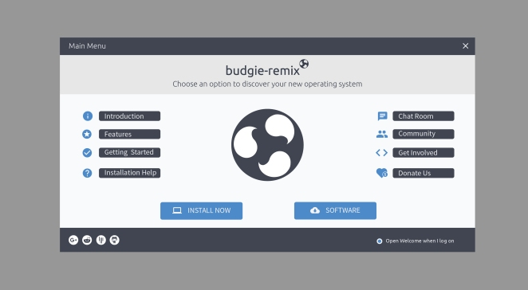

### WHAT’S HAPPENING?

In the past 2 weeks we’ve seen a lot of progress in the development of the distro, as well with the community development. Community driven support helps us realize the key points on where to go with the development, and what are the most important things for the users of our distro.

Our website has been updated, but we are also preparing new version that will be implemented in the not so distant future.

Going with that, we are working on an updated [Welcome app](https://github.com/budgie-remix/budgie-remix-welcome). The first impression is important and the ‘out of the box’ experience should be smooth and pleasant for both new users and professionals alike.

 

New [arc-theme](https://mentors.debian.net/package/arc-theme), [moka-icon-theme](https://mentors.debian.net/package/moka-icon-theme) and [budgie-desktop](https://mentors.debian.net/package/budgie-desktop) packages has been pushed to Debian for review. We are also preparing the other budgie-remix packages for direct inclusion into Ubuntu. We hope that these will make it into the 16.10 repos.

Regarding Arc Theme, all users should have received the updates for `arc-theme` and `arc-firefox-theme` by now, along with `moka-icon-theme` and `faba-icon-theme` packages.

Also, we have seen the video on YouTube claiming that budgie-remix’s memory profile is similar to Unity and GNOME Shell. We’ve tried to reproduce the environment and can confirm budgie-remix is lighter than both of those desktop-environments.  We also note that if you remove both GNOME Software and GNOME Calendar, then budgie-remix memory profile is similar to MATE and XFCE!

We’re also keeping an eye on [Snappy](http://snapcraft.io/) development and how we can introduce _snaps_ in the future.

#### NEW TEAM MEMBERS

2 new team members have joined our team [Nikola “GrindamN” Stojić](https://plus.google.com/112283126326598669581) and [Niyas C](https://plus.google.com/+NiyasC01). Nikola has joined as part of the Community Management team and Niyas C as HTML/CSS Guru. Welcome to the team guys!

#### OFFICIAL UBUNTU FLAVOR STATUS

We’ve had discussion with the official Ubuntu Technical Board regarding our application to become an official flavor. The good news is that they’ve said it will be possible. Guidance to the team has been given; we need to include our packages officially into the Ubuntu repos and demonstrate – amongst other things – that we have a good track-record of updating these. We will be following these recommendation is the next weeks and months and will approach the technical board again.

#### THEME POLL

As you already know, we ship two themes by default, Arc and Vertex. We’ve recently added a [poll on our Google+](https://plus.google.com/+davidfossfreedommohammed/posts/8iUtgoyA2wt) page, asking you, which one of the two we should push to 16.10 repos. Most of you voted for Arc (57%)

#### EMAIL CLIENT POLL

We also added a [poll on our Google+](https://plus.google.com/+davidfossfreedommohammed/posts/dWDioeajLmV) page, asking you, if you use a email client and which one. Seems most of you do – and the favourite is Geary (41%)

#### COMMUNITY

#### REVIEW

Check out the new review done by [AJ Reissig](https://plus.google.com/+AJReissig) on YouTube:

<iframe class="youtube-player" src="https://www.youtube.com/embed/LYvX4hDFXKg?version=3&amp;rel=0&amp;fs=1&amp;autohide=2&amp;showsearch=0&amp;showinfo=1&amp;iv_load_policy=1&amp;wmode=transparent&amp;theme=light" allowfullscreen="allowfullscreen" data-ratio="0.5625" data-width="1280" data-height="720" data-mce-fragment="1"></iframe>

We would like to thank AJ Reissig on pointing out the problems and what he liked and didn’t like about budgie-remix 16.04 release.

[DoomHound173](https://doomhound173.deviantart.com/) from DeviantArt, showed us how awesome her desktop looks with budgie-remix!

 

- [share](https://www.facebook.com/sharer/sharer.php?u=https%3A%2F%2Fbudgie.grindam.com%2Fblog%2F2016%2F06%2F16%2Fnews-release-3 "Share on Facebook")
- [tweet](https://twitter.com/intent/tweet?text=News%20Release%20%233%20%7C%20Ubuntu%20Budgie&url=https%3A%2F%2Fbudgie.grindam.com%2Fblog%2F2016%2F06%2F16%2Fnews-release-3 "Share on Twitter")
- [share](https://plus.google.com/share?url=https%3A%2F%2Fbudgie.grindam.com%2Fblog%2F2016%2F06%2F16%2Fnews-release-3 "Share on Google+")
- [share](https://www.linkedin.com/shareArticle?mini=true&summary=In%20the%20past%202%20weeks%20we%E2%80%99ve%20seen%20a%20lot%20of%20progress%20in%20the%20development%20of%20the%20distro%2C%20as%20well%20with%20the%20community%20development.%20Community%20driven%20support%20he...&title=News%20Release%20%233%20%7C%20Ubuntu%20Budgie&url=https%3A%2F%2Fbudgie.grindam.com%2Fblog%2F2016%2F06%2F16%2Fnews-release-3 "Share on LinkedIn")
- [share](https://share.diasporafoundation.org/?url=https%3A%2F%2Fbudgie.grindam.com%2Fblog%2F2016%2F06%2F16%2Fnews-release-3&title=News%20Release%20%233%20%7C%20Ubuntu%20Budgie "Share on Diaspora")
- [share](https://reddit.com/submit?url=https%3A%2F%2Fbudgie.grindam.com%2Fblog%2F2016%2F06%2F16%2Fnews-release-3&title=News%20Release%20%233%20%7C%20Ubuntu%20Budgie "Share on Reddit")
- [Info](http://ct.de/-2467514 "More information")

Written by NickS
