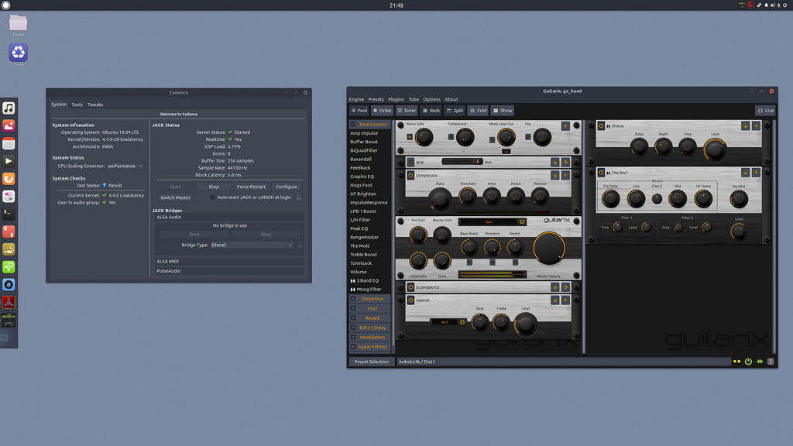

With our fourth news batch, we have some interesting news about budgie-remix’s development and other community related stuff.

Encryption and locale bug that were present during the installation are now fixed. Encryption now works properly and can be turned on/off depending on your choice in our 16.04.1 ISOs that will be soon available for download and available for general use.

Our team leader [David “fossfreedom” Mohammed](https://wiki.ubuntu.com/fossfreedom), has become an official Ubuntu member with 100% votes for him to join! David encourages all Ubuntu users to consider [membership](https://wiki.ubuntu.com/Membership).

We’ve updated our default selection of wallpapers that come with budgie-remix.

One of the new wallpapers that are part of the new 16.04.1 release

Feel free to visit this link to check out the new wallapapers:

[budgie-remix Official Wallpapers for 16.04.1](https://github.com/budgie-remix/budgie-wallpapers)

If you have suggestion on possible new wallpaper that would fit the distro you can always contact us via social networks or via comments on this post. We will be running a 16.10 wallpaper competition so we urge you to seek out the best wallpapers and submit these when the competition is announced in the next couple of weeks.

The welcome app has received more polishing and we have now added specification option that will list your computer’s hardware specification (System Properties). See it in action:

<iframe class="youtube-player" src="https://www.youtube.com/embed/N5uohe5vUcc?version=3&amp;rel=0&amp;fs=1&amp;autohide=2&amp;showsearch=0&amp;showinfo=0&amp;iv_load_policy=1&amp;wmode=transparent" allowfullscreen="allowfullscreen" data-ratio="0.6228373702422145" data-width="1156" data-height="720" data-mce-fragment="1"></iframe>

Some of our packages focusing on the visual part of the distro, have been accepted into Debian repositories ([moka-icon-theme](https://packages.debian.org/sid/moka-icon-theme), [faba-icon-theme](https://packages.debian.org/sid/faba-icon-theme) and [arc-theme](https://packages.debian.org/sid/arc-theme)) and so got synced into the development version of Ubuntu as well. Hopefully, our budgie-desktop package too will be soon available in the repos, as soon as it gets approved by maintainers.

We’ve also added an applet from the fabulous developer [Stefan Ric](https://github.com/cybre) that will allow you to capture screenshots; you can also upload captured images straight to Imgur image hosting service so that you can use it later on. To install, just run this in terminal:

```
sudo apt install budgie-screenshot-applet
```

Then add the applet to a panel using Raven

### COMMUNITY

Here’s one screenshot of budgie-remix we spotted in the wild:

[](https://ubuntubudgie.org/wp-content/uploads/2016/07/27512020323_4511fdef7a_b.jpg)

We got new official Twitter and Google+ profiles, coz we love to interact more with you, the community! Check ’em out:

Twitter: [@budgie-remix](https://twitter.com/budgie_remix)

Google+: [https://plus.google.com/106459857019142382817](https://plus.google.com/106459857019142382817)
