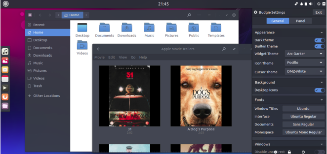

Howdy, budgie-remix users! We’re proud to announce another release of budgie-remix. This time, we’re publishing the beta 2 for the new budgie-remix based on Ubuntu 16.10. While this beta is not final release, it does contain most of the bug fixes and new features that you are going to see with budgie-remix 16.10 final release.

16.10 budgie-remix comes in both 64bit and 32bit ISO’s.  The final release will also include torrents. Download from our [SourceForge repository](https://sourceforge.net/projects/budgie-remix/files/16.10%20beta%202/) – remember to check out the README for current issues that we are aware of that may affect your installation.

If you have previously installed the alpha or beta 1 version of budgie-remix 16.10 we would ask you to please reinstall this beta 2 – this will allow us catch those last minute installation issues.

One of the most notable changes is the new Budgie Desktop version 10.2.7 update by our Solus friends. This new version of Budgie desktop comes with a much needed keyboard applet for users that need to easily switch between different layouts. All indicator applets are now consistent with each other (left clickable) and Raven launches appropriately when the notification applet is clicked. We have also included the super new volume applet that was developed after the main 10.2.7 release.

Other issues that were fixed are:

- A one-pixel line where the wallpaper would be visible when a program is maximized in multi-monitor setups has been resolved.
- Budgie Menu gained a new option to let you open categories by rolling over them. This option is disabled by default, however one can enable it via the Roll-over mouse  option in the Budgie Menu applet settings.  Let us know your thoughts and if we should make this a default option.
- Chrome apps should now be pinnable.
- Fixed a crash in the workspaces applet for GTK 3.20.
- Fixed the dreaded panel-applet-sort issue where sometimes one could see random sorting of the last couple applets on the panel.
- End Session dialogs will now provide context-specific description and actions, such as Cancel and Logout on a Logout dialog.
- Pin to Panel for items in the Icon Tasklist are now translatable.
- Run Dialog will now quit after losing focus.

To find out more, visit [Solus OS release info](https://solus-project.com/2016/09/10/budgie-10-2-7-released/) page.

Another thing that most of our users reported is the Moka icon theme compatibility with the desktop itself and the GTK+3.22 apps available in 16.10. This release fixes a lot of different issues with icons.

#### **[POCILLO ICON THEME](https://github.com/budgie-remix/pocillo)** IS COMING !

This is one of the things that we had a lot of discussion about and why it is needed. While there are a lot other distros that use different icon themes, we feel that budgie-remix needs to be unique and have its own style to differentiate it from other linux distros. For 16.10, Pocillo file and folder icons blend in seamlessly with the gorgeous Arc theme. We’ll be expanding the icon theme in the near future to improve consistency with Moka and Arc.

Every package has been redone, checked and verified by Debian and Ubuntu developers; all of the obsolete packages have been removed so that there is no more unnecessary bloat slowing down your system. Most of these packages are also available to download from Debian and Ubuntu repositories.

Since this release is built upon the superb 16.10 foundations look out for the new linux 4.8.2 kernel as well as the various brand-new GTK+3.22 apps.

With this release, we’re moving forward to unifying Budgie DE experience with Ubuntu as a seamless desktop experience for both the new users and Linux veterans.

* * *

Any issues please raise on our [bug-tracker](https://bugs.launchpad.net/budgie-remix).  Drop-by our community [chat room](https://gitter.im/budgie-remix/community) to discuss your thoughts as well.
