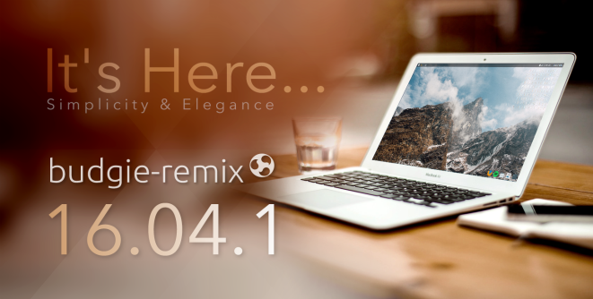
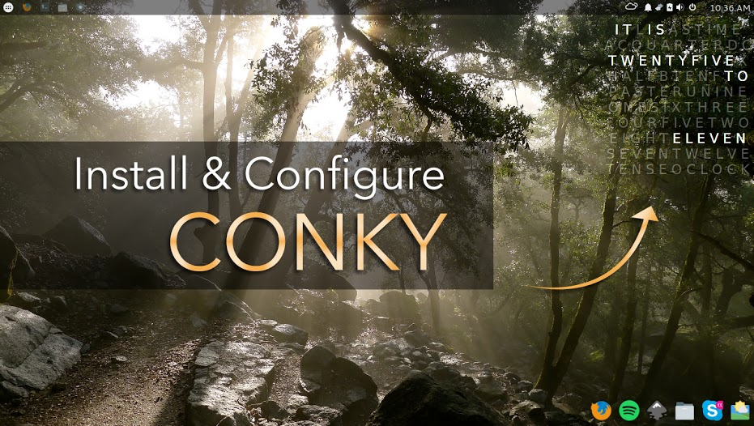
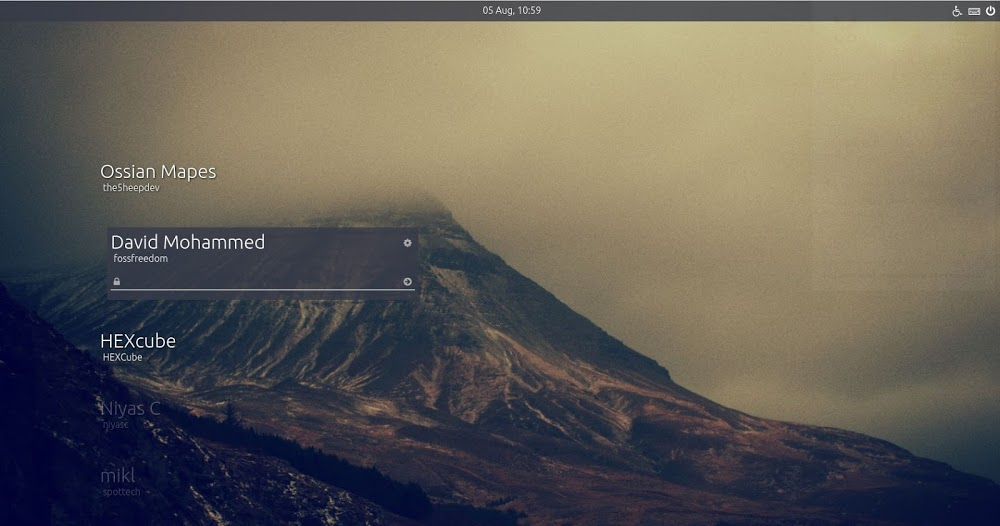

#### 16.10 WALLPAPER CONTEST

Community – We are currently organizing a contest for the best wallpaper by community, so feel free to enter. You don’t have long – so visit our [Flickr Wallpaper contest group](https://www.flickr.com/groups/budgie-remix-16-10/) and submit those pictures. Who knows, maybe your wallpaper will be the one of the few lucky ones to make it into the next budgie-remix release!

#### BUDGIE-REMIX 16.04.1

budgie-remix 16.04.1 has been [released](https://sourceforge.net/projects/budgie-remix/files/16.04.1%20release/) and we’ve updated a lot of different components. Most of the bugs have been resolved, but if you encounter any new one, feel free to report it back.  Please spread the good news!

 

#### BUDGIE WELCOME APP

Look out for the new **Budgie Welcome** app – it’s in your _System Tools_ menu group.

Lots of updates have been made available since the 16.04.1 iso. For eg, panel resets is straightforward:

<iframe class="youtube-player" src="https://www.youtube.com/embed/fJrf41uy_N0?version=3&amp;rel=0&amp;fs=1&amp;autohide=2&amp;showsearch=0&amp;showinfo=1&amp;iv_load_policy=1&amp;wmode=transparent&amp;theme=light" allowfullscreen="allowfullscreen" data-ratio="0.5625" data-width="1280" data-height="720" data-mce-fragment="1"></iframe>

Previewing in the latest updates – switch your desktop from the clean and simple Arc theme to a gorgeous Material theme and icons. More on that in the next newsletter.

#### NEW IMPROVEMENTS

We’ve updated the `budgie-screenshot-applet which should work better than the previous version. We've also updated the Budgie desktop environment package, adding in a few recommendations.`

- `nautilus-share`: this makes samba sharing using GNOME Files file manager a snip
- `policy-desktop-privileges`: you should notice a few areas where previously you needed to use `sudo` you no longer have to.
- `ppa-purge`: a must for those using PPAs - allows you to remove and rollback PPA's easily
- `gnome-system-monitor`: visual tool to help find out what is apps and processes are running.
- `bash-completion`: must have package for those that use terminals alot
- `thermald`: for newer Sandy Bridge based and later laptops your laptop should run much cooler now
- `acpi-support`: support for various wireless scripts and hardware
- `gvfs-fuse`: GNOME's virtual filesystem - various GNOME apps recognize and mounts filesystems automatically now

Due to GTK 3.20 not landing soon enough for updating the themes and testing it, we regret to inform you the budgie-remix 16.10 ISO release will be delayed a little.

#### TUTORIALS

Checkout a couple of fascinating tutorials from our team member [Udara Madubhshana](https://plus.google.com/+UdaraMadubhashana):

### UPCOMING NEW WEBSITE

The new budgie-remix website is ready for its debut in the following days. Optimized for both mobile and tablet devices, you can easily browse the website "on the go".

#### NEW LIGHTDM GREETER

A community member [Ossian  Mapes](https://github.com/The5heepDev) has devised a great demo of a potential budgie-remix LightDM Greeter

Checkout the [working demo](https://remix-greeter.github.io/).
