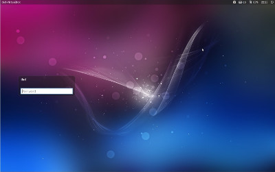
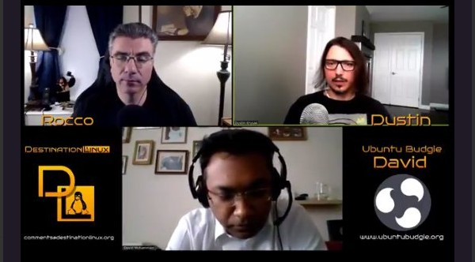

## Shoutout

We have launched our 17.10 [desktop wallpaper competition](https://www.flickr.com/groups/ubuntubudgie1710)  - we really do need your fabulous photos and images so please take part ... otherwise the team will find and use our own family pics ... you have been warned ;)

We are very grateful to our small band of [Patreons and Paypal contributors this month](https://ubuntubudgie.org/admin/blog/post/@page/5) . Everyone who does help out this well makes this project viable for now and the long-term. Cheers.

Our zazzle link is now up-and-running [through our website](https://ubuntubudgie.org/admin/blog/post/@page/16)  and also via budgie-welcome. So please check it out and get some great Ubuntu Budgie merchandise.

## Fixups

Budgie Welcome theming has received a few updates. Vertex theme for 16.04 users now installs the correct Vertex Iconset. The screenshots for the 16.10/17.04 themes have been updated by Niyas to accurately show the themes and icons that would be applied if you installed them. The 16.04 screenshots similarly needs some help - please volunteer!

Budgie Welcome has an issue with reinstalling the same PPA even if its already enabled together with a full update. This has been resolved. Package installation should be faster now.

Bit of an oops moment with budgie-welcome and our Italian translation - the app couldnt be started for our Italian friends. So fixed that in a matter of a few minutes and released it immediately.

## New Development

Pleased to add [Flat-Plat](https://github.com/nana-4/Flat-Plat)  with [Numix Icons (Circle)](https://github.com/numixproject/numix-icon-theme)  as a new default theme that can be applied via Budgie Welcome. Simply gorgeous - well worth checking this out.

EvoPop was the default theme from the very early days of budgie-desktop. It fell into disuse due to newer GTK+ versions and changes to budgie-desktop. Thankfully a new version has been released that is compatible with 17.04 and later and I have added this to budgie-welcome. You can try this now by installing the evopop-gtk-theme package

16.04/16.10 and 17.04 (backports) will have received Udara's fabulous material design wallpaper. This will debut in 17.10 by default. All material design theme makeovers (budgie-welcome - Default Settings) now apply this.

Budgie Welcome has now been updated with our Online Shop. Please check it out - anything you purchase, a small proportion of the proceeds goes towards Ubuntu Budgie enabling the project to grow.

Pleased to see Budgie Welcome (mostly) translated into Italian and Portuguese (Brazillian). Fantastic job by our southern european and south american friends. Given the new online shop we need more help translating this area and to finish off existing translations - [https://www.transifex.com/ubuntu-budgie/budgie-welcome/](https://www.transifex.com/ubuntu-budgie/budgie-welcome/) Where translators and translations are relatively complete, this month I have kept up-to-date through several timely updates.

The default settings page in budgie-welcome has been now split into two tabs to ease navigation - default is themes - the second tab for general settings i.e. panel reset. Really looks nice now and less cluttered.

From the front-screen of budgie-welcome you can now easily navigate to see Flatpak and Snap Apps. In addition we have gathered what we consider the best maintained budgie-applets together for easy installation.

New applets that have been packaged and are now available in 16.04 and 17.10 include:

- [budgie-calendar](https://github.com/danielpinto8zz6/budgie-calendar-applet)  - an alternative clock for the panel but when clicked, the calendar is displayed in a popover
- [budgie-haste-applet](https://github.com/cybre/budgie-haste-applet)  - publish text and prose to a variety of online sources
- [budgie-brightness-control](https://github.com/ilgarmehmetali/budgie-brightness-control-applet)  - control the brightness of your desktop via an easy to use graphical slider
- [budgie-screenshot-applet](https://github.com/cybre/budgie-screenshot-applet)  - take screenshots of your desktop/windows or selections and easily publish these to imgur.com etc.
- [budgie-pixel-saver-applet](https://github.com/ilgarmehmetali/budgie-pixel-saver-applet)  - move maximized (non CSD) window decorations into the panel saving vertical screenspace

OMGUbuntu noticed our tweet and wrote an excellent [article](http://www.omgubuntu.co.uk/2017/06/5-awesome-budgie-desktop-applets)  - nice to see Ubuntu Budgie and budgie-welcome being mentioned.

Budgie Welcome front-page software center button has now changed to a "Install Software" button. You now have links to the Flatpak and Snap online stores.

In addition I have added a stylish new "Budgie Desktop Applet Store" - basically a page with the best applets (IMHO) available today - just one-click to install.

I have submitted changes to Linux Mint's slick-greeter project to fully document the various options available. Creating and editing /etc/lightdm/slick-greeter.conf is straightforward - just type "man slick-greeter" for the options that you can use - e.g. changing the background image. This has resulted in a new release and have uploaded this to Debian/Ubuntu 17.10.

17.10 changes include dropping Eye of GNOME from the default install. The image-viewer will now be gThumb. Don't forget Sushi is available (press space-bar on pictures etc in File) to preview file-content.

We have included the brilliant folder-color package - you can now change Files folder icon colors or change folders to include emblems.

More requested Files changes - you can now right-click in Files to create new template files and images. Yeah - I have been listening! This will be uploaded soon to 17.10

## Insights

To give you an idea of what needs to happen when updating a software package here is a little story. It all begins with wanting to update the Ubuntu repositories with the latest version of budgie-desktop (v10.3.1)...

For 16.04/16.10 users the process is "straightforward" - rework the package and upload to the budgie-remix PPA. Similarly for 17.04 folk - send the package to Launchpad to be built and uploaded to the backports PPA.

To upload to the Artful (17.10) repositories I need to cleanup and fixup all possible packaging issues and upload to Debian Mentors. Mentors is a process where developers can assess the quality of your work - you usually go around a few cycles getting the packaging in tip-top condition. Then you have to find a sponsor that have the necessary rights can upload to Debian. The upload was the first hurdle (I already have a nice sponsor!) The Debian build system mysteriously failed to build the software - whereas the same code could be built manually and obviously can be built into a Ubuntu PPA. After a few weeks of trying, one of the GNOME Twitch developers/packages pointed me to a possible tweak that is specific to Debian. Bingo!

My Debian Sponsor also has the rights to synchronise from Debian to Ubuntu ... and then the Ubuntu build system crashed and burned budgie-desktop.

After much scratching of heads this came down to the Artful build system automatically builds from Proposed packages ... and in amongst those packages was a package critical for budgie-desktop that had lots of regressions (bugs!). The budgie-desktop build failure was eventually tracked down in Meson package. Jeremy Bicha thankfully pull together the fixes from upstream and now 10.3.1 has landed in Arful.

So there you have it ... its not simple to update software. No wonder my hair is going grey!

## Random Stuff

Dustin is applying to Ubuntu Membership - something that I would warmly recommend to all commited Ubuntu users. Give Dustin your endorsement via a testamonial [https://wiki.ubuntu.com/bashfulrobot](https://wiki.ubuntu.com/bashfulrobot)

Both Dustin and myself have been playing with snaps and snapcraft. Snaps are a promising means of delivering software to everyone in a timely manner. For example, we could snap budgie-welcome. Making changes in our GitHub repo will be built automatically and delivered to everyone almost immediately.

Plans by upstream could include allowing snaps as part of the ISO. Some more work to allow file-system overlays is required to enable snaps of applets and other stuff that is file-system specific - but again this is planned work.

**We now say bye-bye to 16.10**. It has virtually reached its end-of-life and will no longer be receiving anymore security updates shortly nor will we be updating any software. This is standard practise for all Ubuntu flavors for an EOL distro. We strongly encourage you to upgrade to 17.04 if you haven't already.

Ikey Doherty and Stefan Ric has been hacking away with budgie-desktop fixups. Brilliant news is that they have completely reworked all the GTK Popup code and as a result the bottom panel animation issues have been resolved. As a massive bonus, left and right panels are now possible. Ikey similarly has brought Mate-Desktop brisk-menu search capabilities to budgie-desktop. Sorting and searching really does work brilliantly now. Kudos to these two for all these changes.

When these changes are released from upstream, there will be a delay before we bring this to 16.04 and 17.04 users since this work unfortunately breaks existing third-party applets. These need fixes first before we can bring the new version when it is released.

Dustin and myself were invited to have a chat with Rocco for [Destination Linux](http://destinationlinux.org/destination-linux-episode-25/) . Its was great fun - well worth a listen on your daily commute!

I spent a bit of time this month packaging the [osx-arc-collection](https://github.com/LinxGem33/OSX-Arc-White)  of themes and icons. Disappointingly the maintainer has discontinued further development of budgie-desktop support. Anyone interested in taking these really nice themes forward?

Finally - I shouldn't really say this ... but Vincenzo has been working on a really - really massive opportunity for both yourself and Ubuntu Budgie. We have an outline agreement and an exciting partner and just need to cross the t's and dot the i. nuff said - more about this in due course.

David (project lead)
