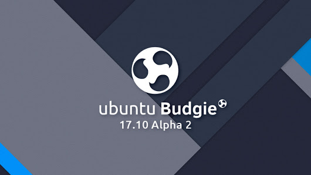
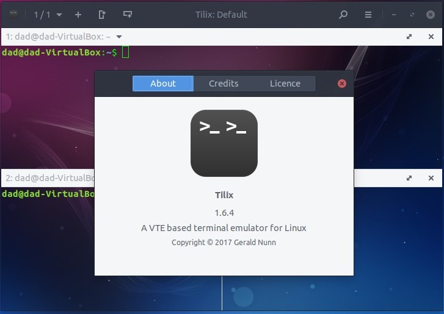
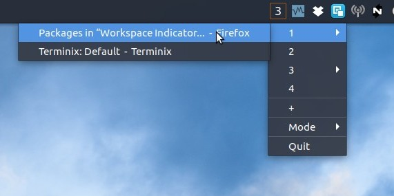

# Showcase

Our [17.10 Desktop Wallpaper contest](https://ubuntubudgie.org/blog/2017/07/31/17-10-contest-winners-and-a-surprise)  attractive many fantastic entries so much so we have chosen both 17.10 desktop wallpapers and our future 18.04 release as well!

We are very grateful to our small band of [Patreons and Paypal contributors this month](https://ubuntubudgie.org/admin/blog/post/@page/5) . Everyone who does help out this well makes this project viable for now and the long-term. Cheers.

# 17.10 Alpha 2

We spent lots of time this month preparing and testing for our first an only Alpha release of 17.10. Good news is that it is really stable especially so early in the development cycle.



Checkout our [release note](https://wiki.ubuntu.com/ArtfulAardvark/Alpha2/UbuntuBudgie)  for the current changes. Onwards towards Beta 1 at the beginning of September!

We have also launched our [testing tracker](https://ubuntubudgie.org/testing)  page. Remember to bookmark this if you are helping us testing the alpha and beta releases

# Fixes

The website certificate was up for renewal and we missed the renewal date and time by a few hours. So apologies for that - you will have noticed that when visiting the website and your browser threw a wobbly saying the site was not safe to continue browsing. Dustin has done a whole bunch of remedial stuff and in future renewing the site certificate will be "mellow" - Dustin assures me.

Dustin has been doing a bit of backend work for the website to make maintainance easier going forward:

- all domains in a central location
- DDOS protection
- access to additional advanced features if we grow and need them such as WAF (Web Application Firewall), Bypass Cache on Cookie, etc.
- Global CDN
- Can start small and grow as needed (pricing, scale, features)

Mozilla have now confirmed that they no longer support third party theming such as arc-firefox. Some of you may have noticed that recent versions of Firefox on 16.04/16.10 look slightly broken with the arc-firefox theme addon.

Thus, I have updated 16.04 and 16.10 to remove the arc-firefox addon. You should now have updated your systems. Firefox will default to the theming UI that Mozilla has decreed.

I have spent some time looking at the lock screen. As you may know, setting the wallpaper for the lock screen via the Background dialog doesnt work. This is because gnome-screensaver precedes the modern Background dialog and doesnt understand here the background wallpaper is chosen. So I have pushed a fix for this. In addition, I have resurrected the old "Unity" lock screen look-and-feel before Unity switched its lock-screen in 16.04. So at least the lock-screen should look a little less 'bad' than it was. Hopefully Canonical devs will accept this.

In their mission to dump all things Unity and switch to GNOME Shell, the Ubuntu devs have managed to add package dependencies that have affected our distro. For those testing the early July dailies you will have noticed both Budgie Desktop and GNOME Shell is installed. A fix by the devs has fixed the immediate issue when UB is installed. So I have done a couple of fixes as well. The devs have accepted my fix to the ubiquity package. Remember this is all the fun of pre-alphas and alpha's. Don't install and keep running on machines. Keep regularly reinstalling to find this sort of issue and let us know when you encounter issues.

I have tried to make the default settings page more discoverable by new users. This is where wholesale theme/fonts etc makeovers is peformed. The getting started wizard on first run now ends by running this page.



The terminal we use is Tilix. It was rather stuck on a relatively old version due to some Ubuntu patching issues. I took the opportunity to resolve some issues and the Ubuntu devs have accepted my patch. Good news - the latest stable Tilix version has found its way into 17.10.

# New Development

Our icon theme Pocillo has had a revamp with much better panel icons. Steam, caffeine, drop-box now work correctly and other icons looks and feel much more stylish. Joshua has been sorting out the Pocillo changes.

The Moka iconset which we also use has had a new release from upstream. This has now been packaged, uploaded into Debian and is now in the 17.10 dailies.

I have been working with upstream ensuring that the new upcoming budgie desktop compiles on 16.04 and 17.04. Ikey has been very generous with resolving all the compilation issues - especially for 16.04 where the older Vala and GLib libraries was causing real havoc.

Upstream have now defaulted to using sassc to compile the inbuilt budgie desktop theme; this is particulary problematic with 16.04 because it actually doesnt exist in the repositories nor have I found it in any third-party PPA.

Thus I have had to backport both libsass and sassc, ensure budgie desktop builds only with the latest recommended meson ... and created a ubuntu only patch to ensure our Debian package runs sassc - sassc + meson doesnt work with 16.04 GLib. All very technical - but at least now 16.04 users have a chance to run the upcoming budgie desktop.

One remaining issue remains - the new budgie-settings window throws some rather nasty looking errors and some parts of the new window looks broken. I haven't figured out how to resolve - so for the moment the 16.04 backport will unfortunately need to be put on hold until this is resolved.

**It is important to note** - no release date has been given for the new budgie desktop. With the upcoming 17.10 freeze we may not be able to ship this latest desktop. We are ever hopeful.

# Random Stuff

I'm happy to announce a new member of the team. Jacob Vlijm hails from the Netherlands and is a brilliant developer with a strong python background. For those that visit askubuntu.com you will have seen Jacobs fantastic in-depth answers. He has a strong in-depth background in all things Ubuntu and will be a great asset to the team.

To kick things off he has been dusting off two of his Unity desktop projects to make them Ubuntu Budgie compatible. So check out his handy-work



An appindicator based and elegant workspace switcher:

```
sudo add-apt-repository ppa:vlijm/wsindicator && sudo apt-get update && sudo apt-get install wsindicator
```

Also you can have a separate wallpaper per workspace - this works for all budgie desktop distro users

```
sudo add-apt-repository ppa:vlijm/wswitcher && sudo apt-get update && sudo apt-get install wswitcher
```

Jacob possibly pulling these both under one package - maybe via a native budgie desktop applet. Stay tuned.

16.04 Ubuntu and official flavours are releasing a point release on Thursday 3rd August. Whilst budgie-remix is not an official flavour, we are endevouring to follow Ubuntu and we will look to also release our 16.04.3 point release which incorporates all the changes released by ourselves and Ubuntu since last Februaries 16.04.2 release. Stay tuned more more info.

David (project lead)
