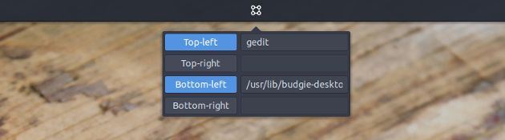
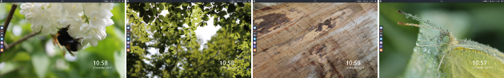
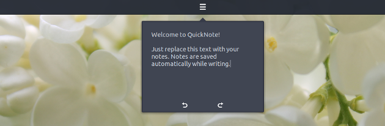
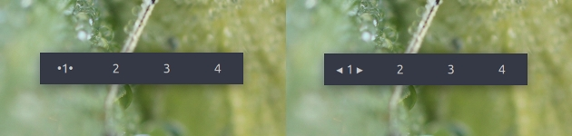

Showcase

This month's activities have been dominated by the final push and release of our [second release](https://ubuntubudgie.org/admin/blog/post/@blog/id?id=33)  as an official member of the Ubuntu family.

It has been an interesting six months - and this month was no exception; more on that later.

We are very grateful to our small yet growing band of [Patreons and Paypal contributors this month](https://ubuntubudgie.org/admin/blog/post/@page/5) . Everyone who does help out this well makes this project viable for now and the long-term.

So much so, we have met another of our goals, and it is our pleasure to make a sizeable donation to our friends at the Solus Project. Without their stewardship of the budgie desktop, we just wouldn't have this distro.

# New Default look

Nikola is spending the time to research a possible revised out-of-the-box-experience for Ubuntu Budgie 18.04. A revised GTK-theme and looking closely at the various software centres as well.

If you have any experience with developing and maintaining themes and would like to get involved **please raise your hand**and get in touch.

Our default desktop artwork that we use for media, login screen, desktop and lock-screen is also being assessed. You can directly change our outward look - enter our [faces competition](https://ubuntubudgie.org/admin/blog/post/@blog/id?id=34) 

# Development

The seven additional applets which were developed by team member Jacob in the past few months have come to the point of their first release. Without exception, they are technically "ready to see the world". We are currently polishing integration in the Budgie desktop.

Time for a short introduction.

1. ShowTime - a digital clock on your desktop\*Options include setting position, colours of both date & time.
    
    
    
2. WindowPreviewsPressing Alt + Tab will call an expose-like overview of windows on the current workspace. Pressing Super + Tab will show an overview of windows of the currently active application. At the bottom of the previews window, small bullet-buttons show the number of windows on all workspaces. Clicking either one will bring up an overview of the referring workspace.
    
    
    
3. HotCornersHot corners are available from the applet's menu. No need to restart the applet just set your commands and activate the corner. If none of the corners is enabled, the applet automatically hibernates.
    
    
    
4. WallpaperSwitcherAutomatically Switch wallpaper on switching workspaces. Just set the wallpaper like you are used to, and the wallpaper will be remembered for that workspace.
    
    
    
5. QuickNoteThe most straightforward way to make a quick note. Comes with a ten-step undo/redo option.
    
    
    
6. WindowMoverAdding this applet will add the following functionality to your desktop:
    
    - Drag a window to the bottom of your screen, and a quick "move to" -bar appears. Click any of the buttons or press the corresponding key on your keyboard, and the window will move to the targeted workspace.
    - Press Ctrl + Alt + w will call the bar, acting on the currently active window.
    - Press Ctrl + Alt + s calls a similar bar (now with small arrows) to make the desktop jump to any of the other workspaces.
    
    
    
7. WorkspaceOverviewAccess all of your windows, spread over all workspaces, from one single applet. Select any of the windows to move to the corresponding workspace and raise the window. To turn the applet into a simple workspace applet, just make your choice from the applet's _Mode_ menu.
    
    
    

So how where can I install these you may be thinking. Well we will be asking for intrepid testers through our [gitter community channel](https://gitter.im/ubuntubudgie/community) . So come on in a join the fun :)

Thanks to community member Zbigniew Stępniewski for helping out with some changes to budgie welcome.

# Random

Both Jacob and myself spent an exhausting weekend at the beginning of the month to investigate various instability issues due to multiple non-budgie updates released after beta 2.

These issues were eventually traced by the Linux community to one tiny bit of code released as part of the GNOME 3.26 point release. Phew!

A big shout out and thanks to Jane Atkinson (irihapeti) for helping out and most importantly adding results to the QA ISO website as part of the 17.10 release candidate testing.

Dustin has been looking at how the team who are from all over the world can best keep in touch with you - our community - and each other. Part of this has been evaluating different chat solutions as well as bridging options. Things are still up in the air due to nothign feelign quite "right". One of our previous bridging issues has been solved by a bug we filed upstream, so that may change our direction.

Dustin has also been evaluating how snaps will fit into 18.04 (and beyond), researching potential things such as applets as snaps, and most likely the welcome app being snapped up!

* * *

David (project lead)
