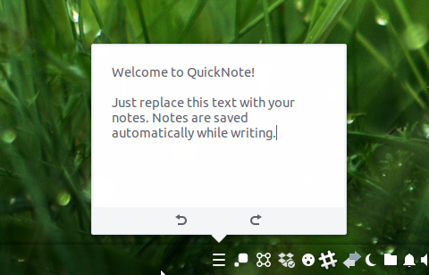
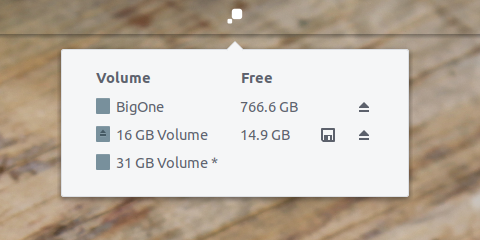
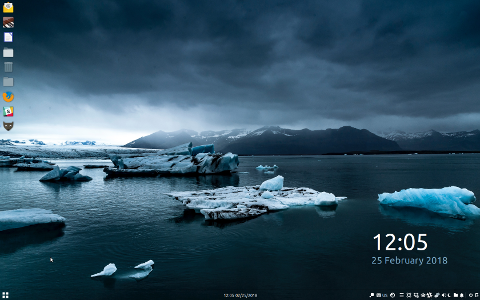
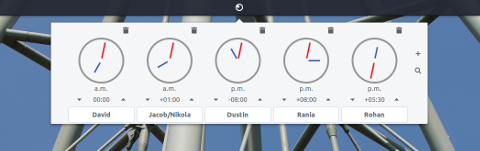
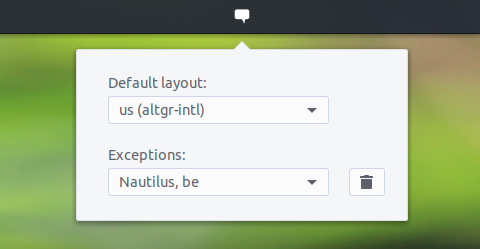
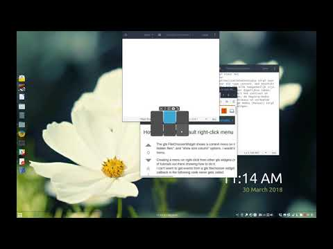
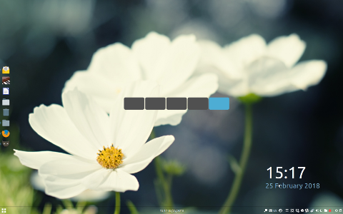
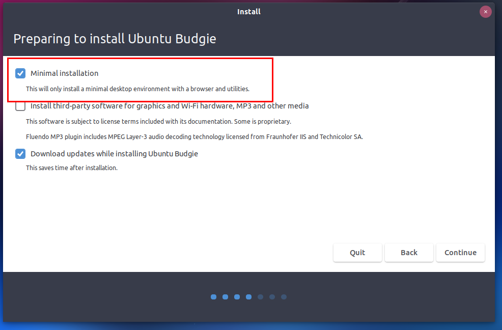

## Version

Ubuntu Budgie v18.04 (bionic beaver) Release: Apr 26th, 2018

**final release notes**

In these release notes the areas covered are:

- New features and enhancements
- Issues Resolved
- Upgrading from 17.10 Ubuntu Budgie
- Upgrading from 16.04.4 budgie-remix
- Known Issues when upgrading
- Where to download Ubuntu Budgie
- Our new support site [https://discourse.ubuntubudgie.org](https://discourse.ubuntubudgie.org/)

* * *

# New features and enhancements

- Add support for openvnc connections via the network-manager applet
- Better font handling for our Chinese and Korean users
- Add color emoji support for GNOME Characters
- Better key shortcuts
    - `Print` Screen button now works as does `<Shift><Ctrl>Print` - Copy a screenshot of an area to clipboard, `<Shift>Print` - Save a screenshot of an area to Pictures, `<Ctrl>Print` - Copy a screenshot of a window to clipboard, `<Alt>Print` - Save a screenshot of a window to Pictures,
    - `Super+D` now toggles the desktop
    - `Super+E` to show a new Files window
    - `Alt+Q` or `F12` shows Tilix Quake mode
- Default Budgie Applets
    - Quick Note - quickest way to make short notes
        
        
        
    - DropBy applet (Media savvy applet pops up when USB based devices/phones connected to open, copy files etc)
        
        
        
    - ShowTime - desktop clock with customizable colors
        
        
        
- New applets, available via Budgie Settings
    
    - Hot Corners - options include a number of preset actions, custom commands and using pressure
    
    
    
    - Window Previews - available via Budgie Settings Alt + Tab to browse through all windows, Alt + \` (grave, above Tab) to browse through the active application's windows. Furthermore: browse through workspaces, Hot Corners integration
    
    
    
    - Rotation Lock - available via Budgie Settings - increasingly many more people have laptops that support screen-rotation

- More new applets, available from Budgie Welcome
    - Clockworks - Keep track on different time zones
        
        
        
    - CountDown - A simple countdown applet with several options
        
        
        
    - Keyboard Autoswitch - Applet to work together with the Keyboard Layout applet, set a different language per application
        
        
        
    - Wallpaper Switcher - Set a different wallpaper per workspace
    - Window Mover - Move windows quickly across workspaces by dragging and click the targeted workspace
    - Workspace Overview - Quickly move to any window on any workspace from a menu
    - Weather applet
- We are also pleased to show-case many more indie developer applets - to just pick a few:
    - Budgie Calendar Applet
    - Global Menu
    - Pixel Saver
- keyboard and GUI friendly window-shuffler capability. This short video explains all - enjoy!



- New exciting GTK+ theme by default called Pocillo
    - Dynamic panel colouring - semi-transparent turns to transparent for maximised windows
    - Ripple effect buttons
    - Coloring takes Arc styling; this allows seamless integration with Budgie System Theming if required
    - Dark, Light and Standard variants
    - All themes also have Slim equivalents - these themes are recommended for lower resolution laptops & desktops
    - Theming of Slick-Greeter and lock-screen
- Arc-Theme now being co-maintained with Ubuntu Budgie & Arch Linux - exciting collaboration and the latest fixes for all DE's is now in 18.04
- We maintain a Vimix theme debian package is now installable via our backports PPA since the third-party we originally linked to is not actively maintaining its package
- Support for Dynamic Workspaces
    - Visual splashscreen shows when changing workspaces - CTRL+ALT Left/Right
        
        
        
    - Pressing CTRL+ALT Right will create more workspaces on the fly. Pressing CTRL+ALT Left will remove unused workspaces that may have been created.
- Menu has Logout, Shutdown, Suspend and Restart action entries
- Snap version of Budgie Welcome:
    - We can be much more dynamic now for the LTS period. As an when new software, themes and applets are developed by the community we can now showcase these instantly via Budgie Welcome
    - Our discourse support site is now displayed on the home-page. The social media icons have moved to the right of the screen and Gitter has now been removed (since discourse is our new support site)
    - Community page has been revamped
    - Lots of translation updates
    - In-line with Ubuntu Policy, third-party repo installs now displays a prompt. Accepting that prompt continues with the installation and adds the third-party repo e.g. Chrome, Vivaldi, Ubuntu Budgie backports PPA
- We maintain the Slick Greeter package on behalf of both Debian and Ubuntu - latest version has been included with better multimonitor support
- We develop and maintain the Alternative Toolbar for Rhythmbox. It gains an easy to use toggle to show menu options for each music source. Also lots of important fixes for various crashes reported since 17.10
- Budgie Indicator Applet - our appindicator supports Vertical Panels!
- Super Community Wallpapers for 18.04 - exciting range of the best wallpapers from the Budgie Community wallpaper contest held last year
- Budgie Welcome
    - Translation team has been very busy - many more languages now available
    - Pop GTK Theme makeover
    - Ant GTK Theme makeover
    - Fixed live session booting instructions
    - Re-done Adapta GTK Theme makeover with Papirus icons theme, better panel look and feel
    - All applets now can show a much larger image when clicking (lightbox view)
    - Replace Flat-Plat with Materia GTK Theme makeover
    - Add important upstream support links for all Budgie Applets
- Minimal Installation option - a stripped back install with just Chromium and a few key utilities to start you on your way



# Key features available to UB from Ubuntu

- spice-vdagent added - we now work much better in VMs such as GNOME Boxes, QEMU
- GNOME 3.28 applications
- Nautilus 3.26 is retained - this is to ensure desktop icons support is maintained throughout the LTS period
- Linux Kernel 4.15
- A shed-load of fixes throughout the Ubuntu stack - congrats on all Canonical, Ubuntu devs, Debian devs and literally all devs in the free software community for all of their hard-work which everyone should be very happy about :)

# Issues Resolved:

- removed the obsolete xdiagnose application
- IBus Keyboard switcher now correctly cycles through layouts
- We no longer interfere when KDE is installed at the same time as Budgie
- Snapping of windows now longer causes lock-ups in a small number of use-cases; snapping animation has been removed
- The text version of the Plymouth theme now correctly displays 18.04 in the text
- The logo version of the Plymouth theme now has the progress bars centered with the logo
- Skippy-XD has now been removed from the recommendations page - the software is unmaintained for a few years now. It is still installable via command-line through our backports PPA on a "try if it works" basis.
- Vivaldi is no longer shown on the 32bit ISO - there is no 32bit packages available

# Known Issues:

- LightDM changes have resulted in the greeter not showing at selected users wallpaper. We ship the "Login Window" application to configure Slick-Greeter
- If you find that after the upgrade clicking the menu button crashes the panel, then CTRL+ALT+T to open a terminal then run:

```
nohup budgie-panel --reset --replace &
```

# Upgrading

## How to upgrade from 17.10 to 18.04

**IMPORTANT:** remember to double-check you have the following vital package before you upgrade:

```
sudo apt install ubuntu-budgie-desktop
```

After the release of 18.04, you will be offered to upgrade when you run Software & Updates.

Alternatively, from a command line run:

```
update-manager
```

**IMPORTANT** We do not recommend running `do-release-upgrade` from a Tilix terminal since this will hang during the upgrade. If you want to use `do-release-upgrade` switch to a TTY and login before running the command.

Some of the packages that were installed as part of the Ubuntu Budgie backports PPA (ppa:ubuntubudgie/backports) will be uninstalled as part of the upgrade. Use budgie-welcome to reinstall anything that is removed.

**POST UPGRADE** From the menu run `Budgie Complete Installation` to install snap version of budgie-welcome.

We also recommend you reset the panel to benefit from the revised Pocillo theme and applets:

```
nohup budgie-panel --reset --replace &
```

## How to upgrade from 16.04 budgie-remix to 18.04

16.04 users are not automatically offered an upgrade until the first point release i.e. 18.04.1 which is released in July 2018.

Alternatively - to force an upgrade from 16.04.4 from a command line run:

```
update-manager -d
```

Some of the packages that were installed as part of the budgie-remix backports PPA will be uninstalled as part of the upgrade. Use budgie-welcome to reinstall anything that is removed.

From the menu run `Budgie Complete Installation` to install snap version of budgie-welcome and to remove the budgie-remix meta package correctly.

We also recommend you reset the panel to benefit from the revised Pocillo theme and applets:

```
nohup budgie-panel --reset --replace &
```

* * *

Please refer to the community wiki for more help:

[https://help.ubuntu.com/community/Upgrades](https://help.ubuntu.com/community/Upgrades)

Also, Ask Ubuntu has an excellent guide to help you upgrade:

[http://askubuntu.com/questions/110477/how-do-i-upgrade-to-a-newer-version-of-ubuntu](http://askubuntu.com/questions/110477/how-do-i-upgrade-to-a-newer-version-of-ubuntu)

# Download

To download the ISO, head on over to:

[https://ubuntubudgie.org/downloads](https://ubuntubudgie.org/downloads)

# Introducing our new support site

Also - we now have introduced our new support site. Thanks to the generosity of discourse.org, our new discourse based website is now up and running.

One to book-mark [https://discourse.ubuntubudgie.org](https://discourse.ubuntubudgie.org/)

More information can be found [here](https://ubuntubudgie.org/admin/blog/post/@blog/id?id=39) .


