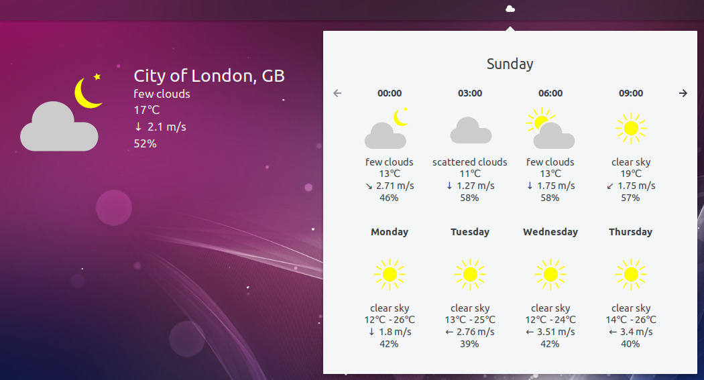
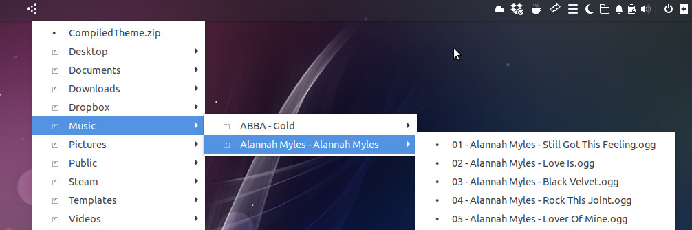
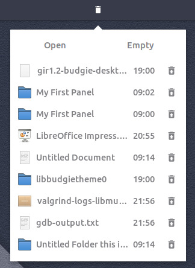
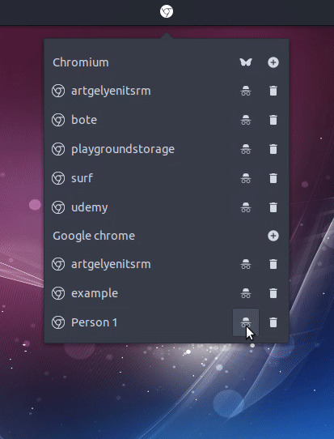

Version

**Ubuntu Budgie v18.10 (Cosmic Cuttlefish)** **Release:** Oct 18th, 2018

Ubuntu Budgie 18.10 will be supported for 9 months until July 2019. If you need Long Term Support, it is recommended you use Ubuntu 18.04 LTS instead.

**beta release notes - 27 Sept 2018**

In these release notes the areas covered are:

- New features and enhancements
- Issues Resolved
- Upgrading from 18.04 Ubuntu Budgie
- Known Issues when upgrading
- Where to download Ubuntu Budgie

# New features and enhancements

- Budgie Desktop "v10.5" (almost) - we are pleased to promote the latest available capabilities made available by the Solus upstream project.
- Due to overwhelming vote (75% for), Firefox now becomes our default browser. So out goes a chromium-browser icon on both the icon-task-list and plank dock - in comes Firefox
- ... and for good measure we have added ubuntu budgie welcome as a default program icon to make discovery instant.
- We have dropped TLP from the default install. The powersavings in the kernel from kernel 4.18 are significant for newer computers. TLP is still available to be installed if the kernel powersavings do not impact you due to using an older CPU.
- The caffeine appindicator has been dropped - this has been replaced with the native caffeine budgie-applet that comes with budgie-desktop v10.5
- We've added a new game 2048 as part of the default install - great way to while-away a few hours
- More new productivity applets are now available from Budgie Welcome
- Ubuntu Budgie Team Wallpapers for 18.10 - the UB team has decided for this release to choose their favorite wallpapers - quite an eclectic bunch. Hope you like them. We will next run a community contest for the 20.04 LTS
- Budgie Welcome - Translation team has been very busy - many more languages now available

# Budgie Applets

New productivity applets are now available from Budgie Welcome:

- WeatherShow - Weather forecast every three hours and over five days. This Desktop based weather applet is installed by default and can be added to your panel.
    
    
    
- Kangaroo - Quick and easy browsing, across (possibly) many folder layers, without having to-do a single mouse click.



- App launcher - Display your favorite applications in a menu and on the panel.
    
    
    
- Trash applet (vala based) - Show, hide and restore trash items.
    
    
    
- Recently Used (vala based) - Show recently used items in a menu.
    
    
    

A couple of existing applets have been rewritten from Python based to Vala based. This has been done to greatly enhance the speed of the applets and make them memory efficient; in addition they have picked up a few enhancements so browse around in the applet setting to discover whats new

- Quick Notes
- Hot Corners

We are also pleased to show-case many more indie developer applets - to just pick a few:

- Advanced Brightness Controller - Control the backlight via your graphics driver controller or GNOME's brightness controller.
    
    
    
- Browser Profile Launcher - Launch and create multiple Chromium/Chrome profiles.



**In total Ubuntu Budgie users have direct install access to twenty-seven applets through budgie-welcome**

If you want to showcase your applet in UB contact us and let us know about your project.

# Budgie Desktop

Whilst v10.5 was not made official by the time of Cosmic Feature freeze, we have grabbed as much as we can to showcase the good work that has been made by Solus and the wider budgie development community.

We are particularly proud of Canonical's Iain Lane (Laney) who provided a massive mutter compatible patch. Without it we would not have been able to bring you 18.10. Cheers Iain :)

From myself I have built upon Iain's good work to resolve as many GTK+3.24 and Mutter 3.30 introduced issues as we have been able to.

From upstream's [blog](https://getsol.us/2018/08/10/summertime-solus/) , in no particular order look out for the following:

- Raven Sound Output widget enables you to do global as well as per-app volume control and output device changing
- Raven Sound Input widget enables you to do microphone control and input device changing.
- Ability to mute / unmute applications and an option to allow raising volume above 100%
- New Raven section in Budgie Desktop Settings. Under this new section, you’re able to show and hide individual widgets as well as enable the ability to raise your volume above 100% in Raven.
- Ability to enable window focus change to being on mouse enter / leave via the “Windows” section of Budgie Desktop Settings, as opposed to click-to-focus.
- The “Fonts” section of Budgie Desktop Settings introduces a new Text Scaling option
- Ability to dismiss individual notifications
- Notification grouping on an application basis
- Large Notifications are now truncated to prevent huge notification windows being displayed
- Caffeine powered - new applet that prevents screen dimming and lock screen triggering. This is now the default on the panel
- You can now middle click on the Bluetooth applet to toggle Bluetooth airplane mode.
- You can now middle click on the Sound applet to mute and unmute global audio.
- We now hide the add workspace button in the Workspace Applet during initialization.
- Icon Task List Grouping - displayed icons can optionally group the windows of the same application

# Key features available to UB from Ubuntu

- GNOME 3.30 applications
- Linux Kernel 4.18
- A shed-load of fixes throughout the Ubuntu stack - congrats on all Canonical, Ubuntu devs, Debian devs and literally all devs in the free software community for all of their hard-work which everyone should be very happy about :)

# UB Maintained packages

Apart from the above (!) UB maintains a number of Debian packages. New versions available in 18.10 include:

- rhythmbox-plugin-alternative-toolbar
- faba-icon-theme
- slick-greeter
- GTK+3.24 fixed version of budgie-haste-applet
- GTK+3.24 fixed version of budgie-screenshot-applet
- Arc-Theme

# Other distros

We are particularly pleased to see our Budgie Applets now available to the wider Linux community. If you are on Arch Linux / Manjaro, look out for "budge-extras" in your official Arch community repository. Debian Buster is now sync'd with Ubuntu and will now continue to receive the latest developments from the UB team.

# Issues Resolved:

- ShowTime crashes & HiDPI positioning
- Hotcorners activation issues when using HiDPI displays
- Various display issues for Window Previews

# Known Issues:

- If you find that after the upgrade clicking the menu button crashes the panel, then CTRL+ALT+T to open a terminal then run:

```
nohup budgie-panel --reset --replace &
```

- Window artefacts displayed when using the budgie menu, notifications and alt+tab. For the interim please disable window animations from budgie-settings. We'll continue to investigate.
- Workspace switching - switching animation is now up/down instead of the usual left/right.
- Super +D Showdesktop does not work
- Showtime settings color button is always white
- Dropby popover does not popup when a USB device is inserted
- Some apps do not respect left/right decoration placement

# Upgrading

## How to upgrade from 18.04 to 18.10

**IMPORTANT:** remember to double-check you have the following vital package before you upgrade:

```
sudo apt install ubuntu-budgie-desktop
```

After the release of 18.10, you will be offered to upgrade when you run Software & Updates - BUT IMPORTANTLY - you need to first switch to being offered updates "For Any Version" in the Update tab of Update Manager - Settings.

Alternatively, from a command line run:

```
update-manager
```

**IMPORTANT** We do not recommend running `do-release-upgrade` from a Tilix terminal since this will hang during the upgrade. If you want to use `do-release-upgrade` switch to a TTY and login before running the command.

Some of the packages that were installed as part of the Ubuntu Budgie backports PPA (ppa:ubuntubudgie/backports) will be uninstalled as part of the upgrade. Use budgie-welcome to reinstall anything that is removed.

We also recommend you reset the panel to benefit from the revised Pocillo theme and applets:

```
nohup budgie-panel --reset --replace &
```

* * *

Please refer to the community wiki for more help:

[https://help.ubuntu.com/community/Upgrades](https://help.ubuntu.com/community/Upgrades)

Also, Ask Ubuntu has an excellent guide to help you upgrade:

[http://askubuntu.com/questions/110477/how-do-i-upgrade-to-a-newer-version-of-ubuntu](http://askubuntu.com/questions/110477/how-do-i-upgrade-to-a-newer-version-of-ubuntu)

# Download

To download the ISO, head on over to:

[https://ubuntubudgie.org/downloads](https://ubuntubudgie.org/downloads)

# Getting support

Thanks to the generosity of discourse.org, our support site is the key site for all things Ubuntu Budgie.

One to book-mark [https://discourse.ubuntubudgie.org](https://discourse.ubuntubudgie.org/)

More information can be found [here](https://ubuntubudgie.org/admin/blog/post/@blog/id?id=39) .


