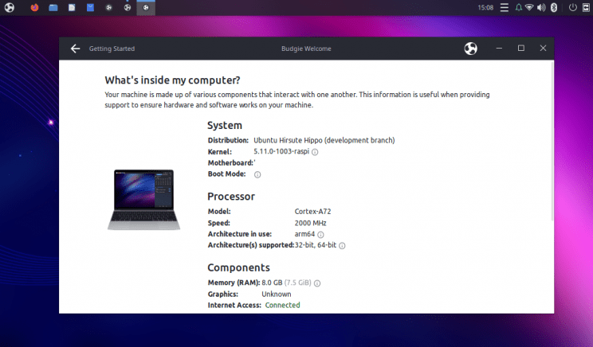
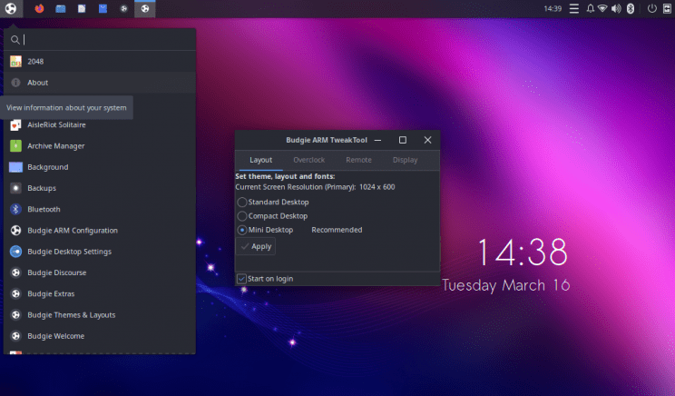
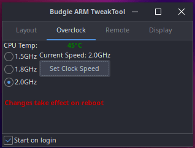
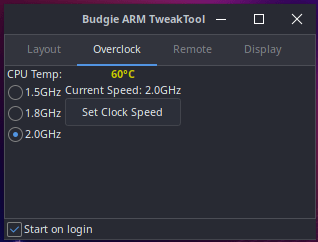
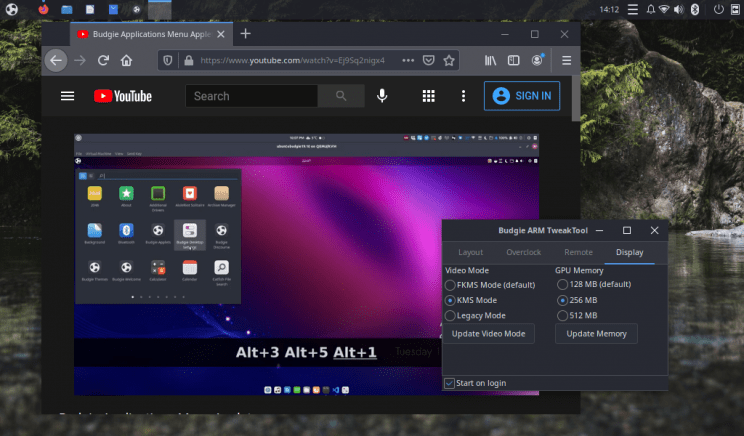
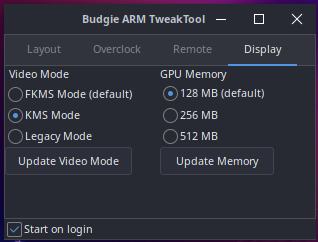
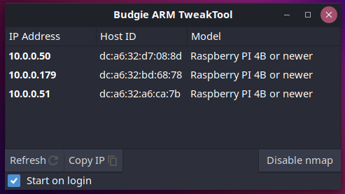
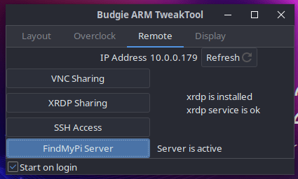

\[caption id="attachment\_2070" align="alignnone" width="744"\] Systeminfo\[/caption\]

# Ubuntu Budgie v21.04 Raspberry Pi 4 Release: 22nd April , 2021

**Beta 1**

This is our very first Raspberry Pi image of Ubuntu Budgie. Team member Sam Lane has been actively creating this and we as a team hope you enjoy his efforts and ideas.

In these release notes the areas covered are:

- Budgie ARM Configuration Tool
- Raspberry Pi Remote Options
- FindMyPi
- Known Issues
- Where to download Ubuntu Budgie

## Summary

Ubuntu Budgie is the sum of many hundreds of developers working together.

21.04 is a large release in itself and we'll describe the desktop release in separate release notes.

Here we describe what we have done for Ubuntu Budgie on a Raspberry Pi.

We recommend this image for a **Raspberry Pi 4 & 400 with 4/8Gb Ram 32Gb SD Card**. Whilst the image can be installed on older variants we do not recommend it. Best use other more suited images for these lower powered Pi's. The image can be installed on a connected SSD.

The team recommends using **KMS** graphics for direct access (attached displays) and **FKMS** for remote access

## Budgie ARM & Pi Configuration Tool

Central to Ubuntu Budgie on a Pi 4 is our ARM & Pi Configuration Tool. This provides key customisation capabilities for the unique aspects of Pi usage.

- Compact and Mini Layouts – these layouts will optimize the font sizes and menus to allow a full Ubuntu Budgie experience on low resolution screens.

\[caption id="attachment\_2060" align="alignnone" width="744"\] Compact\[/caption\]

\[caption id="attachment\_2065" align="alignnone" width="744"\] Mini Layout\[/caption\]

- Overclocking - easily switch between 1.5GHz, 1.8GHz, and 2.0GHz CPU speeds. Clock speed and over\_voltage will be adjusted automatically (reboot required)

\[caption id="attachment\_2068" align="alignnone" width="744"\] Overclock3\[/caption\]

- CPU temp monitor - shows the current temperature, color coded green, yellow, and red to warn of overheating and throttling
    
    \[caption id="attachment\_2066" align="alignnone" width="318"\] Overclock\[/caption\]
    

\[caption id="attachment\_2067" align="alignnone" width="318"\] Overclock2\[/caption\]

- Change Pi video modes - select between FKMS (default), KMS (recommended and continually developed), and legacy (llvmpipe) video modes

\[caption id="attachment\_2061" align="alignnone" width="744"\] Display Modes\[/caption\]

- GPU memory adjustment - while typically not needed, you can select between the default 128MB, 256MB or 512MB GPU memory options.

\[caption id="attachment\_2062" align="alignnone" width="318"\] Display Options\[/caption\]

## Raspberry Pi Remote Options

- SSH and VNC - easily enable VNC screen sharing and SSH to access your Pi via gnome-remote-desktop
- XRDP service - XRDP can be installed and properly set up to allow remote access. Please note, the same user account cannot be logged in remotely and locally simultaneously, however different user accounts can be

\[caption id="attachment\_2069" align="alignnone" width="744"\] Remote\[/caption\]

\[caption id="attachment\_2071" align="alignnone" width="744"\] Vnc\[/caption\]

- Remote tab will display the Pi’s current IP address to provide easier access

## FindMyPi

- FindMyPi - using the configuration app on a machine other than a Raspberry Pi will scan the current network and show a list of IP addresses for Pis detected. Click the "Enable nmap" button to install the scanning tool `nmap`. You do not need the Arm & Pi configuration app running on the Pi 4 if using nmap.

\[caption id="attachment\_2063" align="alignnone" width="493"\] Findmypi\[/caption\]

Look for this in your Menu via the regular 21.04 desktop image (it is preinstalled).

- For locations or networks where nmap may not be legally used to scan a network (e.g. certain workplaces/government locations), the Configuration Tool running on a Pi can enable a fallback UDP server to allow locating Pis on the network. Thus do use the "Start on login" option if using this fallback option to ensure the Pi can be found on boot.

\[caption id="attachment\_2064" align="alignnone" width="425"\] Findpiserver\[/caption\]

## Current known issues

- the graphics are slightly glitchy under the default fkms. We recommend using the KMS mode for direct access displays and fkms for remote access.
    
- nmap via the budgie-arm-environment app installed on Intel/AMD does not work on first install. Do run an update first and reboot.
    

## Downloads

Our image is located on SourceForge - options to install are found on our Downloads page
