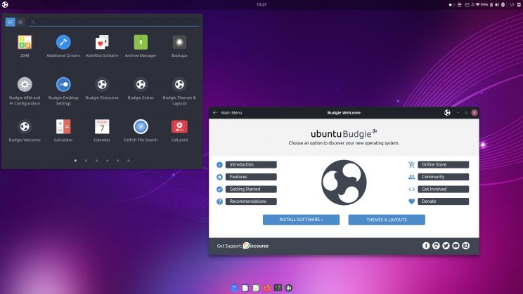
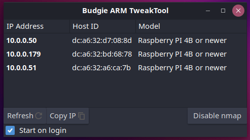
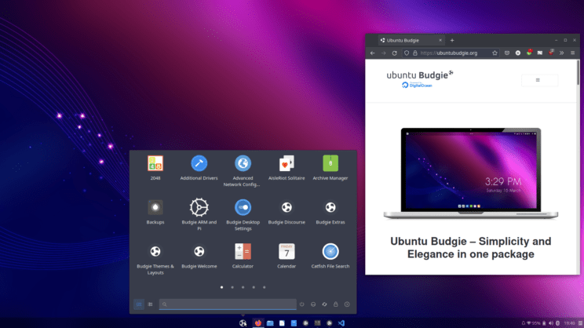
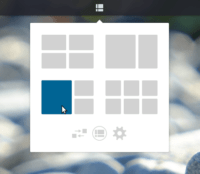
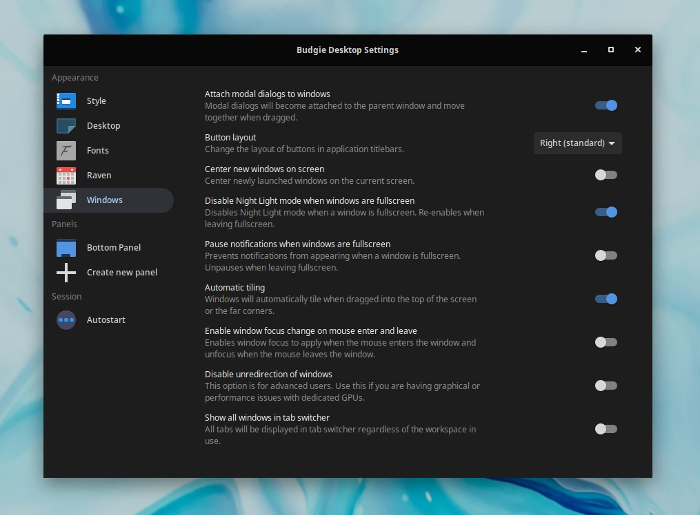

#### Ubuntu Budgie v21.10 (Impish Indri) Release: 14th Oct, 2021

Ubuntu Budgie 21.10 is a normal release that will be supported for 9 months until Jul 2022. Long Term Releases such as 20.04.3 provide assured stability over a longer term (3 yrs) than a standard 9 month release. Critical and stability fixes will be released for all the supported Ubuntu Budgie components; these will be undertaken by ourselves, Canonical and the wider Ubuntu community.

In these release notes the areas covered are:

- New features and enhancements
- Upgrading from 20.04.3/21.04 Ubuntu Budgie
- Known Issues when upgrading
- Where to download Ubuntu Budgie



## Summary

Ubuntu Budgie is the sum of many hundreds of developers working together. For 21.10 your Ubuntu Budgie team have primarily concentrated on our window management system called Shuffler and we are very excited to share the great new features

For 21.10 we now have also produced our second Raspberry Pi 4 image – this has continued to be refined. Do checkout the [README](https://sourceforge.net/projects/budgie-remix/files/budgie-raspi-21.10/) – the optional optimisations really make a difference with a 8Gb Raspi model.



Budgie Desktop has now been uplifted to v10.5.3. We are pleased as a team to have contributed to this release – the results from the whole budgie developer community really shows in 21.10

… and for fun we now include a Windows 11 like optional layout.



Our desktop has been refreshed – we now sport a revamped dark theme with GTK+4 support. Windows Shuffler now auto-moves and arranges windows.

https://www.youtube.com/watch?v=NPjxmY\_OAGo

Taken together, all the smaller changes plus the larger enhancements shapes our distro to be fully flexible and customisable to your workflow; with sane defaults to provide a first rate experience from the get-go.

## Applets and mini-apps

Summary of changes:

1. Lots of updated translations from our brilliant translators [https://www.transifex.com/ubuntu-budgie/](https://www.transifex.com/ubuntu-budgie/)
2. Fix for spamming the syslog when previews was enabled but end-user was logged into a wayland desktop session
3. Fix for WIndow Shuffler layouts executable installation path to work on stateless distros
4. Window Shuffler Control has been completely revamped and redesigned

<figure>


<figcaption>

Shuffler Control  

</figcaption>

</figure>

5\. Window Shuffler now includes an applet to (re-) arrange and automatically move windows, either a single window or a group of windows.

<figure>



<figcaption>

Shuffler applet

</figcaption>

</figure>

6\. Shuffler now includes Window Rules – explained here [https://discourse.ubuntubudgie.org/t/testing-21-10-are-you-brave-enough/4897/4?u=fossfreedom](http://budgie.org/t/testing-21-10-are-you-brave-enough/4897/4?u=fossfreedom)

https://www.youtube.com/watch?v=a5GbdLnXqLM

7\. Shuffler Window rules now allow you to open application windows on specific workspaces

<figure>


<figcaption>

Rules

</figcaption>

</figure>

  
8\. Applications Menu – Calculator now shows a visual hint how to copy the result to the clipboard. Try it – press Super then enter 2+2

9\. Applications Menu – transition from Grid to List modes is now a fade rather than a slide animation

10\. We no longer install the elementary gsettings schema – this ensures we don’t clash with a pantheon install. The elementary schema entry is now found in the budgie applications schema.

11\. Some themes space the category list oddly. We now have a user configurable override (adjust category spacing) in the applet settings allowing you to control the spacing.


12\. Fix where after connecting to a VPN spinner cursor was still showing

13\. Budgie Calendar Applet changes: Handle correctly the display of AM/PM when using custom date formats. Also backported to 20.04/20.10

14\. Budgie Calendar Applet changes: Select the current date when opening the popover. Also backported to 20.04/20.10

15\. Budgie Calendar Applet changes: How & Hide current week option. Also backported to 20.04/20.10

16\. v0.7.0 of budgie-indicator-applet has been released. This has a fix (hopefully) for any appindicator that used to display big/huge icons

17\. New applet called CPU Temp that displays the temperature of various sensors. It has been backported to 20.04, 20.10 & 21.04 as well.


18\. Thanks to contributor Akira ([https://github.com/AkiraMiyakoda](https://github.com/AkiraMiyakoda)) budgie-pixel-saver-applet has now received a number of enhancements:

- Drag – drop to unmaximise
- Configurable title theming
- Updates to ensure work with arc-theme
- Increase configurable title width to 200px
- Allow right alignment of title
- revamped theming support for window controls
- new style class "pixelsaver" to aid theme maintainers

These changes are now available in 20.04/21.04 & 21.10

19\. VisualSpace – we now display a hint when you open the popover – scrolling over the panel icon changes the workspace.

20\. Brightness Controller has now been reworked to use GNOMEs dbus control … so this should be all distro friendly and will reflect accurately the same Power slider in GNOME Settings.

## Budgie Desktop

[Budgie 10.5.3](https://github.com/solus-project/budgie-desktop/releases/tag/v10.5.3) is a minor release that introduces fixes for bugs, various quality-of-life improvements, and support for the GNOME 40 stack.

### Bug Fixes and Cleanup

Budgie 10.5.3 introduces fixes to Budgie panel applets, Raven, and various window state tracking.

- Drop use of Queue and Cancellable in Raven’s NotificationView.
    - Instead of using a Queue (which is not thread safe anyways), just update a reference to a NotificationWindow since we only really cared about the head of the Queue to begin with.
    - Dropped Cancellable usage for async pixbuf scaling. There has not really been a scenario yet where we have not been able to scale an icon within the amount of time before a NotificationWindow is removed.
- Fix application icons not scaling in Raven’s Notification Group headers.
- Fix issue with VirtualBox icon not being displayed in IconTaskList applet
- Fix regression in Budgie Desktop Settings icon handling.
- MPRIS metadata, playback status, and CanGoPrevious / CanGoNext fetching is now performed immediately rather than being an unnecessary idle operation.
- Notifications now use a high priority timeout.
- Notification iconography now uses a consistent `IconSize.DIALOG` instead of `IconSize.INVALID` and only scales if the icon provided is not already the desired height.
- Prevent Budgie Desktop Settings from being pinned via drag-and-drop, fixing an issue where Budgie Desktop Settings was inadvertently pinnable and unable to be unpinned.
- Sound Indicator applet and Raven
    - Use standard mute/unmute methods, fixing issues like muting with media keys and then trying to unmute via the applet, which would previously not work.
- System Tray applet
    - Fix issue with KeePass causing panel segfaults.
    - Various stability improvements, such as more proactive X11 error trapping.

### GNOME 40 Support

Budgie 10.5.3 introduces support for the GNOME 40 stack. GNOME 40 introduced various changes in Mutter, gsettings-desktop-schemas, and gnome-shell which impacted the ability to use Budgie under a GNOME 40 stack or in conjunction with GDM (GNOME’s login manager which leverages gnome-shell).

When compiled alongside GNOME Settings Daemon 40.x, Budgie will use the migrated font anti-aliasing and hinting options, which were moved from `org.gnome.settings-daemon.plugins.xsettings` to `org.gnome.desktop.interface` . In [GNOME Shell](https://gitlab.gnome.org/GNOME/gnome-shell/-/commit/af5aff32514d7236d3261670a5ed0c087ee3abdd) and [GNOME Settings Daemon](https://gitlab.gnome.org/GNOME/gnome-settings-daemon/-/commit/f7702421321ff8aeeb2aad26afefee997b63e938) 40, there were changes introduced which impacted Budgie’s ability to use dedicated screensavers, such as gnome-screensaver (which we have been using since 2017). As always, we encourage that Budgie be used with lightdm and an optional greeter such as slick-greeter, as opposed to being installed alongside GDM and GNOME Shell where locking the screen is very hit-and-miss.

### Quality-of-life Improvements

<figure>



<figcaption>

Budgie Desktop Settings

</figcaption>

</figure>

Here are some quality-of-life improvements shipping in Budgie 10.5.3

- Filter out audacious notifications so they do not clutter up Raven.
- Hide “Default”, which is typically Adwaita / GTK’s internal theme. We continue to encourage the use of theming that officially supports Budgie, such as Materia and Plata.
- Mutter and WM preference schema settings are now only applied for Budgie session.
- Spacing is now configurable in the Status applet.
- The application fullscreen state tracking has been slightly rewritten to use the window XIDs, only call our track window state function on specific flags in the changed or current state, and reducing instances where some unset flags would not result in the application being removed as a fullscreen application.
- There is now an option in Budgie and exposed via Budgie Desktop Settings’ “Windows” section to automatically pause notifications when a window is fullscreen and unpause when there no longer is a fullscreen window. This is useful in reducing distractions when gaming or watching content!
- To improve the default user experience of Budgie on some downstream operating systems such as Arch Linux, Budgie now ships with a default wallpaper, eliminating the need for downstreams to apply supplemental changes or ship a wallpaper package.
- We will no longer filter device added / removed notifications. This resolves issues where ejection notifications for external media would not get stored in Raven’s Notifications section.
- When `xdotool` is available on the operating system, the Lock Keys applet can be clicked to toggle CapsLock and NumLock!

## Raspberry Pi

Changes for 21.10:

1. Added support for the Compute Module 4 board
2. Add `--force-arm-mode` command line option
3. Add `--force-findpi-mode` command line option
4. Add `--force-model modelname` command line option
5. Add `--model modelname —cpuinfo “CPU String to Match”`
6. Disable buttons and provide hint on Display tab if pibootctl is not found
7. Disable buttons and provide hint on Overclock tab if no ‘/boot/firmware/config.txt’
8. Enhanced the various option discoverability by using mouse hover and displaying a hint in a ‘status area’

## Themes

1. Snaps have been produced for [QogirBudgie](https://snapcraft.io/gtk-theme-qogirbudgie) and [Pocillo](https://snapcraft.io/gtk-theme-pocillo) GTK Themes – this means you can now theme snaps that are themable
2. GTK+4 compatible version of WhiteSur available in Makeovers – backported to 20.04/20.10 & 21.04. Available to install on 21.10
3. GTK+4 compatible version of QogirBudgie available in Makeovers
4. GTK+4 compatible version of Vimix Theme available in Makeovers – backported to 21.04 and available to install on 21.10
5. GTK+4 compatible version of Mojave Theme available in Makeovers – backported to 21.04 and available to install on 21.10
6. GTK+4 compatible version of Pocillo Theme available
7. Updated our default Pocillo icon theme with lots of new icons
8. Updated Whitesur icon theme with lots of new icons

## Budgie Welcome

1. Lots of updated translations from our brilliant translators [https://www.transifex.com/ubuntu-budgie/](https://www.transifex.com/ubuntu-budgie/)
2. Welcome snap no longer is updated from end-of-support 18.04. A message is now displayed when running on 16.04/18.04 & unrecognised distros
3. Welcome has now been uplifted to core20 (focal) which ensures long-term compatibility with future Ubuntu Budgie versions – this ends all support for 16.04/18.04 (32bit) since it cannot be installed on these legacy versions.

## Additional

1. A couple of fixes to budgie-desktop-environment has been made to make budgie more friendly to other desktop environments / remote access that use dash as the default shell.
2. Nemo Previews now available as a recommended app in Budgie Welcome to allow you to visualise the content of a highlighted file. Just press Space to toggle the viewer in Nemo. Backported to 20.04 & 20.10 as well.
3. IRC links in Budgie Welcome now point to Libera Chat since the Ubuntu family has ended its association with Freenode.
4. We have uploaded v0.8.3 of the Drawing application.
5. The UB teams 21.10 wallpapers are now on the daily ISO. Eclectic as always… enjoy!

6\. Right click on a picture via Nemo has a "Set as wallpaper" menu option. This now has a fix to set both the desktop wallpaper and the lock-screen wallpaper at the same time. Previously only the desktop wallpaper was updated.

7\. GNOME 40 and later utilises the same super alt left/right keys combination to change workspaces that we also need for Shuffler to shift windows. For Ubuntu Budgie we use a gsetting override to revert to keybindings to that as used prior to GNOME 40.

### Areas to look out for

1. Kernel 5.13 is now the default in impish. Do look out for this – remember its the key part of any linux distro so issues need to be reported … not worked around! [https://launchpad.net/ubuntu/+source/linux](http://pad.net/ubuntu/+source/linux)
2. Note – from 22.04 Canonical & Mozilla will be enforcing all flavours to swap to using the [snap version of Firefox](https://discourse.ubuntu.com/t/feature-freeze-exception-seeding-the-official-firefox-snap-in-ubuntu-desktop/24210). For 21.10 we will default to the usual Debian package install. **We do encourage all 21.10 users** to start using the snap version now and feedback your finding back to Canonical so that 22.04 will be as problem free as possible. Don’t forget you can [Pocillo](https://snapcraft.io/gtk-theme-pocillo) & [QogirBudgie](https://snapcraft.io/gtk-theme-qogirbudgie) theme all compatible snaps as well.

### KEY FEATURES AVAILABLE TO UB FROM UBUNTU

- Linux kernel v5.13
- GNOME 40 applications and some GNOME 41 applications
- Latest version of LibreOffice 7.2

What does all that mean – most cutting edge yet stable software that brings great benefits for brand new hardware compatibility – including support for the very latest games.

### UB MAINTAINED PACKAGES

Apart from the above (!) UB maintains many Debian packages. New versions available in 21.10 include:

- Arc Theme
- Rhythmbox Alternative Toolbar

### KNOWN ISSUES

If you find that after the upgrade clicking the menu button crashes the panel, then CTRL+ALT+T to open a terminal then run:

```
  nohup budgie-panel --reset --replace &
```

Launching terminal based apps from the menu does not work. Workaround is to fool GLib to assume that a supported terminal (tilix isnt supported) is installed `sudo ln -s /usr/bin/tilix /usr/bin/nxterm`. [](https://eu6.proxysite.com/process.php?d=0ae2pAg9L6aKEgCkK783cLnJIiNR%2Ba1%2FuQAv5jqh1qTSkA%2FbP33RqEfcua%2FWwM%2B0qFr%2BLd2vxObwysPMx9tm56A%3D&b=1)[https://bugs.launchpad.net/ubuntu/+source/budgie-desktop/+bug/1873428](https://bugs.launchpad.net/ubuntu/+source/budgie-desktop/+bug/1873428)

Please read the [Ubuntu Release](https://eu6.proxysite.com/process.php?d=0ae2pA4hO7bLCxOiIPIqYq3DeDga7u1n9AFu%2ByL%2BlKTVyBTWPiDa8FHevK%2Ba18%2FqrUHlOIGrlKKu0MM%3D&b=1) notes which covers issues common to all Ubuntu Flavors.

The raspi image with some types of HDMI monitors hangs on boot. Please note the detail in the Download README link and how to change to fkms to enable booting.

### HOW TO UPGRADE FROM 20.04.3 TO 21.10

Basically you don’t. You should upgrade to 20.10 first, then to 21.04 before then upgrading to 21.10

### HOW TO UPGRADE FROM 21.04 TO 21.10

IMPORTANT: remember to double-check you have the following vital package before you upgrade:

```
sudo apt install ubuntu-budgie-desktop
```

A few days/week or two after the formal release of 21.10 in Oct you will be automatically offered a graphical prompt to upgrade.

Alternatively, from a command line run:

```
update-manager
```

Some of the packages that were installed as part of the Ubuntu Budgie backports PPA (ppa:ubuntubudgie/backports) will be uninstalled as part of the upgrade. Use budgie-welcome to reinstall anything that is removed.

* * *

Please refer to the community wiki for more help:

[https://help.ubuntu.com/community/Upgrades](https://help.ubuntu.com/community/Upgrades)

Also, Ask Ubuntu has an excellent guide to help you upgrade:

[http://askubuntu.com/questions/110477/how-do-i-upgrade-to-a-newer-version-of-ubuntu](http://askubuntu.com/questions/110477/how-do-i-upgrade-to-a-newer-version-of-ubuntu)

### DOWNLOAD

Final release is available here: [https://ubuntubudgie.org/downloads/](https://ubuntubudgie.org/downloads/)

### GETTING SUPPORT

Thanks to the generosity of discourse.org, our support site is the crucial site for all things Ubuntu Budgie.

One to bookmark [https://discourse.ubuntubudgie.org](https://discourse.ubuntubudgie.org)

More information can be found [here.](https://eu6.proxysite.com/process.php?d=0ae2pB8qPbvQCwOkIbs2ZfbCfiobv7I741pxoWC%2BxfjKgBHbNT%2FW8FfU%2Fa6S18motlziON0%3D&b=1)

### INFRASTRUCTURE

We just wanted to thank our infrastructure sponsors who help us keep the lights on.

### [DIGITAL OCEAN](https://www.digitalocean.com/)

On a mission to simplify cloud computing so developers and their teams can spend more time building software that changes the world.

### [DISCOURSE](https://www.discourse.org/)

Discourse is the 100% open source discussion platform built for the next decade of the Internet. Use it as a mailing list, discussion forum, long-form chat room, and more!

### [STATUS.IO](https://status.io/)

Status.io was built to help companies enhance transparency and keep their customers in the loop during downtime. The Status.io platform enables organizations to maintain a customized public system status page, external to their infrastructure, that always displays the current health of their app, website or service.

### [SerpAPI](https://serpapi.com/)

SerpAPI allows you to scrape Google and other search engines from their fast, easy, and complete API.
