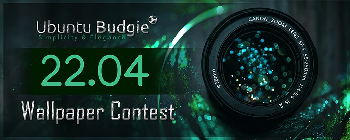

Ubuntu Budgie 22.04 LTS release is just around the corner, as the team is rushing to complete the last few tasks, I want to take a moment to write about my amazing experience with both our community and Ubuntu Budgie team.

## Contest Starting in 3...2...1...

In November 2021, I posted about our wallpaper contest for 22.04 LTS release. If you want to check it, you can have a look at [this discourse post](https://discourse.ubuntubudgie.org/t/ubuntu-budgie-22-04-wallpaper-contest/5501 " this discourse post ")

This was my first community powered wallpaper contest, and honestly I was not expecting such an incredible response from our community. There were some amazing submissions, actually so many great pictures that it took us quite a while to sort them, filter by resolution and quality, and get them ready for the contest.

## Pictures Quality and noise issues

As we were arranging pictures, we noticed that a few had a very high amount of noise, and even if those were awesome pictures with great resolution, looking at them from a 4K monitor was less than ideal.

As I said, some of those pictures were really good. So good that we did not want to disqualify them from our contest just because of some noise. David and Jacob tried to run some denoise filters with various applications, but the result was less than ideal, as noise was replaced with blur.

As we were losing hope, our team member Nikola came to the rescue. He fired up some magic, AI-powered photo software, ran all the pictures through it and after a few hours, we got the processed pictures. So far, this project has been full of surprises. We immediately saw that most of the noise was removed or greatly reduced, and all pictures looked great even on our ultra-wide and 4K monitors. What an excellent example of good use of AI software.

## Challenging times with pictures selection

With renewed energy, Jacob and I continued with our work. Nothing could stop us, we were energized, happy, and motivated. The task at hand was simple, we were to select 10 pictures. Wait, what? Ten? We soon realized that our mission looked simple, but it was quite an impossible one. I started with 24 pictures, Jacob had 29, and we thought we did not want to remove any.

Our great momentum stopped, we soon called for a video chat, where it was mostly Jacob and myself scratching our heads and trying to justify why we could not remove this or that picture.

So many great submissions, so much effort from our beloved community, how could we? How could we betray and disappoint them, by removing the great pictures they sent us? This was not working. We got stuck.

Then, after a bit of mumbling and grumbling, we finally decided to change our approach. How about we don't consider discarding pictures, but voting for the best ones? Let's for a moment pretend they all make it into the wallpaper list, just pick the ones we like the most.

That sounded like a more positive approach, and soon the discussion was started. First, we needed a bit more variety. We noticed we had quite a few landscapes, a few macro pictures of flowers and insects. But we had too many with green backgrounds and definitely too many with water.

It was Jacob's time to rescue us this time. He is also a hobbyist photographer, and he allowed us a few of his pictures. He happened to have a couple that were very different in both subject and colors, from our community submissions. Perfect! On top of that, Jacob made it very clear from the start that he was not participating in the contest, he only wanted to help but not take any prize.

Finally we had a very good selection with nice variety. Then, Jacob came up with a good plan. Both of us had to choose 16 of the pictures we liked the most. We would both vote for our favorite pictures, with heavier weight for the ones we liked the most, downwards. We combined our selections, ran the numbers, and surprisingly we agreed with quite a few of the pictures in our respective lists. From final results, we still had 16 which was still too much compared to the target of 10.

Oh, reality is bad sometimes, did we have to keep eliminating 6 awesome pictures? I admit that last part of the project was the hardest. When we reached 12 pictures, we had nowhere left to go. Nothing we were willing to give up and remove from our wallpaper selection.

## Mutiny!

This time it was my turn to have a brilliant idea. How about we keep 12 and don't tell David? After all, he might just not notice the difference between 10 and 12, such similar numbers. And developers are not that good with math anyway.... Hmm, I felt somehow my logic was not very sound, but we tried nonetheless.

Well, our deception did not last long, as David noticed the difference immediately. However we had a few excuses lined up and we managed to convince him our choice was the best.

Actually, it is more likely that David was tired of listening to our blabbering, and being the awesome guy he is, he granted our wish. 22.04 will have 12 pictures in its wallpaper list. On top of that, since we had so many awesome images, David suggested we should also gift sticker packs to all the artists that had pictures selected.

## Contest winners

Time to roll the drums, here we are with our final selection:

And the winners are:

- **1st place:** Sigisagi
- **2nd place:** Marxpresso
- **3rd place:** Gregor
- **4th place:** Bakpaul
- **Special guest:** Jacob

## Honorable mentions

A few honorable mentions, we would like to thank all artists that submitted awesome pictures we loved: Frossty, S12wu, Eizen, MLampner, Radugalan, Puffettacicciottella, Coeur-Noir, NeonDemon318, Storm, Raxelgrande.

## Contest rewards and conclusion

Per our initial discourse post, 1st place will receive US$50 worth of merchandise from Ubuntu Budgie store. All other winners and our special guest, will get a sticker pack from our Ubuntu Budgie store.

Last but not least, all participants of this contest that submitted pictures, do get Ubuntu Budgie team's gratitude. Thank you all for being awesome. You all had great pictures and allowed us to run them through our contest. If your picture was not selected, don't feel too bad. We had a very hard time choosing only twelve from so many excellent pictures. Our recommendation for next contest, is to check picture resolution, noise, and variety.

This was a great community project. I can't wait for our 22.04 LTS to be out, so we can show off our community's beautiful wallpapers.
