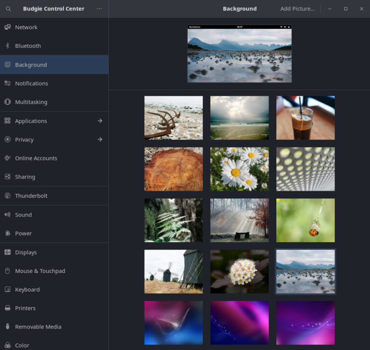
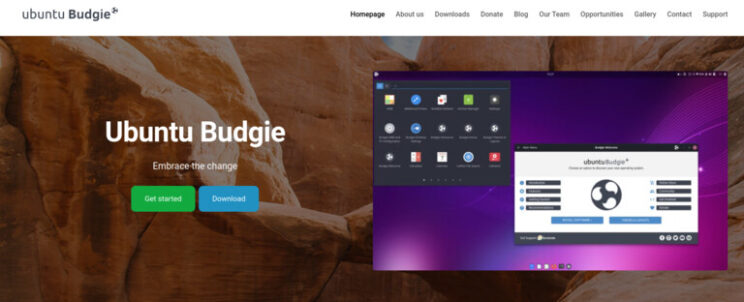

## Introduction and overview

Ubuntu Budgie 22.04 LTS (Jammy Jellyfish) is a Long Term Support release with 3 years of support, from April 2022 to April 2025.

Ubuntu LTS releases are focused on long term support, therefore stability is more important than having latest and greatest version of kernel, desktop environment, and applications.

In these release notes, we are going to cover the following items:

- Release schedule
- New features and enhancements
- Upgrade from 20.04 LTS
- Upgrade from 22.10
- Where to download Ubuntu Budgie daily, beta and final releases
- Infrastructure Sponsors

If you are upgrading from 20.04 LTS we have a [dedicated release note](https://ubuntubudgie.org/2022/04/ubuntu-22-04-release-notes-for-20-04-upgraders/ "dedicated release note") for you.

## Release Schedule

Release schedule is outlined below here. If you want to learn more, please see Release planning and scheduling, shared by Canonical on this post [https://discourse.ubuntu.com/t/jammy-jellyfish-release-schedule/23906](https://discourse.ubuntu.com/t/jammy-jellyfish-release-schedule/23906)

- March 28: Beta Freeze, Hardware Enablement Freeze.
- March 31: Beta.
- April 07: Kernel Freeze, Non Language Pack Translation Deadline.
- April 14: Final Freeze, Release Candidate, Language Pack Translation Deadline.
- April 21: Final Release.
- August 04: 22.04.1 Point Release.

## New Features and Enhancements

### Applets and mini-apps

\[caption id="attachment\_2703" align="alignnone" width="744"\] Budgie Desktop Settings: Hotcorners Applet\[/caption\]

- Lots of updated translations from our brilliant translators: Transifex [https://www.transifex.com/ubuntu-budgie/](https://www.transifex.com/ubuntu-budgie/)
- Latest version of budgie-calendar-applet (also backported to 22.04/21.10)
- Budgie-indicator-applet has now swapped to support ayatana-indicators. This is the new upstream of the original ubuntu indicators.
- ayatana-indicator-applet can be installed - this integrates with Evolution & Thunderbird (with the evolution plugin) to display appointments and calendar events
- ayatana-webmail can be installed - this displays notifications in plank when an email is received.
- budgie-applications-menu-applet: This has the following enhancements from upstream.
    - App context menu available when right click from search results
    - Reads the PrefersNonDefaultGPU setting from .desktop files and uses that to automatically configure default or non-default GPU
    - Adds a new context menu to support choosing the other GPU (integrated if PrefersNonDefaultGPU is set to true, discrete if key not present or its set to false)
    - Categories have been slimmed down - less apps should default to the “Other” category -When searching, Nemo bookmarks are also displayed in the search results
- Shuffler Control animation when switching tabs is now the same as budgie-desktop-settings & the app-menu so that we have a consistent look and feel
- SDXC card and such like now appears in DropBy … so the popup prompt will appear when such a card is inserted in the same way as a USB drive & stick
- Hotcorners now has an option to “delay” the activation of a hotcorner as well as invoking via “pressure” - i.e. how quickly you pushed your cursor into the corner. This will be useful for those touchpads that doesn’t have the sensitivity to allow for the extant pressure option.
- Budgie Previews, Budgie Quickchar and Budgie Window Shuffler now appear in GNOME-Software with meaningful descriptions and pictures.
- Quicknote pop-up correctly retains its scroll-position so no need to keep scrolling up and down to find text you previously was looking at.
- Fix crash with shuffler when an application window disappears when using invoking shuffler actions.
- Quickchar gets a nice new app icon to view in the menu.
- Applications menu category view now defaults to 6px which gives a less squashed look for most themes - this can be configured via the applet settings.
- Budgie Trash Applet has a number of fixes and enhancements:
    - Support multiple file drag and drop to panel icon.
    - Show trash full icon when there are items in trash.
    - Open trash folder instead of popup when > 100 items.
    - Fix paths with certain characters not restoring correctly.

### Budgie Desktop

\[caption id="attachment\_2702" align="alignnone" width="744"\] Budgie Control Center\[/caption\]

- Our default layout has changed slightly. The icons in the panel now have additional spacing to ensure we no longer have a cramped look-and-feel. The appindicator applet is now at the beginning of the right ride block of icons. To see this if you are upgrading you will need to reset your panel: `nohup budgie-panel --reset --replace &`
    
- RISCV64 support has now been enabled for this up-and-coming architecture [https://discourse.ubuntubudgie.org/t/testing-22-04-are-you-brave-enough/5461/56](https://discourse.ubuntubudgie.org/t/testing-22-04-are-you-brave-enough/5461/56)
    
- Our plank-preferences menu option no longer appears in GNOME Software - this will ensure users of other desktop don’t accidentally install this together with budgie!
    
- Budgie Desktop 10.6 has been released - [https://github.com/BuddiesOfBudgie/budgie-desktop/releases/tag/v10.6](https://github.com/BuddiesOfBudgie/budgie-desktop/releases/tag/v10.6)
    
- GNOME Control Center AKA Settings has now been hidden from the menu. New from budgie 10.6 is our Budgie Control Center (via the menu) to control all budgie relevant control & device settings.
    

### Raspberry PI

The 22.04 Pi4 beta image is now available. This includes all the updates from the desktop image described in the release already including the firefox snap and theming changes. For the beta we have hidden the VNC option in the Pi app since GNOME have removed that capability in GNOME 42. We will be investigating the way-forward. In the interim we recommend the GNOME 42 RDP option available through the Pi App

### Themes and Wallpapers

\[caption id="attachment\_2701" align="alignnone" width="744"\] Ubuntu Budgie 22.04 Wallpapers\[/caption\]

- 22.04 wallpapers are available on daily iso. If you want to learn more about our wallpaper contest, [check our blog post](https://ubuntubudgie.org/2022/02/ubuntu-budgie-22-04-wallpaper-contest/ "check our blog post").
- GTK+4 compatible version of Arc Theme available in Makeovers.
- Latest version of WhiteSur icon theme available in Makeovers - backported to 20.04/21.10.
- Latest version of WhiteSur GTK theme available in Makeovers - backported to 20.04/21.10.
- Pocillo Gtk Theme has the following fixes
- Displays correctly the keyboard indicator applet for the dark-theme when CAPS/NUM lock is active.
- QogirBudgie Gtk Theme has been refreshed from upstream
- Pocillo icon theme has been refreshed from upstream tela-icon and qogir icon sources.

### Budgie Welcome

\[caption id="attachment\_2705" align="alignnone" width="744"\] Budgie welcome application\[/caption\]

- Lots of updated translations from our brilliant translators: Transifex [https://www.transifex.com/ubuntu-budgie/](https://www.transifex.com/ubuntu-budgie/).
- Welcome snap updated to install 22.04 budgie-extras etc.
- Welcome snap includes a snapshot of the community developed gaming page. Please do get involved to shape this Community project: Ubuntu Budgie Gaming [https://discourse.ubuntubudgie.org/t/community-project-ubuntu-budgie-gaming/5225](https://discourse.ubuntubudgie.org/t/community-project-ubuntu-budgie-gaming/5225).
- MS Edge web-browser now available to be installed in the browser ballot (Getting Started).
- In the Getting Started - ballot browser - the Brave deb repository is an install option alongside the snap install.
- For 22.04 there is a new Chrome OS like layout available via budgie welcome.
- For 22.04 the deb version of Firefox has been removed since only the snap is now available.
- Canonical’s Firefox ESR (extended support release) PPA is now a browser option for all supported released.

### Mesa

Late breaking for 22.04 is the inclusion of mesa 22. If you don’t know what mesa is - it is the 3d graphic layer that translates graphics requests to your graphics driver. A few important points about this change:

- This is really great news for Gamers - the latest vulkan stuff comes automatically so the latest and greatest games now and in the future have a great base to work from 22.04.

### Additional

- Catfish is no more. We have now dropped this as part of the default install. There should no longer be a catfish rightclick option in the nemo file-manager. File name search & file content search is available via nemo itself.

## Upgrading from previous releases

It is important to keep in mind a few useful tips before attempting a release upgrade:

- Backup your data.
- Install all available updates and reboot.
- It is always a good idea to run either a full system snapshot with Timeshift, to a secondary drive, or a full system image using Clonezilla.
- If you have PPAs that come with updated kernel, mesa, GPU drivers, it is better to purge those PPAs and reboot before attempting release upgrade.
- Once release upgrade starts, all your PPAs will be disabled. If you rely on important software from PPAs, it is better to manually check if those are updated for upcoming release of Ubuntu.
- After upgrade is completed, remember to go to software sources, change release name on your PPAs, enable them and refresh package cache.

### Scheduled upgrade from 20.04 LTS

Users of Ubuntu Budgie 20.04 LTS will be prompted to upgrade to new 22.04 LTS version, but not right away. LTS versions are focused on stability, therefore release upgrades are not proposed as soon as latest LTS is released.

Users of 20.04 LTS will be prompted to upgrade a little bit later, when 22.04.1 LTS is released in August 2022. This is a very safe and sensible approach for those that value stability.

### Scheduled upgrade from 21.10

Users of 21.10 interim release will be prompted to upgrade a few days or weeks after 22.04 LTS is available.

### Manual upgrade from 20.04 or 21.10

For those that don't want to wait, it is possible to trigger manual upgrade by hand. If you are interested, check latest and up to date [22.04 upgrade procedure on Ubuntu Wiki](https://help.ubuntu.com/community/JammyUpgrades "22.04 upgrade procedure on Ubuntu Wiki").

## Where to download Ubuntu Budgie daily builds and final releases

\[caption id="attachment\_2708" align="alignnone" width="744"\] ubuntubudgie.org\[/caption\]

### Daily and Beta builds

Ubuntu Budgie daily builds for AMD64 architecture are available here: [http://cdimage.ubuntu.com/ubuntu-budgie/daily-live/current/](http://cdimage.ubuntu.com/ubuntu-budgie/daily-live/current/)

Ubuntu Budgie beta build for RaspberryPI is available here: [https://sourceforge.net/projects/budgie-remix/files/budgie-raspi-22.04/](https://sourceforge.net/projects/budgie-remix/files/budgie-raspi-22.04/)

### Final Releases

Links to download final releases, as well as installation instructions, will be available on our Ubuntu Budgie website once Final Release is built: [https://ubuntubudgie.org/downloads/](https://ubuntubudgie.org/downloads/).

## Known Issues

- Some app icons remain in the icon-task-list - e.g. steam/discord after opening.
- For more generic issues with Ubuntu 22.04, please check this link: [Ubuntu 22.04 Release Notes](https://discourse.ubuntu.com/t/jammy-jellyfish-release-notes/24668 "Ubuntu 22.04 Release Notes").

## Infrastructure Sponsors

We just wanted to thank our infrastructure sponsors who help us keep the lights on.

### Digital Ocean

On a mission to simplify cloud computing so developers and their teams can spend more time building software that changes the world.

### Discourse

Discourse is the 100% open source discussion platform built for the next decade of the Internet. Use it as a mailing list, discussion forum, long-form chat room, and more!
