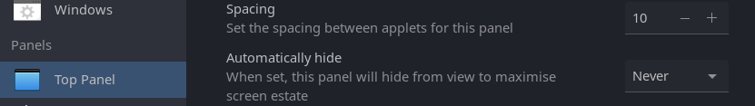
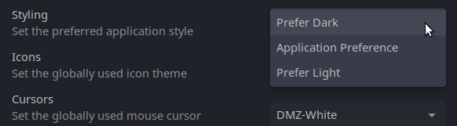

## Introduction and overview

Ubuntu Budgie 22.10 (Kinetic Kudu) is a normal release with 9 months of support, from October 2022 to July 2023.

Ubuntu LTS releases are focused on long term support. If stability is more important than having the latest and greatest version of the kernel, desktop environment, and applications then Ubuntu Budgie 22.04 LTS is perfect for you.

In these release notes, we are going to cover the following items:

- Release schedule
- New features and enhancements
- Upgrade from 22.04 LTS
- Where to download Ubuntu Budgie daily, beta and final releases
- Infrastructure Sponsors

## Release Schedule

If you want to learn more, please see Release planning and scheduling, shared by Canonical on this post [https://discourse.ubuntu.com/t/kinetic-kudu-release-schedule/27263](https://discourse.ubuntu.com/t/kinetic-kudu-release-schedule/27263)

## New Features and Enhancements

## Applets and mini-apps

1. Lots of updated translations from our brilliant translators [https://www.transifex.com/ubuntu-budgie/](https://www.transifex.com/ubuntu-budgie/)
2. bug-fix - wallstreet accepts custom folder with spaces
3. Traditional layout now reflects the default 'v10.7' layout upstream - use budgie welcome to apply this layout (see below)

## Budgie Desktop & Budgie Control Center

1. New upstream budgie-menu (traditional layout) with places, control-center and settings access buttons 
2. Sharing capabilities in BCC have been revamped - screensharing can now be performed via both RDP & VNC
3. Fractional scaling support has been enhanced - backported to 22.04
4. Lots of wacom support updates made in BCC
5. color profile support in BCC reworked and only supported if the monitor used itself supports color-profiles
6. BCC Displays show the monitor refresh rate
7. Applets can now be globally spaced rather than needing individual spacers 
8. Refinements to the workspace applet
9. Clock applet no longer displays a link to a calendar application
10. Complete reworking of the Budgie in-built theme
11. Icon-tasklist applet no longer supports non-grouping of apps
12. v10.6.4 budgie-desktop is the version that we ship with together with a whole host of extra goodies. Upstream has full details as to what 10.6.4 consists of: [https://blog.buddiesofbudgie.org/budgie-10-6-2-released/](https://blog.buddiesofbudgie.org/budgie-10-6-2-released/) [https://blog.buddiesofbudgie.org/budgie-10-6-3-released/](https://blog.buddiesofbudgie.org/budgie-10-6-3-released/) [https://blog.buddiesofbudgie.org/budgie-10-6-4-released/](https://blog.buddiesofbudgie.org/budgie-10-6-4-released/)
13. In addition we have added a native screenshot capability - look for the icon in the menu - or just press print screen / alt print screen etc etc.  
14. We have added the ability to use the "preferred style" option in budgie-desktop-settings desktop so that you can set the dark-light style of those GNOME 42 & libhandy based apps. This latter capablity will evolve as upstream works through various issues in this area. 
15. IBUS handling has been revamped to resolve the wrong keyboard layout on logon. This needs careful testing especially for those that use multiple keyboard layouts.

## Raspberry Pi

Beta release [https://sourceforge.net/projects/budgie-remix/files/budgie-raspi-22.10/](https://sourceforge.net/projects/budgie-remix/files/budgie-raspi-22.10/)

This release has all the new and changed updates described in this release note.

## Budgie Welcome

Our welcome app is automatically updated for all 20.04, 22.04 & 22.10 users

1. Lots of updated translations from our brilliant translators [https://www.transifex.com/ubuntu-budgie/](https://www.transifex.com/ubuntu-budgie/)
2. Our Backports is now complete - testing of budgie-welcome recommendations/themes and applets/getting started is needed.
3. Menu Option and welcome page changed from "Budgie Themes & Layouts" to "Budgie Makeovers & Layouts" to present a more accurate overview of the capability.

## Themes

1. Orchis Gtk Theme has been update to the latest upstream version. Note - upstream has changed its name convention for each variant & colour. So on an upgrade you have to manually change your theme name when you re-add the backports PPA
2. Pocillo Gtk Theme has the following fixes: fixes for styling mate-system-monitor fixes for styling atril pdf reader fixes for styling mate-calculator

## Additional

1. Pulseaudio is no longer our default audiostack. Pipewire is now the default. The package `pulseaudio` can safely be purged.

## Areas to look out for

1. Our default applications have been revamped - This is described fully in this post [https://discourse.ubuntubudgie.org/t/default-applications-review-for-22-10-23-04-and-beyond/5883?u=fossfreedom](https://discourse.ubuntubudgie.org/t/default-applications-review-for-22-10-23-04-and-beyond/5883?u=fossfreedom) and outlined here:
    
    - GNOME-Calculator → Mate Calc
    - GNOME-Calendar → drop from the install
    - GNOME-Maps → drop from the install
    - GNOME System Monitor → Mate System Monitor
    - Evince → Atril
    - File Roller aka GNOME Archive Manager → leave as is and monitor
    - Deja-Dup backup tool → leave as is and monitor
    - GNOME Screenshot → drop from the install
    - GEdit text editor → undecided
    - GNOME Font Viewer → font-manager
    - Cheese → guvcview or webcamoid
    - Celluloid → Parole
    - gThumb → leave as is and monitor
    - GNOME Log → leave as is and monitor
    - GNOME Disks → leave as is and monitor
    - Rhythmbox → Lollypop + Goodvibes + gpodder - open question
    - GNOME Characters → leave as is
    - Transmission → leave as is and monitor
2. We now have webp image support out-of-the-box
    

## Upgrading from previous releases

It is important to keep in mind a few useful tips before attempting a release upgrade:

- Backup your data.
- Install all available updates and reboot.
- It is always a good idea to run either a full system snapshot with Timeshift, to a secondary drive, or a full system image using Clonezilla.
- If you have PPAs that come with updated kernel, mesa, GPU drivers, it is better to purge those PPAs and reboot before attempting release upgrade.
- Once release upgrade starts, all your PPAs will be disabled. If you rely on important software from PPAs, it is better to manually check if those are updated for upcoming release of Ubuntu.
- After upgrade is completed, remember to go to software sources, change release name on your PPAs, enable them and refresh package cache.

### Scheduled upgrade from 22.04 LTS

Users of Ubuntu Budgie 22.04 LTS will not be prompted to upgrade to 22.10 automatically. Remember the upgrade path for most LTS users is from LTS to LTS i.e. 22.04 to 24.04. LTS versions are focused on stability.

### Manual upgrade from 22.04

After the release of 22.10, ensure you change your Software Sources to offer updates for any version:

You will then be offered to upgrade when you run Software & Updates.

## Where to download Ubuntu Budgie daily builds and final releases

### Daily and Beta builds

Ubuntu Budgie daily builds for AMD64 architecture are available here: [http://cdimage.ubuntu.com/ubuntu-budgie/daily-live/current/](http://cdimage.ubuntu.com/ubuntu-budgie/daily-live/current/)

Ubuntu Budgie beta build for RaspberryPI is available here: [Download Link](https://sourceforge.net/projects/budgie-remix/files/budgie-raspi-22.10/)

### Final Releases

Links to download final releases, as well as installation instructions, will be available on our Ubuntu Budgie website once Final Release is built: [https://ubuntubudgie.org/downloads/](https://ubuntubudgie.org/downloads/).

## Known Issues

- For more generic issues with Ubuntu 22.10, please check this link: [Ubuntu 22.10 Release Notes](https://discourse.ubuntu.com/t/kinetic-kudu-release-notes/27976).

## Infrastructure Sponsors

We just wanted to thank our infrastructure sponsors who help us keep the lights on.

### Digital Ocean

On a mission to simplify cloud computing so developers and their teams can spend more time building software that changes the world.

### Discourse

Discourse is the 100% open source discussion platform built for the next decade of the Internet. Use it as a mailing list, discussion forum, long-form chat room, and more!
