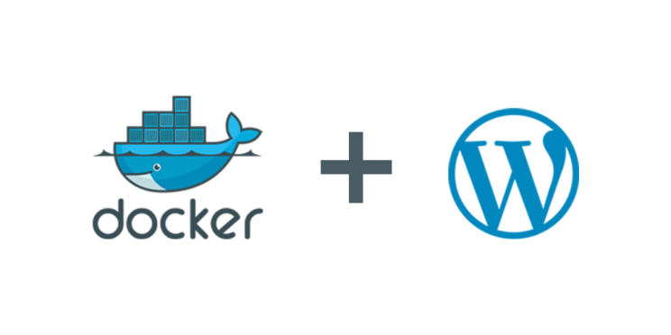

Making and maintaining a distribution, be it an independent distro or a flavor of a bigger one, such as Ubuntu Budgie, requires a good infrastructure setup to make sure that everything is reliable and functioning like a well oiled machine.

In case of a Ubuntu Budgie, we made sure to make a setup that is both easy to use and sturdy. The first step, the most visible part is this website that you are currently reading this post on. The website itself is powered by a WordPress installation. There were a lot of discussions on what to use for our website among the team, ranging from custom CMS, static HTML, Grav and other CMS (Content Management System).

Most of the posts are written in Markdown that is then converted to HTML when publishing a post. Some of you may be wondering why Markdown as choice, doesn't WordPress use WYSIWYG (What you see is what you get) editor? While this is true, markdown allows us to be lean and write from anywhere and at any time and just get text ready for publishing. There is no need to login and start writing from a browser. We can write a post from a code editor and then copy/paste. Other parts of the website however are managed using WYSIWYG editor, such as Downloads page, About us, etc.

We currently host our website on a Digital Ocean droplet, running the Ubuntu Server edition. Digital Ocean has been kind enough to sponsor us with hosting for a few years as of now. To host our website, we are utilizing Docker, but with a twist. Most of the services, such as Database, Apache web server, Traefik, are ran in its own container. This enables us to isolate the problems fairly easy and make sure that one service does not bring down the whole server.

Shared web hosting for example is good for smaller websites, but as you do not have a control over the server, you are dependent on your host for most stuff, with limits included. Plus you always run a risk of someone overusing provisioned space and bandwidth, thus taking you and other websites down that are hosted on shared web server.

As Ubuntu Budgie is fairly visited website with up to 50.000 to 100.000 monthly visits on release day, having a good setup is a must have to get quickly on our feet in case something goes wrong.

For example, if there is a bad update or some problem with for example WordPress, we can check the WP container itself without touching other parts of a setup, which would be the usual case when running the default LAMP (Linux, Apache, MariaDB, PHP) server. Having good infrastructure is a necessity to pull this off and quite easy on VPS (Virtual Private Server) or with Digital Ocean. The best of all is that we can backup everything, quickly spin up new droplet and add even more services without endangering the currently running ones.

To handle the visits, and make sure that you have a good browsing experience, we also utilize CloudFlare, so that we can handle both upcoming traffic, as well our DNS (Domain Name System) hosting needs. For SSL (Secure Sockets Layer), we use LetsEncrypt, that is also an open source and free software as nearly all software mentioned in this article, via certbot to automate the process.

While running Ubuntu Budgie, the most important thing we have learned in regards to website and other web oriented services is how important it is to decentralize. If one thing goes down, the whole set of services can go down and you are left stranded. On days such as release days of new Ubuntu Budgie, this is really important since in some cases even a huge amounts of visits could consist of "hug of death" that could take down the whole website, making it unavailable. True, you want to have huge amounts of visits, but when unprepared it can create a problem with congestion of huge amount of incoming traffic that you didn't account for when building your infrastructure.

I would like to thank our team member Dustin Krysak, for helping me (Nikola) and other team members with setting up our infrastructure, utilizing his DevOps knowledge, to make sure that everything is up and running in accordance to best practices.
