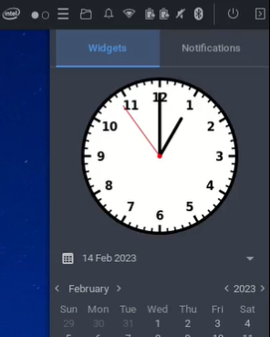
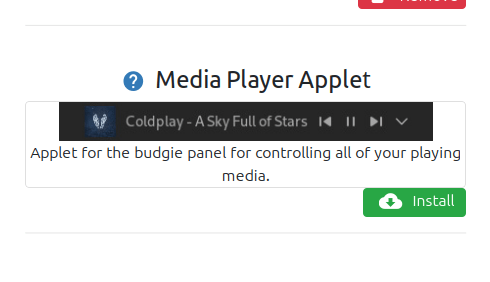
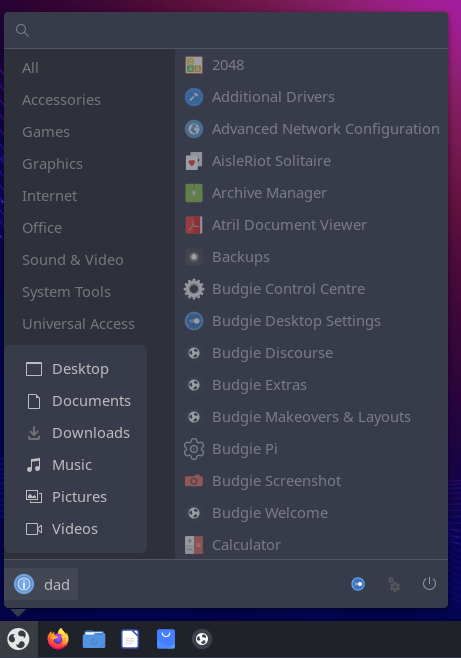
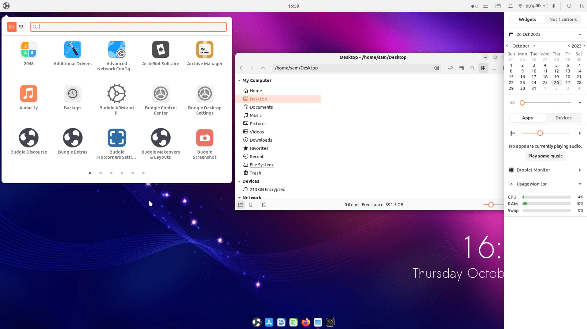
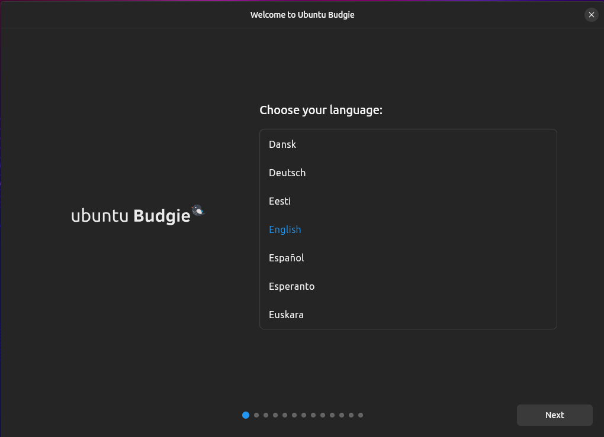

# Introduction and overview

Ubuntu Budgie 24.04 LTS (Noble Numbat) is a Long Term Support release with 3 years of support by your distro maintainers, from April 2024 to May 2027.

These release notes showcase the key takeaways for 22.04 upgraders to 24.04.

In these release notes the areas covered are:

- New features and enhancements released since 22.04
- Upgrading from 22.04 Ubuntu Budgie
- Fixed Issues
- Known Issues when upgrading
- Support arrangements for our distro
- Where to download Ubuntu Budgie


# New Features and Enhancements

## Applets and mini-apps

1. Lots of updated translations from our brilliant translators [https://www.transifex.com/ubuntu-budgie/](https://www.transifex.com/ubuntu-budgie/)
2. bug-fix - wallstreet accepts custom folder with spaces
3. Traditional layout now reflects the default 'v10.7' layout upstream - use budgie welcome to apply this layout (see below)
4. Clockworks applet - clocks can now vary by up to 24hrs
5. Weather Applet Icons have been reworked to work better against both light and dark themes


4. Fix for ShowTime, Weather applet disappearing from the desktop after logon
5. Weather applet now allows searching by locale characters i.e. not just plain ascii
6. Both screenshot applet and haste applet have now been [archived](https://discourse.ubuntubudgie.org/t/testing-23-04-are-you-brave-enough/6380/9?u=fossfreedom) by its author and as such we have removed the ability to install these applets.
7. Ubuntu Budgie developer, Sam, has updated his personal project budgie-analogue-applet. This now displays correctly when fractional scaling is used. In addition, the clock is available as a Raven widget to be added.



8. Ubuntu Budgie dev Jacob has [improved hotcorners](https://ubuntubudgie.org/2023/02/new-hotcorners-feature-introduced-in-23-04/)


- Hotspot areas are now extended to 8 spots (all edges & corners)
- The settings interface now has a dedicated window. The applet is still available for quick access to hotcorner settings, but is optional.


- The options to set pressure and/or delay no longer exclude each other, so the user can fine tune his or her own touch to prevent unintended firing.
- Hotcorners now has another built-in feature to prevent unintended firing. When for example text is selected and we unavoidably hit the edge of the screen, the corresponding command could be triggered. Hotcorners therefore checks for mouse button 1 to be pressed, skips action if that is the case.

9. [Window Shuffler](https://ubuntubudgie.org/2023/01/new-edge-tiling-introduced-in-23-04/) has undergone a dramatic rework by Jacob. Now available is quarter tiling both keyboard and using a mouse via a feature we call Drag Snap

 Quarter & half tiling is pretty much self-explaining. Dragging a window to the top of the screen will tile the window to top half, but keeping the mouse button pressed will progress the action into full screen tiling.

Also available is asymmetric tiling by pressing Alt or Ctrl whilst dragging

- Alt + drag will tile the window into 3/5 of the screen width
- Control + drag will tile the window into 2/5 of the screen width

10. From the BuddiesOfBudgie team member EbonJaeger is a new applet that replaces the new default user indictor with a more traditional looking applet


11. VisualSpace applet has now an option in Budgie Desktop Settings to reverse the icon scroll direction to switch between workspaces
12. The Brightness applet no longer resets the night-light setting/colour if it is active when the brightness popover is shown.
13. Wallstreet images are now displayed in alphabetical order rather than in file-system order.
14. A fix to the application indicators to display more chrome based icons has been made
15. QuickNote now includes a copy button and a paste button. These perform the same as CTRL+C and CTRL+V in quicknote - quick GUI based method for copy/paste.

 _New copy/paste buttons in QuickNote_

16. QuickNote buttons have gained a tooltip to improved understanding
17. Budgie Desktop has removed the legacy xembed based system tray in favour of the Status Notifier applet. There are a number of very old legacy apps still in the archive that use the old panel icons. Ubuntu Budgie have made an optional applet called Budgie Carbon Tray Applet that provides support for these legacy apps. This applet will be dropped in future Ubuntu Budgie releases that will be based on Wayland.

 _Carbon Tray Applet supports legacy XEMBED tray apps_

18. The network applet now supports bluetooth tethering for network access - i.e. use your phone to be used to access the internet. So you should see your phone in the list of networks. Use budgie-control-center - networks / bluetooth to manage these connections
19. a new applet called Media Player applet is available from an inspiring independent developer through budgie welcome. This is an alternative to those that want to control media via the panel rather than raven.



## Budgie Control Center

We have uploaded a brand new budgie-control-center - this incorporates dozens of enhancements and bug fixes that have been pulled together

Changelog here [https://github.com/BuddiesOfBudgie/budgie-control-center/releases/tag/v1.3.0](https://github.com/BuddiesOfBudgie/budgie-control-center/releases/tag/v1.3.0)

1. Screen sharing capabilities in BCC have been removed due to upstream GNOME changes that are incompatible with BCC.
2. Fractional scaling support has been enhanced.
3. Lots of wacom support updates made in BCC
4. color profile support in BCC reworked and only supported if the monitor used itself supports color-profiles
5. BCC Displays show the monitor refresh rate

## Budgie Desktop

We are pleased to include the very latest budgie desktop version in 24.04. This is a really great release!

1. Applets can now be globally spaced rather than needing individual spacers 
2. Refinements to the workspace applet
3. Clock applet no longer displays a link to a calendar application
4. Complete reworking of the Budgie in-built theme
5. Icon-tasklist applet no longer supports non-grouping of apps
6. Raven now has a full API allowing third-party developers to create new widgets for it. We look forward to seeing how developers make use of this in the future.
7. The Media Player widget now has a more compact design.
8. You can now click on the widget header icons for sound output and input to mute the respective device.
9. You can now turn off day names in the Calendar widget.
10. There is now a new Raven widget called Usage Monitor. This is a minimalistic widget that displays CPU, RAM, and Swap usage.
11. Notifications are now sorted oldest to newest.
12. New Power Dialog for common actions such as shutdown, reboot, suspend, and more. This functionality replaces the actions exposed through the User Indicator applet, no longer requiring it to be added to the panel. The User Indicator will now invoke the Power Dialog and the new button in Budgie Menu will do the same!
13. Budgie Desktop now includes a native screenshot capability - look for the icon in the menu - or just press print screen / alt print screen etc etc.  
14. IBUS handling (if ibus is installed) has been revamped to resolve the wrong keyboard layout on logon.
15. New upstream budgie-menu (traditional layout) with places, control-center and settings access buttons. The Utilities category has been removed entirely, since it had considerable overlap with the System Tools category and it was not immediately clear what the difference was between Accessories and Utilities. Now, applications previously in Utilities can be found in the System Tools category.



2. Budgie Desktop also has received improvements _(the alternative menu available to be added to your panel)_,
    
3. There is the adoption of StatusNotifier support in System Tray _(an alternative to the application indicator that can be added to your panel)_, This native budgie system tray (like Ubuntus app indicator) resolves
    
    - Icons not scaling with panel size
    - High DPI scaling relied on the application providing the icon to support DPI scaling
    - Inconsistent styling of tray menus
4. We know however there are still legacy apps that require the old system tray. We have budgie-carbon-tray-applet available in our budgie-extras PPA for these types of apps.
    
5. Budgie Window manager is now called Magpie which is a soft-fork Mutter at the state it was in for GNOME 43; this has eliminated the regressions introduced in GNOME 44 and later. Note: Later versions of Budgie Desktop will be Wayland only. The release for 24.04 is X11 based only.
    
6. Budgie 10.9 switches to using budgie-session; this is a "softish fork of gnome-session, designed to provide a stable session manager for Budgie 10.x".
    

#### Redesigned Bluetooth applet

Budgie 10.9 features a redesigned Bluetooth applet. This applet now provides direct (dis-)connect functionality for paired Bluetooth devices, battery life indicators, as well as functionality for sending files to Bluetooth devices.

#### Budgie Trash Applet

 _Budgie Trash applet allows easy access to the trash folder_

The previously third-party Budgie Trash Applet, developed by Buddies of Budgie team member Evan Maddock, has been merged into mainline Budgie Desktop to become a part of the default applets available to users out-of-the-box. This trash applet enables the user to quickly access and empty the contents of their trashcan as well as restore files.

#### Privilege Escalation Dialog Improvements

 _Polkit Dialogs now provide an action description_

#### Performance / Power Modes In Battery Status Applet

 _Quickly switch between different power profile modes_

Budgie's battery indicator in the Status applet now provides the ability to control the Performance / Power profile modes offered by [power-profiles-daemon](https://gitlab.freedesktop.org/hadess/power-profiles-daemon?ref=buddiesofbudgie.org). When available on a supported system, you will get access to various options such as:

- Balanced
- Power Saver
- Performance

#### Internal Theme Refinements

 _The internal theme now features a green accent color, and better contrast_

We have made some small refinements and recoloring to our internal theme. Historically, the primary accent color in our internal theme mirrored that of the Solus blue. When Budgie Desktop development began under Buddies of Budgie, the decision was made early on to move to our adopted light green primary color. This was chosen to be more like greenery and common (green) budgerigars. The first to be updated was the Budgie logo itself and the color has finally made its way to our default internal theme as well.Alongside this change, we have darkened some elements such as Budgie Menu, the panel, and Raven's background. Raven widgets, text, and iconography should contrast better against the darker background as a result!

#### Other Small Things

- Kvantum and Murrine themes are now hidden in Budgie Desktop Settings [#393](https://github.com/BuddiesOfBudgie/budgie-desktop/pull/393)
- We have moved the battery label setting to Budgie Desktop Settings as well as moved the percentage label from left of icon to right [#389](https://github.com/BuddiesOfBudgie/budgie-desktop/pull/389)

#### Bug Fixes

It would not be a Budgie release without some bug squashing. In this release, we have:

- Enabled ellipsize for Style boxes in BDS [#403](https://github.com/BuddiesOfBudgie/budgie-desktop/pull/403)
- Fixed Icon Tasklist not showing Private Internet Access [#379](https://github.com/BuddiesOfBudgie/budgie-desktop/pull/379)
- Fixed Polkit dialog resizing
- Prevented notifications and screenshot from locking up when sink is locked

## Raspberry Pi

Due to the extraordinary changes in 24.04 we have run out of time to produce a raspi image on the 24.04 release day. We'll be looking more closely at the development of our raspi image in due course and a separate announcement will be made.

## Budgie Welcome

Our welcome app is automatically updated for all 22.04 & 23.10 users

1. Lots of updated translations from our brilliant translators [https://www.transifex.com/ubuntu-budgie/](https://www.transifex.com/ubuntu-budgie/)
2. Our Backports is now complete - testing of budgie-welcome recommendations/themes and applets/getting started is needed.
3. Menu Option and welcome page changed from "Budgie Themes & Layouts" to "Budgie Makeovers & Layouts" to present a more accurate overview of the capability.
4. The front page icons now are fixed rather than trying to be translated. This prevents locale characters such as chinese being displayed.
5. Mysteriously Chromium Browser disappeared as an option for the browser ballot. This now has been resolved.
6. Welcome has been moved to core22 - this allows us compatibility with future versions of ubuntu and to reduce our ISO size.
7. Tweaks to the dropbox screenshot size and the message when installing Flatpaks has been made
8. Nemo Dropbox installation has been tweaked to be more seamless
9. New Fluent make-over is available
10. New Colloid make-over is available
11. getting started. The information about your NVME drives should now be displayed.
12. gaming - corectrl. This now installs corectrl from the universe package rather than from a PPA.
13. our mastodon instance is now accessible from the front-page
14. our matrix community channel is now accessible from the front-page
15. Gaming page now ensures Steam successfully installs in Ubuntu Budgie without extra "386 repository" tweaks.

## Themes

 _Latest Orchis, Mojave, and WhiteSur themes improve appearance for Raven widgets_

1. Orchis Gtk Theme has been update to the latest upstream version. Note - upstream has changed its name convention for each variant & colour. So on an upgrade you have to manually change your theme name when you re-add the backports PPA
2. Pocillo Gtk Theme has the following fixes: fixes for styling mate-system-monitor fixes for styling atril pdf reader fixes for styling mate-calculator fix for chrome and chromium showing the background in a 1px wide divider
3. Latest Pocillo Icons derived from Qogir & Tela icons
4. Latest QogirBudgie theme derived from Qogir upstream. The Dark and Light theme variants have been renamed slightly (capitalised). Thus on an upgrade these themes will need to be applied via budgie desktop settings
5. Latest upstream Mojave Gtk Theme
6. Latest upstream WhiteSur Gtk Theme
7. Latest upstream WhiteSur Icon Theme
8. Latest upstream Vimix Gtk Theme
9. Latest upstream Tela Circle Theme
10. Latest WhiteSur gtk theme is now available
11. Brand new Fluent based makeover is now available

 _New Fluent theme, available in light and dark variants, with multiple color choices_  

12. Latest McMojave-circle icon theme is now available
13. A new Colloid makeover is now available - colloid gtk theme + colloid icons and ubuntu fonts/cursors



## Additional

1. Pulseaudio is no longer our default audiostack. Pipewire is now the default. The package `pulseaudio` can safely be purged.
2. Really nice changes made by the slick-greeter project have been captured on a fresh package by team-member Sam [https://github.com/UbuntuBudgie/slick-greeter/blob/debian/debian/changelog](https://github.com/UbuntuBudgie/slick-greeter/blob/debian/debian/changelog)
3. Slick Greeter now allows toggling the password visibility

## Areas to look out for

1. Our default applications have been revamped - This is described fully in this post [https://discourse.ubuntubudgie.org/t/default-applications-review-for-22-10-23-04-and-beyond/5883?u=fossfreedom](https://discourse.ubuntubudgie.org/t/default-applications-review-for-22-10-23-04-and-beyond/5883?u=fossfreedom) and outlined here:
    
    - GNOME-Calculator → Mate Calc
    - GNOME-Calendar → dropped from the install
    - GNOME-Maps → dropped from the install
    - GNOME System Monitor → Mate System Monitor
    - Evince → Atril
    - File Roller aka GNOME Archive Manager → new look due to switch to GTK4
    - GNOME Screenshot → dropped from the install
    - GEdit text editor
    - GNOME Font Viewer → font-manager
    - Cheese → guvcview
    - Celluloid → Parole
    - Rhythmbox → Lollypop + Goodvibes + gpodder
    - App-Center replaces GNOME-Software
2. We now have webp image support out-of-the-box
    
3. The plymouth theme (the image that is displayed during boot up-to the login manager) has been revamped.
    

This now is a spinner based theme. For machines that boot with the manufacturer image, you will see that image up-to the login screen.

4. Canonical have also been working through the problems of the plymouth themes disappearing/reappearing due to extraneous messages on the boot console. We now see a more seamless boot image experience.
5. Canonical have switched thunderbird to a snap. This ensures faster updates directly from Mozilla including new versions of thunderbird in the future.
6. Our default terminal font is now Noto Mono Bold size 11.

We have changed the font due to changes made by Canonical in Lunar with the Ubuntu Mono font we previously used for many year which we do not feel work for our distro.

7. The following issue we have noted with budgie related components:
    - window shuffler crashes on ubuntu - [wayland session](https://github.com/UbuntuBudgie/budgie-extras/issues/446)
    - on QEMU/KVM and possibly VirtualBox, adjusting the screen-resolution via budgie-control-center followed by reopening budgie-control-center crashes the whole desktop. Resetting the last-panel dconf key for budgie-control-center will allow budgie-control-center to be reopened again.
8. The following snap issue that impact UB:
    - installing missing theme [snaps failed](https://github.com/snapcore/snapd-desktop-integration/issues/52)
    - touchscreen, cursor disappears to never come back unless restarting budgie-wm

## Installer

We are pleased to ship with Ubuntu's brand new installer. Ubuntu Budgie was the first flavour that shipped with the installer in 23.10 and have actively help to make this a first class replacement for the old Ubiquity installer. It has fantastic new graphics, clean looks and new capabilities.



Do look out for the ability to use subiquity based auto-install scripts. Active Directory support is also available via an installer option. Do note for the 24.04 release

- slick greeter needs to be switched to manual login via the login settings app or by including in `/etc/lightdm/lightdm.conf` the line `greeter-show-manual-login=true`
- Switch to a TTY before first login and run `sudo pam-auth-update --enable mkhomedir` to ensure the home folder is created

## Upgrading from previous releases

It is important to keep in mind a few useful tips before attempting a release upgrade:

IMPORTANT: remember to double-check you have the following vital package before you upgrade:

```
sudo apt install ubuntu-budgie-desktop
```

- Backup your data.
- Install all available updates and reboot.
- It is always a good idea to run either a full system snapshot with Timeshift, to a secondary drive, or a full system image using Clonezilla.
- If you have PPAs that come with updated kernel, mesa, GPU drivers, it is better to purge those PPAs and reboot before attempting release upgrade.
- Once release upgrade starts, all your PPAs will be disabled. If you rely on important software from PPAs, it is better to manually check if those are updated for upcoming release of Ubuntu.
- After upgrade is completed, remember to go to software sources, change release name on your PPAs, enable them and refresh package cache.

### Scheduled upgrade from 22.04 LTS

Users of Ubuntu Budgie 22.04 LTS will not be prompted to upgrade to 24.04 automatically. Remember the upgrade path for most LTS users is from LTS to LTS i.e. 22.04 to 24.04.1 due in August this year. LTS versions are focused on stability.

### Manual upgrade from 22.04

After the release of 24.04, ensure you change your Software Sources to offer updates for any version:

[](https://ubuntubudgie.org/wp-content/uploads/2020/09/wp_editor_md_34f6ab29d9728ad3e078317aaafffcc0.jpg)

You will then be offered to upgrade when you run Software & Updates.

Please refer to the community wiki for more help:

[https://help.ubuntu.com/community/Upgrades](https://help.ubuntu.com/community/Upgrades)

Also, Ask Ubuntu has an excellent guide to help you upgrade:

[http://askubuntu.com/questions/110477/how-do-i-upgrade-to-a-newer-version-of-ubuntu](http://askubuntu.com/questions/110477/how-do-i-upgrade-to-a-newer-version-of-ubuntu)

- For more generic issues with Ubuntu 23.10, please check this link: [Ubuntu 23.10 Release Notes](https://discourse.ubuntu.com/t/mantic-minotaur-release-notes/35534).
- We recommend that you install Ubuntu Budgie on hardware - suggested configuration is 4GB or more RAM and a newer than 10 year computer with 40GB disk space or more. UB can be installed in a virtual machine; we recommend you use 3D host graphics with 128Mb virtual graphics memory and 4GB RAM or more plus 40GB virtual disk space. Running with defaults on most virtualisation systems often results in a broken experience with crashes when launching budgie-control-center, applications such as Microsoft Edge failing to run because of the lack of a graphics card, choppy youtube experience etc.

## On-going support

As an official community flavour we will be supporting the distro for three years. This support includes releasing important stability issues as well as critical security fixes directly affecting our distro.

Budgie packages are primarily in the Universe repository where the community help maintain this software.

Community Support is available via our discourse forum. Ask Ubuntu and Ubuntu forums can and should also be used for all Ubuntu matters - all flavours are Ubuntu!

Canonical have also stated that they will support all packages with critical security related issues in the main and universe repositories for twelve years via a Ubuntu Pro subscription. Remember this is free for Ubuntu members - so get involved and this can be one of the many rewards for actively participating in Ubuntu.

## Where to download Ubuntu Budgie daily builds and final releases

### Daily and Beta builds

Ubuntu Budgie daily builds for AMD64 architecture are available here: [http://cdimage.ubuntu.com/ubuntu-budgie/daily-live/current/](http://cdimage.ubuntu.com/ubuntu-budgie/daily-live/current/)

### Final Releases

Links to download final releases, as well as installation instructions, will be available on our Ubuntu Budgie website once Final Release is built: [https://ubuntubudgie.org/downloads/](https://ubuntubudgie.org/downloads/).

## Known Issues

- For more generic issues with Ubuntu 24.04, please check this link: [Ubuntu 24.04 Release Notes](https://discourse.ubuntu.com/t/noble-numbat-release-notes/39890).

## Infrastructure Sponsors

We just wanted to thank our infrastructure sponsors who help us keep the lights on.

### Digital Ocean

On a mission to simplify cloud computing so developers and their teams can spend more time building software that changes the world.

### Discourse

Discourse is the 100% open source discussion platform built for the next decade of the Internet. Use it as a mailing list, discussion forum, long-form chat room, and more!
