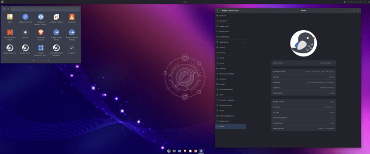
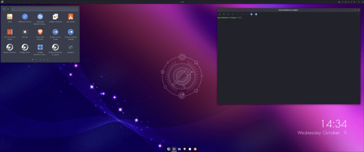

# Introduction and overview

Ubuntu Budgie 24.10 (Oracular Oriole) is a Standard Release with 9 months of support by your distro maintainers and Canonical, from Oct 2024 to July 2025..

These release notes showcase the key takeaways for 24.04 upgraders to 24.10.

In these release notes the areas covered are:

- New features and enhancements released since 24.04
- Upgrading from 24.04 Ubuntu Budgie
- Fixed Issues
- Known Issues when upgrading
- Support arrangements for our distro
- Where to download Ubuntu Budgie

# New Features and Enhancements

The key focus for the team for this cycle has been the conversion of our distro to a Wayland based distro. We have been working closely with our fellow Buddies Of Budgie maintainers.  
Excellent progress has been made towards this huge effort - internally we already have a Wayland based distro that we are 'dog-fooding'. We will share more information once we have a more stable offering.

## Applets and mini-apps

1. Lots of updated translations from our brilliant translators [https://www.transifex.com/ubuntu-budgie/](https://www.transifex.com/ubuntu-budgie/)
2. The third-party applet budgie-sysmonitor-applet has received a number of new sensors and changes (v0.10.2). This has been backported to noble as well.

## Budgie Desktop

[](https://ubuntubudgie.org/wp-content/uploads/2024/10/Screenshot-from-2024-10-09-14-30-24.png)

1. The latest budgie-desktop v10.9.2 forms the basis of our Oracular offering. summary of the upstream [notes](https://buddiesofbudgie.org/blog/budgie-10-9-2-released)

- Budgie Menu: The upstream budgie menu will now show applications which report as being Terminal-based (e.g. `Terminal=true` in their desktop file). Users of applications like Neovim rejoice!
- Budgie Run Dialog: Fixed a regression where our setting of skip pager and taskbar was not being called during construction, which resulted in it showing up in our task switchers (IconTasklist and Task List).
- Dialogs: Fixed end session dialogs blocking authentication dialogs.
- Notifications: Fixed an issue where a notification's default action would be performed when the close button was clicked.
- Specification Compliance: Fixed an issue where we referred to the restart / reboot icon as "system-restart-symbolic" instead of "system-reboot-symbolic". This should improve compatibility with icon themes while retaining our own icon as a fallback in the event the icon theme does not provide it.
- System Tray: Fixed an issue whereby some applications would not show with their intended icon. This is the result of such applications (e.g. Cinny and Tauon) being non-compliant with the [StatusNotifierItem specification](https://www.freedesktop.org/wiki/Specifications/StatusNotifierItem/StatusNotifierItem/) by providing absolute paths to icons instead of either an icon name or icon data.
- TabSwitcher: We will no longer show an empty switcher when there are no windows to actually switch between.
- Workspace Applet
    - Fixed an issue where clicking a window icon would not perform an intended workspace switch.
    - Fixed left scroll direction. In libxfce4windowing, _our_ concept of "left" maps to their "down", but "right" is still "right".
- build: Re-hide warnings that were previously hidden in Meson < 1.4.0. In 1.4.0, it began to show warnings that are largely the result of bad C codegen in the Vala compiler, resulting in unreadable log spam and making it substantially more difficult to see actual warnings that need to be addressed.
- vapi: update to support libxfce4windowing 4.19.3

## Other Improvements and Bug Fixes

[](https://ubuntubudgie.org/wp-content/uploads/2024/10/Screenshot-from-2024-10-09-14-34-46.png)

1. Our default layout has been revised to ensure a smooth transition later to our wayland offering. The X11 plank dock has been dropped. We have now the budgie-desktop dock styled with our Pocillo theme. The top-bar defaults to a dark bar theme.
    
2. We now support the Apple image format .heif - such images can be seen through gThumb, Nemo and can be set as a wallpaper via budgie-control-center
    
3. We now support the Jpeg-xl format .jxl - again such images can be seen through gThumb, Nemo and can be set as a wallpaper via budgie-control-center
    
4. In 24.04 external deb packages were installed via gdebi. gdebi has now been dropped in favour of the updated snap-store that handles side-loading of deb packages.
    
5. Due to Tilix receiving very little maintenence bugs are creeping in without any resolution upstream. The project desperately needs an active maintainer. As such, we have decided to change our default terminal. We have changed from Tilix to xfce4-terminal. This is actively looked after by our xfce friends. We have slightly switched the appearance of xfce4-terminal for our distro.
    
6. Default wallpaper updated for oracular.
    
7. To celebrate 20 years of ubuntu we also sharing all the LTS backgrounds that have been tweaked and updated.
    

### Bug Fixes

1. Budgie Control Center. Add picture button fails to select an image. This has been resolved by Ubuntu devs and has also been SRUd to 24.04

## Budgie Welcome

[](https://ubuntubudgie.org/wp-content/uploads/2024/10/Screenshot-from-2024-10-09-14-31-26-scaled.jpg)

Our welcome app is automatically updated for all 24.04 and 24.10 users

Budgie welcome now has its oracular configuration.

## Areas to look out for

The Ubuntu release notes are to be found [here](https://discourse.ubuntu.com/t/oracular-oriole-release-notes/44878)

## Packaging Updates

Whilst not immediately obvious, various packages need to be updated for a number of reasons, so this section lists what updates have been made and this needs extra testing to confirm no regressions:

1. budgie-session. Debian has split systemd into various component parts. budgie-session has been updated to correspond to this split request. This resolved build related issues.
2. slick-greeter has received a number of refinements; v2.0.5 has been packaged by Ubuntu Budgie
3. lightdm-settings has received a number of updates; v2.0.4 has been packaged by Ubuntu Budgie

## Upgrading from previous releases

It is important to keep in mind a few useful tips before attempting a release upgrade:

IMPORTANT: remember to double-check you have the following vital package before you upgrade:

```
sudo apt install ubuntu-budgie-desktop
```

- Backup your data.
- Install all available updates and reboot.
- It is always a good idea to run either a full system snapshot with Timeshift, to a secondary drive, or a full system image using Clonezilla.
- If you have PPAs that come with updated kernel, mesa, GPU drivers, it is better to purge those PPAs and reboot before attempting release upgrade.
- Once release upgrade starts, all your PPAs will be disabled. If you rely on important software from PPAs, it is better to manually check if those are updated for upcoming release of Ubuntu.
- After upgrade is completed, remember to go to software sources, change release name on your PPAs, enable them and refresh package cache.

### Scheduled upgrade from 24.04 LTS

Users of Ubuntu Budgie 24.04 LTS will not be prompted to upgrade to 24.10 automatically. Remember the upgrade path for most LTS users is from LTS to LTS i.e. 22.04 to 24.04. LTS versions are focused on stability.

### Manual upgrade from 24.04

After the release of 24.10, ensure you change your Software Sources to offer updates for any version:

[](https://ubuntubudgie.org/wp-content/uploads/2020/09/wp_editor_md_34f6ab29d9728ad3e078317aaafffcc0.jpg)

You will then be offered to upgrade when you run Software & Updates.

Please refer to the community wiki for more help:

[https://help.ubuntu.com/community/Upgrades](https://help.ubuntu.com/community/Upgrades)

Also, Ask Ubuntu has an excellent guide to help you upgrade:

[http://askubuntu.com/questions/110477/how-do-i-upgrade-to-a-newer-version-of-ubuntu](http://askubuntu.com/questions/110477/how-do-i-upgrade-to-a-newer-version-of-ubuntu)

- We recommend that you install Ubuntu Budgie on hardware - suggested configuration is 4GB or more RAM and a newer than 10 year computer with 40GB disk space or more. UB can be installed in a virtual machine; we recommend you use 3D host graphics with 128Mb virtual graphics memory and 4GB RAM or more plus 40GB virtual disk space. Running with defaults on most virtualisation systems often results in a broken experience with crashes when launching budgie-control-center, applications such as Microsoft Edge failing to run because of the lack of a graphics card, choppy youtube experience etc.

## On-going support

As an official community flavour we will be supporting the distro for nine months. This support includes releasing important stability issues as well as critical security fixes directly affecting our distro.

Budgie packages are primarily in the Universe repository where the community help maintain this software.

Community Support is available via our discourse forum. Ask Ubuntu and Ubuntu forums can and should also be used for all Ubuntu matters - all flavours are Ubuntu!

### Final Release

Links to download final releases, as well as installation instructions, will be available on our Ubuntu Budgie website once Final Release is built: [https://ubuntubudgie.org/downloads/](https://ubuntubudgie.org/downloads/).

## Known Issues

- On first install and logon, using budgie-welcome to access web-based installs such as Chrome will open gedit not firefox. The workaround is to launch firefox first. Logout and login and open Budgie Welcome again

## Infrastructure Sponsors

We just wanted to thank our infrastructure sponsors who help us keep the lights on.

### Digital Ocean

On a mission to simplify cloud computing so developers and their teams can spend more time building software that changes the world.

### Discourse

Discourse is the 100% open source discussion platform built for the next decade of the Internet. Use it as a mailing list, discussion forum, long-form chat room, and more!
