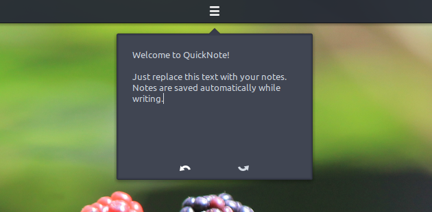

# Our fabulous community

Thank-you to everyone who has donated this month. We now have raised enough to cover:

- URL renewal costs for budgie-remix.org and ubuntubudgie.org for the next three years
- Put aside server costs for the next three years if our sponsorship with DigitalOcean is not renewed.

Our [donation page](https://ubuntubudgie.org/admin/blog/post/@page/5)  has been revamped with additional goals to enable the team to help you the community. Please check it out.

# 17.10 Beta 2

Again - many thanks to those who have helped testing our final beta release for 17.10.

Have a look at a nice [beta 2 video](https://www.youtube.com/watch?v=itFPmr991dM&feature=youtu.be)  to see 17.10 in all its glory :)

# Bug-Fixing Galore

Ubuntu 17.10 entered its "freeze" phase at the beginning of September. What this means is that new features are discouraged, and developers instead are encouraged to concentrate on bug-fixing.

1. The ISO installer was missing budgie wallpaper. I fixed that... and at the same time, the installer dialog became Arc themed. Simply Gorgeous
2. At beta 1 I had put in a workaround to enable budgie-welcome to work without crashing due to a new WebKit library. Shortly after, upstream had advised what the real fix should be and the fix was applied as required. The budgie-welcome package now operates much more smoothly. The new WebKit library is also due to be backported to 17.04 to fix additional security issues. Extra time was spent backporting the Artful fixes to the Zesty version of budgie-welcome to ensure it does not crash.
3. More fixes were added to our desktop settings package budgie-desktop-environment. Tilix no longer throws the irritating VTE error if launched quickly after login. Also, I managed to squeeze in a Dark theming for Tilix (looks much better now!) and when highlighting terminal text, the text is now automatically copied to the clipboard.
4. Our translators for budgie-welcome have been very busy. So these updated translations have been pulled in and updated in the repositories. Budgie-welcome is now truly multilingual!

1. Caught a very irritating issue with Slick Greeter for those that use multiple desktop environments - slick greeter insisted in showing every desktop environment with a budgie logo. I pushed a pull-request to Linux Mint to get this fixed.
2. In budgie-desktop 10.4 the budgie-desktop-settings application and the Plank application were not playing ball - there was a "budgie panel" icon that could not be removed from Plank. A simple fix was pushed to the upstream budgie-desktop project, and then uploaded to Ubuntu. This will also be backported to 17.04 and 16.04 in due course.
3. gthumb was displaying a rather irritating menu addition to the headerbar breaking the look and feel to the app. Luckily the great gthumb devs upstream had fixed this, so I backported this fix for all Ubuntu users.
4. Finally I have managed to track down why some app indicators were displaying huge icons. Bad bad apps - so we have basically ignored the sizing they wanted and sized it per the appindicator specification.

# New Development

In the past weeks, Jacob has been working hard on a collection of Budgie-extras; a new set of handy applets to add to the default desktop. A sneak preview of two of the most recent developments includes the upcoming Window Previews:

and a small, extremely easy and simple note applet; Quick Note:

Other applets that were mentioned before, the Hot Corners, the Window Mover (move windows quickly among workspaces), the Workspace Overview (menu) and the Wallpaper Switcher are nearly finished.

To be continued!

# Communications Infrastructure

While we are busy with the upcoming 17.10 release, we have a few background things brewing that Dustin is working on. One of these such things has been how we would like to interact with the community in our real-time chat, as well as our internal communications.

Today, the Ubuntu Budgie project leverages the Gitter platform for both internal and community communications. While the platform as a whole is quite decent, one reoccurring issue our team members are having is related to notifications. Gitter (with good intentions) intercepts all mobile notifications when you have a desktop client running. While this at its heart is appealing on some level, if you are in the scenario where you have multiple computers (any of which could have the Gitter client running) - at times this can be bad.

We are a distributed team (as nearly all OSS projects are), working from multiple time zones. Communication can happen at all hours of the day. Compound that with community members potentially needing assistance - missing notifications at times can be undesired. So with that transpiring, we are evaluating moving to a new platform. While we do not have many requirements, every bullet point is important to us.

### Requirements

- Must have a reliable method for our community members to join without issue.
- Would prefer a web client to be available for the community members to keep the barrier to entry low.
- Must support integrations - specifically GitHub, and Trello. But would like extensibility for future projects we are working on (bots, etc.).
- Mobile and Desktop applications
- Excellent notification system!!!!

### Considerations

In no particular order, we have been looking at:

- Discord
- Slack
- Mattermost
- Hipchat
- Riot
- Rocketchat
- Telegram
- IRC

Since Gitter is OSS, one may ask why we don't submit a PR, etc. The reason is due to other initiatives, having a smaller team and time constraints. We are trying to stay focused on the project at hand (Ubuntu Budgie).

### Feedback

What would you as the community like to see? Do you feel like we have overlooked any potential solutions? While we cannot please everyone, we are curious to see what your feedback would reflect.

* * *

David (project lead)
