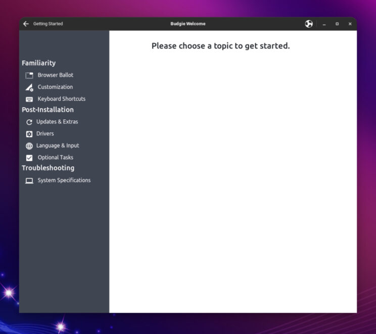
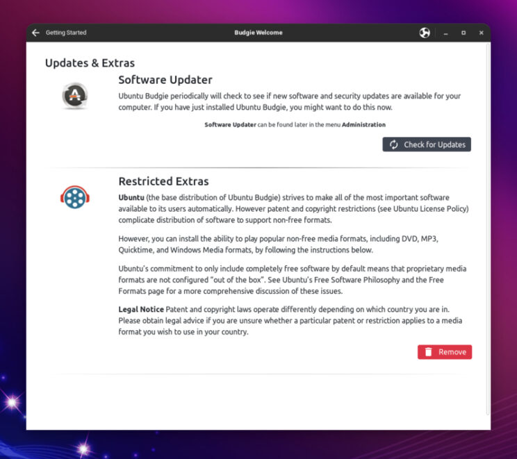

\[caption id="attachment\_2588" align="alignnone" width="744"\] Budgie Welcome Application\[/caption\]

Budgie Welcome is the first thing we see when we boot a Live ISO, and after we complete our install. But do we really know what it offers? In this quick write up, I am going to walk you through all the features of this small but very useful Welcome application.

Budgie Welcome is a Snap application. There has been quite some development time on it lately. If you want to check what the team has been up to, it is very easy to jump forward to development release (edge channel), either via Software GUI, or by running this command:

```
snap refresh --edge ubuntu-budgie-welcome
```

\[caption id="attachment\_2587" align="alignnone" width="744"\] Software Center - Ubuntu Budgie Welcome Snap Channels\[/caption\]

## Let's have a look at the left side of our Budgie Welcome Application.

### Introduction and Features

Introduction and Features are a couple of very nice pages, created with the purpose of giving a new user a quick look of what this distribution has to offer.

\[caption id="attachment\_2589" align="alignnone" width="744"\] Introduction\[/caption\]

\[caption id="attachment\_2590" align="alignnone" width="744"\] Features\[/caption\]

### Getting Started

When we open Getting Started, we see a lot of very useful features. I always open this menu after a new installation of Ubuntu Budgie, so I can quickly install browsers, drivers, check options, software, and settings.

\[caption id="attachment\_2591" align="alignnone" width="744"\] Getting Started\[/caption\]

#### Browser Ballot

Most browsers are represented here. In some cases, there is even both choice of snap and regular debian package install. If some external repositories are needed to install a particular browser, a quick menu informs the user and everything is done automatically.

\[caption id="attachment\_2592" align="alignnone" width="744"\] Browser Ballot\[/caption\]

#### Customization

Very useful shortcuts to "Budgie Desktop Settings", where we can tweak our Budgie related settings, such as appearance, desktop, panels, and more.

There is also a shortcut to "Settings" which opens Operative system settings, such as Network, Bluetooth, Notifications, Sound, Power, Displays, Printers and more.

\[caption id="attachment\_2593" align="alignnone" width="744"\] Customization\[/caption\]

#### Keyboard Shortcuts

Useful menu to check default keyboard shortcuts for Ubuntu Budgie.

\[caption id="attachment\_2594" align="alignnone" width="744"\] Shortcuts\[/caption\]

#### Updates and Extras

Here we can check system updates, and install Ubuntu restricted extras for codecs and other non-free media formats.

\[caption id="attachment\_2595" align="alignnone" width="744"\] Updates and Extras\[/caption\]

#### Drivers

A very useful page that shows us what GPU we have, if installed drivers are optimized. There is also a link to "Additional Drivers", which is useful for those that need proprietary drivers, such as NVIDIA cards.

\[caption id="attachment\_2596" align="alignnone" width="744"\] Drivers\[/caption\]

#### Language and Input

Language and Input is great for my personal use. I type in different languages, and I also need Traditional Chinese input, which could be a bit of a hassle in some distributions. With Ubuntu Budgie, I click on the Complex Input I want, leave iBus active, and that's pretty much it. There is also a link to "Language Support" where I can check Installed Languages, and formats.

\[caption id="attachment\_2597" align="alignnone" width="744"\] Language and Input\[/caption\]

#### Optional Tasks

A few but important tasks are recommended here. Backups and Firewall are very important for everyone. I urge everyone to spend a few moments and make sure they have backups and firewall enabled. There is also a shortcut to "Configure Users", in case you need to add users to your system.

\[caption id="attachment\_2598" align="alignnone" width="744"\] Optional Tasks\[/caption\]

#### System Specifications

This menu will open a quick overview of your system, where you can check your distribution, kernel, Motherboard, CPU, RAM, Storage, and more.

\[caption id="attachment\_2599" align="alignnone" width="744"\] System Specifications\[/caption\]

## Moving to the right side of our Budgie Welcome Application

### Online Store

This page shows us a quick overview of what is available on our Merch store, if you want to support the project and spread the word, you can click on the bottom icon "Ubuntu Budgie Online Store".

\[caption id="attachment\_2600" align="alignnone" width="744"\] Online Store\[/caption\]

### Community

In this page you can find support channels such as discourse, IRC, Ask Ubuntu forums. There are also links to social media, and local communities.

\[caption id="attachment\_2601" align="alignnone" width="744"\] Community\[/caption\]

### Get Involved

This page does a great job explaining our users how they can get involved, help the project, and join the community. There are also links to Ubuntu Budgie Launchpad, Ubuntu Budgie GitHub, Budgie Desktop Github. Last but not least, The "Opportunities" Icon brings us to a page that has very specific lists of items the team needs help with.

\[caption id="attachment\_2602" align="alignnone" width="744"\] Get Involved\[/caption\]

### Donate

If you want to make a single or recurring donation to either PayPal or Patreon, click on this page and follow the links.

\[caption id="attachment\_2603" align="alignnone" width="744"\] Donate\[/caption\]

## We are now going to take a look at the items at the bottom of our Budgie Welcome application.

### Install Software

This is a very useful menu, that presents many ways to install software in your Ubuntu Budgie install:

- Budgie Extras: All the Ubuntu Budgie applets you might ever want. All bundled here, in the distribution, updated and tested for the specific release you installed.
- Recommendations: A few recommended packages
- Software Center: This is Gnome software center, which is used in the Budgie Desktop Environment
- Snap Apps: If you want to install Snap applications, this link takes you to snapcraft store.
- Flatpak Apps: If you want to install Flatpak applications, this link takes you to flathub.
- Gaming: This is a new entry, completely dedicated to gaming. You will read all about this on a separate blog post.

\[caption id="attachment\_2606" align="alignnone" width="744"\] Budgie Extras\[/caption\]

\[caption id="attachment\_2609" align="alignnone" width="744"\] Gaming\[/caption\]

### Themes and Layouts

This is the place to go if you like to automatically switch layouts to try something familiar, or perhaps you feel adventurous and want to try a different approach to your workflow. With themes, you can apply different window colors, icons, and fonts.

\[caption id="attachment\_2607" align="alignnone" width="744"\] Themes\[/caption\]

\[caption id="attachment\_2608" align="alignnone" width="744"\] Layouts\[/caption\]

## Conclusion

This was a quick overview of Budgie Welcome application. I have been using Ubuntu Budgie for years, and I still find this useful. I love it, and I am very proud to say that every time I show Ubuntu Budgie to a new user, they all appreciate it, especially in the first few weeks, as they get familiar with their new Operative System.

Give it a try, tell us what you think, and remember, it is all FOSS. Our code is on GitHub. If you have ideas, recommendations, or even better, you want to help, don't be shy and get in touch with us.

Last but not least, I want to take a moment to thank all the great contributors to our Budgie Welcome app. Since there is a long list and I don't want to miss anyone, please [check this link to GitHub contributors](https://github.com/UbuntuBudgie/budgie-welcome/graphs/contributors "check this link to GitHub contributors").
