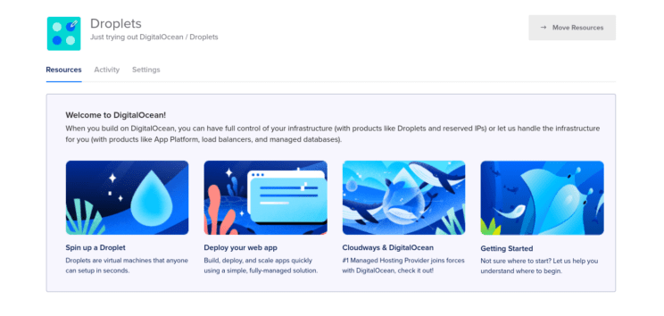

For several years, DigitalOcean has been an important sponsor of Ubuntu Budgie. They provide the infrastructure we need to host our website at [https://ubuntubudgie.org](https://ubuntubudgie.org) and our Discourse community forum at [https://discourse.ubuntubudgie.org](https://discourse.ubuntubudgie.org). Maybe you are familiar with them. Maybe you use them in your personal or professional life. Or maybe, like me, you didn't really see how they would benefit you.

Since I don't run servers or use cloud computing professionally, I overlooked DigitalOcean. However, a few years ago, I started to create a Twitch bot for a friend. Though it was far from a critical service, I wanted a place to host it, instead of locally for several reasons:

- My internet was spotty at times back then. Who wants a bot that stops working randomly.
- Instead of having it on my home network, I could avoid possible security concerns by running it on a remote server.
- If there are issues, I don't need to be at home to fix them.

I had seen a post on Ubuntu Budgie Discourse in which Project Leader David (fossfreedom) recommended DigitalOcean to another user as a place to host bots. So I started there. I won't lie, I also tested out a few other providers, but ultimately, I chose DigitalOcean. They had a very straight-forward, intuitive website. The price was right. And they just made it so fast and easy to spin up a server. I created an Droplet - basically a Linux-based virtual machine, and put the bot on it.

The little bot server has now been up and running for almost 3 years now, without issue. I couldn't be happier with how it is working out.

Where DigitalOcean really shines though, is through its Marketplace. It has hundreds of 1-Click Droplets that you can easily create, play around with, and destroy if you are done with it. I have tried out many - PiHole, OpenVPN, and NextCloud just to name a few. All were up an running effortlessly. After creation, they have a Get Started page which walks you through any configuration that needs to be done, which is great especially for someone like me who has zero experience with any of this software.

I wanted to see what it takes to get a WordPress site up and running from scratch. How much time and effort would I really need to spend? As it turns out, not much, and here is a quick look at how easy it was.

So I spun up a droplet, selected the OpenLiteSpeed WordPress image. I chose a few other things, such as the geographic server location and the SSH key to use.

Several seconds later, my WordPress Droplet was ready to go. And once running, you can look at the Get Started page, and you will have easy-to-follow instructions to get things going. Now, this time, I didn't go through the process of registering a domain, however I have done this in the past. The process made it very easy to properly set up SSL certificates through Let's Encrypt.

I give it a quick test.

And it's up and running, in under 5 minutes of effort! Obviously, there is much more to do, to make it a usable website, but I am impressed at how easy they make it to quickly go from nothing to functional.

What is also nice is that DigitalOcean does offer a free 60-day trial, up to $200 worth of credit. This makes it perfect for anyone who really just wants to play around a bit, and see what they are all about. At [https://marketplace.digitalocean.com](https://marketplace.digitalocean.com), you can see all the 1-Click Droplets images they provide.
