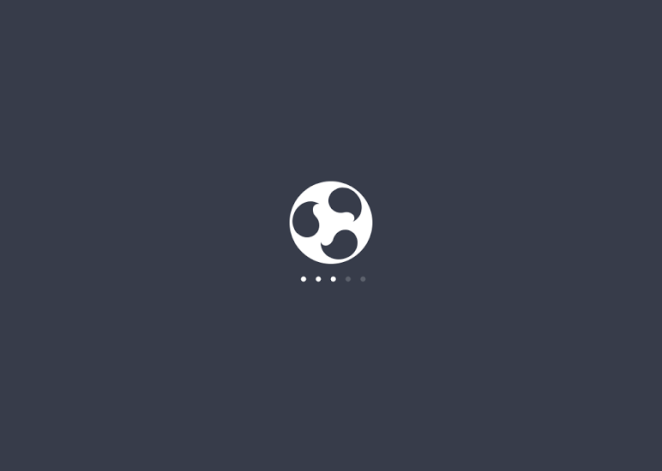

This is the first of our fortnightly roundup of budgie-remix news.

As part of improving our visual branding, look and feel, HEXcube has published a proposal to replace our current Plymouth splash screen

> The splash screen seen during bootup is an element that can influence the first impression of new users. Sure, there are users who enable text mode to replace the splash, or use fast booting machines (especially the ones with SSDs) where the splash isn’t visible for long, if at all. But, the boot splash always plays an important role in conveying the identity of an OS.
> 
> So, we’ve been working on creating a better splash screen since last month. We chose Ubuntu MATE’s Plymouth splash as the starting point. A mockup was made as a reference: [https://github.com/budgie-remix/assets/blob/master/Mockups/SplashScreenMockup.svg](https://github.com/budgie-remix/assets/blob/master/Mockups/SplashScreenMockup.svg) . Today I’m happy to announce that the concept has become reality! The new splash’ll be available soon in our Development PPA for testing and later as regular update.

APoliTech has started looking at introducing a **Welcome to budgie-remix** app for new users. See the screenshot below. This is our first real application development for 16.10 cycle. However, we intend to backport this for our 16.04 users too as soon as its ready! Follow the development on our [project development repo](https://github.com/budgie-remix/budgie-remix-welcome).

SpotTech has been polishing our ISO building capabilities – looks very good for 16.04.1 and 16.10. We believe we have solved two notable issues raised as part of the 16.04 installation – freeze on encrypting the home-folder and ubiquity crash on using some non-english locales. We are happy for you to [help out with testing](https://sourceforge.net/projects/budgie-remix/files/xenial%20testing/) – BUT please read the README first.  We don’t want to kill those proverbial cats.

David has been investigating how to [write python applets](http://xpressubuntu.wordpress.com/2016/05/07/writing-python-applets-for-the-budgie-desktop) for Budgie desktop. We think this is the first applet from outside the wonderful Budgie desktop team upstream.  Let this inspire you to write many more

#### AROUND THE WEB

1. [Youtube review of budgie-remix](https://www.youtube.com/watch?v=m28dd4dxH6M)
2. [webupd8 review of budgie-remix](http://www.webupd8.org/2016/04/a-quick-look-at-budgie-remix-1604.html)
3. [ubuntu podcast](http://ubuntupodcast.org/2016/04/28/s09e09-solitary-confinement/) – nice comments from the ubuntu podcast team – cheers!
4. [sourceforge project of the week](https://sourceforge.net/blog/projects-of-the-week-may-9-2016/?utm_source=rss&utm_medium=rss&utm_campaign=projects-of-the-week-may-9-2016) – great news to be recognised by the sourceforge team

#### OUR DESKTOP FAVOURITE

Our community has been posting pictures on our G+ community page. This is our favorite of this issue  Mike Johnston:

#### OPPORTUNITIES:

We have a growing number of areas we need you to help with – please jump in:

[Opportunity 1:](https://plus.google.com/+davidfossfreedommohammed/posts/Ey4UVCCoB8v) How to replace the ugly gnome-screensaver lockscreen

[Opportunity 2:](https://plus.google.com/+davidfossfreedommohammed/posts/NysKueyFycF) Join our budgie-remix bug-busting  team

[Opportunity 3:](https://plus.google.com/+davidfossfreedommohammed/posts/GHUqzTBs271) fonts and branding – we need your inspiring mockups

#### UPSTREAM BUDGIE DESKTOP

Its been fairly quiet upstream. These are some of the highlights in the last fortnight:

1. Ikey has been working on some [example C, Python and Vala applets](https://github.com/solus-project/budgie-desktop-examples).  Checkout these great examples.
2. A fix has been released upstream to allow Vala and C plugins to be compiled.  budgie-remix has included this fix as a patch.
3. A [discussion](https://github.com/solus-project/budgie-desktop/issues/436) about supporting Budgie panel on multiple monitors has taken place. It looks favorable to include this as a future enhancement. So, stay tuned for new features!
