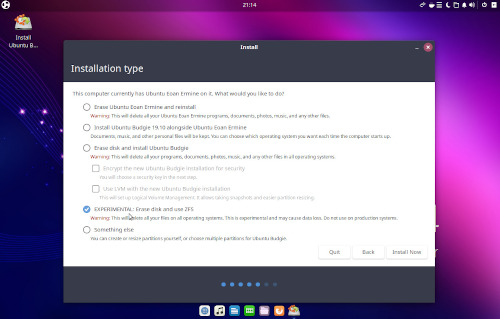
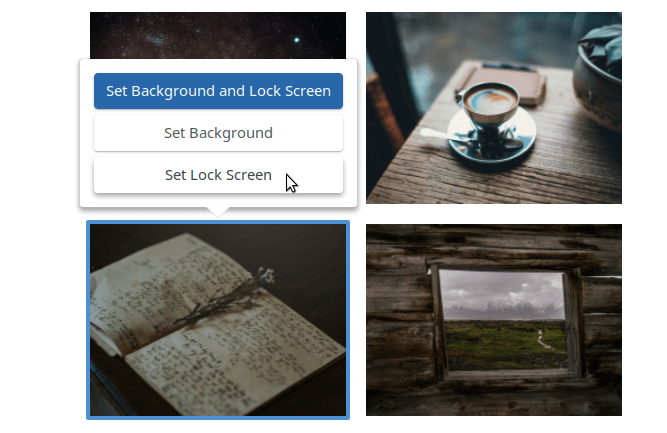

# VERSION

**Ubuntu Budgie v19.10 (Eoan Ermine)** **Release:** Oct 17th, 2019

Ubuntu Budgie 19.10 will be supported for 9 months until Jul 2020. If you need Long Term Support, it is recommended you use Ubuntu 18.04 LTS instead.

In these release notes the areas covered are:

- New features and enhancements
- Issues Resolved
- Upgrading from 18.04 / 18.10 / 19.04 Ubuntu Budgie
- Known Issues when upgrading
- Where to download Ubuntu Budgie

<!--more-->

# NEW FEATURES AND ENHANCEMENTS

## 19.10 STUFF TO LOOK OUT FOR

- Ubuntu Budgie Team Wallpapers for 19.10 - the UB team has decided for this release to choose their favourite wallpapers - quite an eclectic bunch. I hope you like them. We will next run a community contest for the 20.04 LTS
- All our backport packages have now been rebuilt for 19.10 - look out for nemo 4, nemo-share and nemo-dropbox and also skippy-xd is available through backports.
- Budgie Welcome - Translation team has been bustling - many more languages now available
- Latest versions of our default themes Pocillo, QogirBudgie and Arc
- Budgie Appindicators now deal with shrinking panel sizes

## BUDGIE DESKTOP:

Once again Ubuntu Developers (thanks Marco Trevisan) & Ubuntu Budgie continues to take the lead to ensure budgie desktop remains compatible with the latest GNOME stack. This time around the development ride has been particularly rough but I've worked with the GNOME mutter developers to ensure a smooth ride for all distros uplifting to GNOME 3.34.

I've added the following enhancements:

- patch to bring support for nemo-desktop and DesktopFolder to budgie desktop settings.
- ability to increase the spacer applet sizing without impacting the overall size of the panel.
- sort the menu taking into account your user locale characters such as accents
- ability to launch applications from the menu requiring elevated privileges
- hopefully reduced the occasional budgie desktop based apport dialogs seen during logon

Also have pulled from upstream a Fonts DPI configuration option in budgie desktop settings.

### ACCESSIBILITY

We have taken a closer look at making our distro more easy to use for those of us who need just a little extra help. This is where we need your help. What tricks & techniques are you aware of that helps improve the accessibility of the desktop?

We have incorporated a super useful screen magnifier - just enable via the Settings - Accessibility options

Bind both Super + Alt + = and Super + Alt + + as zoom-in keys


Also we have included the on-screen keyboard (onboard)


### NVIDIA

Our 19.10 distro now includes the NVIDIA proprietary driver sets on its ISO. This allows NVIDIA users to install & configure drivers out of the box without needing an internet connection. Just click the wifi installer option to install the correct NVIDIA driver for your computer - obviously assuming that your hardware needs it.

Likewise, we have added support for Optimus graphics switching direct from the budgie panel. If you have Optimus graphics look for the intel/nvidia icon to switch between your intel & nvidia GPUs.

<figure>


<figcaption>

Nvidia Menu

</figcaption>

</figure>

### ZFS

We are pleased to support [Ubuntu's ZFS initiative](https://ubuntu.com/blog/enhancing-our-zfs-support-on-ubuntu-19-10-an-introduction). For Ubuntu Budgie, you will have the option to [install the ZFS file-system](https://didrocks.fr/2019/10/11/ubuntu-zfs-support-in-19.10-zfs-on-root/) from the ISO



Remember this is experimental - so don't use on a valuable production system. Canonical devs are very interested in feedback - so this is an easy way to help-out early with 20.04LTS development.

You will need a minimum of 4GB RAM to install ZFS - don't use on RAM limited systems.

## BUDGIE APPLETS & BUDGIE MINI-APPS

Debuting for 19.10 are Window Previews, QuickChar, FuzzyClock, Workspace Stopwatch, Budgie Brightness Controller and Budgie Status-Notifier

### WINDOW PREVIEWS

Window previews (Alt Tab replacement) has been rewritten in vala - faster with per workspace/all workspaces and shift backwards controls. Additionally, Alt Above-Tab shows windows of the currently active application only.


Enable through Menu - Previews Control

### QUICKCHAR MINI APP

Quickly find and choose the equivalent locale character for an ascii character

Press Super+Alt+C to call the window

Type a character, and all its derivates will appear. Click one (or tab to the targeted character and press Return) and the character will be pasted into the document

Press again to toggle visibility, or Escape to hide


Install via Menu - Budgie Applets

### FUZZYCLOCK APPLET

Shows the time in a Fuzzy Way.

Supports 24-hour format Supports Dates Supports Horizontal Panels

<figure>


<figcaption>

Fuzzy

</figcaption>

</figure>

This is a new applet contributed by community member Adam Dyess - Thanks Adam!

Install via Menu - Budgie Applets

### WORKSPACE STOPWATCH APPLET

Workspace Timer Applet is an applet to keep track of usage per workspace, e.g. to find out how much minutes/hours were actually spent on a job. Workspaces can be freely named, custom names and all data are rmembered, also after logout/restart, until the RESET button is pressed. The log file is updated on workspace switch/clicking the icon for popup or else every 30 seconds. Time during suspend is automatically retracted from a workspace' time.


Install via Menu - Budgie Applets

### ADD BUDGIE-BRIGHTNESS-CONTROLLER APPLET

Brightness Controller is a Budgie Desktop applet allowing you to control the desktop/laptop brightness via your hardware brightness controller or via Xorg as a fallback.


Install via Menu - Budgie Applets

### BUDGIE STATUS-NOTIFIER

System Tray in KDE StatusNotifierItem format.


Install via Menu - Budgie Applets

### EXTRAS CHANGES

- Add budgie-extras-daemon to handle applet shortcut key handling
- Add automatic multi-monitor support for Showtime
- Showtime bug fix to deal with more locale variations
- Set the defaults for hotcorners
- Scaling fixes for Showtime when theme/resolution/font changes
- Display Window Mover applet correctly on primary monitor when multiple monitors are available
- Rework Dropby to display in an independent window rather than a popup - this resolves panel freeze issues.
- Dropby bug-fix to deal with non-accessible mount-points
- display dropby window close button icon
- Dropby - Fix right corner action appearance
- Window Mover no longer disappears when navigating using cursor keys
- hide countdown message window from docks
- Add option for take-a-break to unlock the screensaver
- Lots of translation updates
- Fix visualspace window being displayed when releasing ctrl/alt after arrow keys
- Correctly integrate hotcorners with window previews
- Reduce budgie panel CPU usage with keyboard auto-switch applet
- Fix for crash with keyboard auto-switch with malformed config file

All these productivity applets and mini-apps are now available from Budgie Welcome - select Menu - Budgie Applets

Remember, budgie-applets showcases many more indie developer applets

In total Ubuntu Budgie users have direct install access to 35 budgie applets and budgie mini-apps through budgie-welcome

If you want to showcase your applet in UB contact us and let us know about your project.

- Daily builds for budgie-extras is available - so to get the latest (warts and all) ppa:ubuntubudgie-dev/budgie-extras-daily

## KEY FEATURES AVAILABLE TO UB FROM UBUNTU

- Linux kernel v5.3
- GNOME 3.34 applications - our favourite - look out for the wallpaper changer. Very nice!



- Latest version of LibreOffice 6.3
- A shed-load of fixes throughout the Ubuntu stack - congrats on all Canonical, Ubuntu devs, Debian devs and all devs in the free software community for all of their hard-work which everyone should be pleased about :)

What does all that mean - most cutting edge yet stable software that brings great benefits for brand new hardware compatibility - including support for the very latest games.

## UB MAINTAINED PACKAGES

Apart from the above (!) UB maintains many Debian packages. New versions available in 19.10 include:

- slick-greeter
- Arc-Theme
- DesktopFolder

## ISSUES RESOLVED:

- Budgie Pixel Saver has been fixed to work with newer versions of mutter.
- Appindicator applet now ignores right-click events; this is now consistent with all budgie applets and prevents confusion between left/right click events.
- Out of the box we are now Python 2 free - better security especially due to the imminent end-of-life for python 2 security fixes.
- Thunderbolt support is now available from the start menu.

## KNOWN ISSUES:

- If you find that after the upgrade clicking the menu button crashes the panel, then CTRL+ALT+T to open a terminal then run:
    
    ```
    nohup budgie-panel --reset --replace & 
    ```
    
- Please read the [Ubuntu Release notes](https://wiki.ubuntu.com/EoanErmine/ReleaseNotes) which covers issues common to all Ubuntu Flavors.
    

# UPGRADING

## HOW TO UPGRADE FROM 19.04 TO 19.10

**IMPORTANT:** remember to double-check you have the following vital package before you upgrade:

```
sudo apt install ubuntu-budgie-desktop
```

After the release of 19.10, you will be offered to upgrade when you run Software & Updates.

Alternatively, from a command line run:

```
update-manager
```

**IMPORTANT** We do not recommend running `do-release-upgrade` from a Tilix terminal since this will hang during the upgrade. If you want to use `do-release-upgrade` switch to a TTY and login before running the command.

Some of the packages that were installed as part of the Ubuntu Budgie backports PPA (ppa:ubuntubudgie/backports) will be uninstalled as part of the upgrade. Use budgie-welcome to reinstall anything that is removed.

## HOW TO UPGRADE FROM 18.04 OR 18.10 TO 19.10

Short story - you cannot directly upgrade. You must first upgrade to 18.10 ... then 19.04 before upgrading to 19.10. Anything else is not supported nor supportable.

* * *

Please refer to the community wiki for more help:

[https://help.ubuntu.com/community/Upgrades](https://help.ubuntu.com/community/Upgrades)

Also, Ask Ubuntu has an excellent guide to help you upgrade:

http://askubuntu.com/questions/110477/how-do-i-upgrade-to-a-newer-version-of-ubuntu

# DOWNLOAD

Final release is available here: [https://ubuntubudgie.org/downloads/](https://ubuntubudgie.org/downloads/)

# GETTING SUPPORT

Thanks to the generosity of discourse.org, our support site is the crucial site for all things Ubuntu Budgie.

One to bookmark [https://discourse.ubuntubudgie.org](https://discourse.ubuntubudgie.org)

More information can be found [here](https://ubuntubudgie.org/2018/03/08/welcome-to-discourse/).

# INFRASTRUCTURE

We just wanted to thank our infrastructure sponsors who help us keep the lights on.

### [DIGITAL OCEAN](https://www.digitalocean.com/)

On a mission to simplify cloud computing so developers and their teams can spend more time building software that changes the world.

### [DISCOURSE](https://www.discourse.org/)

Discourse is the 100% open source discussion platform built for the next decade of the Internet. Use it as a mailing list, discussion forum, long-form chat room, and more!

### [STATUS.IO](https://status.io/)

Status.io was built to help companies enhance transparency and keep their customers in the loop during downtime. The Status.io platform enables organizations to maintain a customized public system status page, external to their infrastructure, that always displays the current health of their app, website or service.

* * *

David (project lead)
