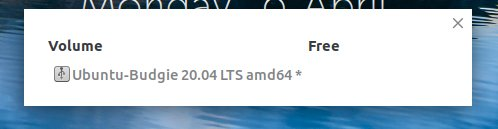

\[caption id="attachment\_1754" align="alignnone" width="719"\] Ubuntu Budgie 20.04 Desktop\[/caption\]

# VERSION

### Ubuntu Budgie v20.04 (Focal Fossa) Release: April 23rd, 2020

Ubuntu Budgie 20.04 is a LTS (Long Term Support) release that will be supported for 3 years until April 2023. Long Term Releases provide assured stability over a longer term than a standard 9 month release. Critical and stability fixes will be released for all the supported Ubuntu Budgie components; these will be undertaken by ourselves, Canonical and the wider Ubuntu community.

This is the 18.04 upgraders release note. This takes the 19.10/19.04 and 18.10 release notes and highlights the key parts that 18.04 upgraders need to be aware of.

If you are upgrading from 19.10 we have a [release note](https://ubuntubudgie.org/2020/04/02/ubuntu-budgie-20-04lts-release-notes/ "release note") more applicable to you!

In these release notes the areas covered are:

- New features and enhancements
- Issues Resolved
- Upgrading from 18.04 Ubuntu Budgie
- Known Issues when upgrading
- Where to download Ubuntu Budgie

\[caption id="attachment\_1756" align="alignnone" width="744"\] UB Desktop 20.04\[/caption\]

# NEW FEATURES AND ENHANCEMENTS

## 20.04 STUFF TO LOOK OUT FOR

- Stylish menu applet as the default
- budgie based network manager applet as the default
- Window Shuffler - animations, faster, keyboard friendly tiling CTRL+ALT+keypad numbers; The currently focussed window can be now tiled to each corner, side to side or maximized/unmaximized all from the keyboard. Give it a try (enable via Menu - Shuffler control).
- Desktop Layouts - choose your default desktop layout with one click
- 4K resolution friendly budgie desktop and budgie applet support
- GNOME Firmware and Drawing are new default applications
- Ubuntu Budgie Team Wallpapers for 20.04 - there was a community contest to choose its favourite wallpapers - and the community certainly contributed [amazing desktop images](https://ubuntubudgie.org/2020/02/11/congratulation-to-winners-of-20-04-wallpaper-competition/ "amazing"). I hope you like them. We will next run a community contest for the 22.04 LTS
- All our backport packages have now been rebuilt for 20.04 - look out for nemo-share and nemo-dropbox and also skippy-xd is available through backports.
- Firefox is the default browser.
- Catfish file and text search is now a default install
- The community has requested Files (Nautilus) to be switched to Files (Nemo) - so welcome back split screen and other goodies. Tip - press Alt or right-click the toolbar to show the Menu for preferences etc.
- budgie-nemo integration - right click options for changing the background, launch budgie-desktop-settings and catfish file & text search. Nemo folder-color is unfortunately not available in the repositories, so it has been dropped.
- QogirBudgie from the fiendishly clever themer vinceliuice - so three of the best themes are now default in budgie-desktop-settings (Arc, Pocillo and QogirBudgie)
- As the community has requested, Plank dock has now been switched to the bottom of the screen, is transparent and has the bounce animations by default

## BUDGIE DESKTOP:

Ubuntu Budgie 20.04 LTS ships with budgie-desktop v10.5.1. This is a massive upgrade for 18.04 users and the updates are too extensive to list. So here are the areas you should go/look and discover!

- Raven - Sound controls
- New Raven section in Budgie Desktop Settings.
- Ability to enable window focus change to being on mouse enter / leave via the “Windows” section of Budgie Desktop Settings, as opposed to click-to-focus.
- The “Fonts” section of Budgie Desktop Settings introduces hint, Text Scaling and anti-aliasing options
- Raven Notification grouping and the ability to turn off notifications. Look out for setting the Notification position as well.
- You can now middle click on the Bluetooth applet to toggle Bluetooth airplane mode. You can now middle click on the Sound applet to mute and unmute global audio.
- Icon Task List has received a lot of love; Grouping, launching instances via middle lick, favourites.
- Under the Desktop section of Budgie Desktop Settings, you'll find a new option called “Number of virtual desktops”, where you can go from just having one workspace up to eight!

### Ubuntu Budgie Experience

The following areas have been added or changed to enhance our budgie-desktop implementation:

- System Tray applet now dropped as a default - it is buggy and the network manager applet is now/intended as a default
- At the same time - added the ability to not run network-manager applet - this ensures the buggy system tray icon no longer appears
- CTRL+ALT+left/right swaps workspaces without a workspace indicator in the middle of the screen. This has been done to speed up switching workspaces & most importantly removes the possibility of crashes due to conflicts with the workspace animations
- Event alerts sounds are disabled by default now - if you want alert sounds choose the alert noise you want and sound level in Settings - Sound
- HiDPI (4K) support for Budgie applets (both in built-in and third-party) and their popup functionality
- Fix for keyboard shortcuts mysteriously going missing
- Fix for multimonitors to stop windows overlapping the top-bar when maximised
- Switch from qt5-style-plugins to qt5ct for QT app styling - apps such as vlc. You should see a QT5 Config app now in the menu to help you configure styling of QT apps. Also to note - some QT5 apps such as VLC also have styling options built in as well.
- Moka based icons revised to capture GNOME 3.32/3.34 and 3.36 changes
- Support large global menu in budgie-desktop panel
- Better lock screen styling - buttons are now flat and match the lock screen dialog
- Pixel Saver & Pocillo: Close button is now styled to match CSD windows
- Stylish menu applet as the default
- budgie based network manager applet as the default
- Window Shuffler - animations, faster, keyboard friendly tiling CTRL+ALT+keypad numbers; The currently focussed window can be now tiled to each corner, side to side or maximized/unmaximized all from the keyboard. Give it a try (enable via Menu - Shuffler control).
- 4K resolution friendly budgie desktop and budgie applet support
- GNOME Firmware and Drawing are new default applications
- All our backport packages have now been rebuilt for 20.04 - look out for nemo-share and nemo-dropbox and also skippy-xd is available through backports.
- We have dropped TLP from the default install. The power savings in the latest kernels are significant for newer computers. TLP is still available to be installed if the kernel power savings do not impact you due to using an older CPU.
- The caffeine appindicator has been dropped - this has been replaced with the native caffeine budgie-applet that comes with budgie-desktop v10.5
- We've added a new game 2048 as part of the default install - a great way to while away a few hours
- Catfish file and text search is now a default install
- The community has requested Files (Nautilus) to be switched to Files (Nemo) - so welcome back split screen and other goodies. Tip - press Alt or right-click the toolbar to show the Menu for preferences etc.
- budgie-nemo integration - right click options for changing the background, launch budgie-desktop-settings and catfish file & text search. Nemo folder-color is unfortunately not available in the repositories, so it has been dropped.
- QogirBudgie from the fiendishly clever themer vinceliuice - so three of the best themes are now default in budgie-desktop-settings (Arc, Pocillo and QogirBudgie)
- Advanced Network Configuration, LibreOffice Math, Software Sources and Additional Drivers are now available from the menu
- As the community has requested, Plank dock has now been switched to the bottom of the screen, is transparent and has the bounce animations by default
- UB logo is proudly displayed in the About screen and is the default menu icon
- ability to increase the spacer applet sizing without impacting the overall size of the panel.
- ability to launch applications from the menu requiring elevated privileges

Note also GNOME Upstream have now removed the split of Application Menus from the Window menu. So for Budgie this means there is no separate “Application” icon in the decoration to show the appmenu. Appmenus are now combined in the Window menu.

## Desktop Layouts

For 20.04 LTS we now support a one click method to set up your desktop with a look and feel that you are most comfortable with.

\[caption id="attachment\_1632" align="alignnone" width="744"\] Layouts\[/caption\]

Accessed through the Menu - Themes & Layouts, the following layouts can be used:

- Traditional Budgie
- Classic Ubuntu Budgie
- Ubuntu Budgie
- Cupertino
- The One
- redmond

Choosing a layout replaces your current setup with a predefined panel and applet layout. Combine that with the theme makeover option, you now have a extremely fast method to configure Ubuntu Budgie the way you want to.

## BUDGIE APPLETS & BUDGIE MINI-APPS

### WeatherShow

Weather forecast every three hours and over five days. This Desktop based weather applet is installed by default and can be added to your panel.

\[caption id="attachment\_1709" align="alignnone" width="744"\] Weathershow Applet\[/caption\]

### Budgie Applications Menu

We are pleased to ship by default our take on a simple but elegant menu for our desktop. Heavily based upon the good work of the ElementaryOS crew, this menu displays your installed applications via a Grid View as well as the traditional category view budgie users know and love.

\[caption id="attachment\_1648" align="alignnone" width="744"\] Appscreen\[/caption\]

We have enhanced the menu to optionally show the budgie powerstrip - so for those users who dont want to use the default power applet in the panel. The menu has many extra features - e.g. right click action options for those applications live steam that offer them.

\[caption id="attachment\_1637" align="alignnone" width="744"\] Appmenu3\[/caption\]

… a couple of hidden extras - type 2+2 - its a built in calculator or type ubuntubudgie.org into the search.

Again optionally - if you install zeitgeist the menu will start to learn what you frequently search for - and the search results be more tailored to your frequent requests - i.e. find things first time.

### Network Manager Applet

Budgie Desktop has shipped with a legacy network manager icon in the panel. It has never integrated very well - and together with the buggy system tray weird icon effects were visible on logon.

\[caption id="attachment\_1630" align="alignnone" width="303"\] Nm1\[/caption\]

Enter the native Network Manager budgie applet. This integrates fully with our budgie desktop. We have tidied up and built upon the good work of the Daniel Pinto (original creator) and the ElementaryOS team from which the budgie-applet was derived from.

### Budgie Window Shuffler

Focal's Window Shuffler is a completely rewritten and re- designed version of Budgie's tiling add-on. Apart from the drastically improved responsiveness, features now include:

- Setting margins and padding of the window grid \[caption id="attachment\_1629" align="alignnone" width="600"\] Shuff1\[/caption\]
- Shortcuts for snapping windows to the nearest tile
- Shortcuts for resizing windows in all directions
- Scroll over the GUI grid to set its shade
- Targeted position preview when using the GUI grid \[caption id="attachment\_1628" align="alignnone" width="600"\] Shuff2\[/caption\]
- Animated window movement when using shortcuts to move windows
- Swapping windows in case a window is moved to an existing window's position
- Shortcuts for Quarter / half tiling

The new Shuffler Control window \[caption id="attachment\_1627" align="alignnone" width="744"\] Shuff3\[/caption\]

### Wallstreet

One request that continually was made was to have the ability to rotate through a folder full of photos and display on your desktop. We know there are many heavy-weight tools out there - but what our community wanted is a simple - very lightweight solution built into the desktop.

\[caption id="attachment\_1625" align="alignnone" width="535"\] Wallstreet\[/caption\]

Enter - WallStreet - a new lightweight wallpaper rotator every x minutes. Just enable it through the menu - wallstreet control

### Visual-Space

New applet budgie-visualspace-applet - a stylish compact workspace switcher as a default on the panel.

\[caption id="attachment\_1626" align="alignnone" width="501"\] Visualspace\[/caption\]

So this desktop focused productivity tool is used if you have lots of windows spread over your desktop and/or between workspaces - you can quickly focus that window without having to alt-tab through everything.

### Dropby

Dropby applet makes a reappearance as a default panel applet

\[caption id="attachment\_1650" align="alignnone" width="498"\] Dropby\[/caption\]

When any USB device is connected then you have easy access to it - with the ability to copy its contents, open to see what is on it and to eject the device safely directly from a popup and panel applet.

### Other notable applets and mini apps

- Kangaroo - Quick and easy browsing, across (possibly) many folder layers, without having to-do a single mouse click.
- App launcher - Display your favorite applications in a menu and on the panel.
- Trash applet (vala based) - Show, hide and restore trash items.
- Recently Used (vala based) - Show recently used items in a menu.
- Quick Notes & Hot Corners: These existing applets have been rewritten from Python based to Vala based. This has been done to greatly enhance the speed of the applets and make them memory efficient; in addition they have picked up a few enhancements so browse around in the applet setting to discover whats new
- New Pomodoro like applet Take-A-Break
    - QUICKCHAR MINI APP - Quickly find and choose the equivalent locale character for an ascii character. Press Super+Alt+C to call the window. Type a character, and all its derivates will appear. Click one (or tab to the targeted character and press Return) and the character will be pasted into the document. Press again to toggle visibility, or Escape to hide
    - FUZZYCLOCK APPLET - Shows the time in a Fuzzy Way. Supports 24-hour format Supports Dates Supports Horizontal Panels

\[caption id="attachment\_1417" align="alignnone" width="640"\] Fuzzy\[/caption\] This is a new applet contributed by community member Adam Dyess - Thanks Adam!

- WORKSPACE STOPWATCH APPLET - Workspace Timer Applet is an applet to keep track of usage per workspace, e.g. to find out how much minutes/hours were actually spent on a job. Workspaces can be freely named, custom names and all data are rmembered, also after logout/restart, until the RESET button is pressed. The log file is updated on workspace switch/clicking the icon for popup or else every 30 seconds. Time during suspend is automatically retracted from a workspace time.
    
- BUDGIE-BRIGHTNESS-CONTROLLER APPLET - Brightness Controller is a Budgie Desktop applet allowing you to control the desktop/laptop brightness via your hardware brightness controller or via Xorg as a fallback.
    

\[caption id="attachment\_1419" align="alignnone" width="200"\] Brightnesscontroller\[/caption\]

- BUDGIE STATUS-NOTIFIER - display status notifications
    
- Showtime - Adds automatic multi-monitor support for Showtime
    
- Display Window Mover applet correctly on primary monitor when multiple monitors are available
    
- Rework Dropby to display in an independent window rather than a popup - this resolves panel freeze issues.
    
- Weathershow applet - Display temperature correctly on vertical panels
    
- Tweaked budgie-pixel-saver-applet to correctly handle displaying Titles/Titles & Buttons/Buttons
    

All these productivity applets and mini-apps are now available from Budgie Welcome - select Menu - Budgie Applets

### WINDOW PREVIEWS

Window previews (Alt Tab replacement) has been rewritten in vala - faster with per workspace/all workspaces and shift backwards controls. Additionally, Alt Above-Tab shows windows of the currently active application only.

\[caption id="attachment\_1415" align="alignnone" width="640"\] Previews\[/caption\]

Remember, budgie-applets showcases many more indie developer applets

In total Ubuntu Budgie users have direct install access to 35 budgie applets and budgie mini-apps through budgie-welcome

If you want to showcase your applet in UB contact us and let us know about your project. Daily builds for budgie-extras is available - so to get the latest (warts and all) ppa:ubuntubudgie-dev/budgie-extras-daily

## Budgie Welcome

### Budgie Themes & Layouts

We have shipped for a few releases now the ability via one-click to completely update the look of your desktop - cursors, icons, themes etc. From 20.04, this makeover ability can now be individually applied i.e. just the theme, or icon etc. giving you an easy way to mix and match between different makeovers.

\[caption id="attachment\_1631" align="alignnone" width="744"\] Makeover\[/caption\]

Latest version of vimix theme available through Menu - Budgie Themes & Layouts is shipped in 20.04 together with QogirBudgie (available by default on the installation)

## Default Applications

### Drawing

\[caption id="attachment\_1635" align="alignnone" width="683"\] Drawing\[/caption\]

We are pleased to ship by default the stylish new Drawing application. This application is a basic image editor, similar to Microsoft Paint, but aiming at the GNOME based desktops such as GNOME Shell and Budgie Desktop. PNG, JPEG and BMP format files are supported.

### GNOME Firmware

Ubuntu Budgie now ships with GNOME Firmware - it is really a power user tool to resolve those specific vendor device issues that can be resolved by firmware. We don't expect you to generally use this to update stuff - only update if you are having issues that cannot be resolved by updating the linux kernel. Also to note - not all manufacturers release firmware that can be installed via linux - you may still have to resort to MS Windows based upgrades.

### Celluloid

\[caption id="attachment\_1636" align="alignnone" width="744"\] Celluloid\[/caption\]

Celluloid has now replaced gnome-mpv

### Samba

Samba has been removed as a default install

### Android Phone integration

Ubuntu Budgie now provides seamless desktop-to/from-android phone transfer capabilities - we now ship with go-mtpfs by default. Simply plug-in your android phone and it will appear automatically in nemo allowing you to copy files/photos etc between your phone and the desktop.

### ACCESSIBILITY

We have taken a closer look at making our distro more easy to use for those of us who need just a little extra help. This is where we need your help. What tricks & techniques are you aware of that helps improve the accessibility of the desktop?

We have incorporated a super useful screen magnifier - just enable via the Settings - Accessibility options

Bind both Super + Alt + = and Super + Alt + + as zoom-in keys


Also we have included the on-screen keyboard (onboard) ### NVIDIA

Our distro now includes the NVIDIA proprietary driver sets on its ISO. This allows NVIDIA users to install & configure drivers out of the box without needing an internet connection. Just click the wifi installer option to install the correct NVIDIA driver for your computer - obviously assuming that your hardware needs it.

Likewise, we have added support for Optimus graphics switching direct from the budgie panel. If you have Optimus graphics look for the intel/nvidia icon to switch between your intel & nvidia GPUs.

\[caption id="attachment\_1413" align="alignnone" width="640"\] Nvidia Menu\[/caption\]

## KEY FEATURES AVAILABLE TO UB FROM UBUNTU

- Linux kernel v5.4
- GNOME 3.36 applications
- Latest version of LibreOffice 6.4
- Latest ZFS support with automatic APT rollback support
- A shed-load of fixes throughout the Ubuntu stack - congrats on all Canonical, Ubuntu devs, Debian devs and all devs in the free software community for all of their hard-work which everyone should be pleased about ?
- What does all that mean - most cutting edge yet stable software that brings great benefits for brand new hardware compatibility - including support for the very latest games.

## UB MAINTAINED PACKAGES

Apart from the above (!) UB maintains many Debian packages. New versions available in 20.04 include:

- Slick Greeter
- Login Window Preferences
- DesktopFolder

## ISSUES RESOLVED:

- GNOME Software Updates tab has been hidden - it doesn't really work and the recommended update process is via Menu - Software & Updates
- Fixed budgie-desktop bug to allow custom layouts that include left & right panels.
- Papercut - uninstalling default applets now no longer uninstalls the Ubuntu Budgie desktop environment.
- Budgie Desktop now includes a patch developed by myself hopefully to reduce the number of crash reports you see on first logon.

## KNOWN ISSUES:

- When installed on default VirtualBox settings or QEMU, on first logon the session will crash when budgie-welcome is first open. The session also crashes when other applications such as Settings is open. [https://bugs.launchpad.net/ubuntu/+source/xorg-server/+bug/1745345](https://bugs.launchpad.net/ubuntu/+source/xorg-server/+bug/1745345)
- For virtualbox ensure the VMSVGA graphics driver is used in the virtual machine settings
- For QEMU use the VMVGA graphics driver.
- Alternatively for both uninstall the gstreamer1.0-vaapi package
- If you find that after the upgrade clicking the menu button crashes the panel, then CTRL+ALT+T to open a terminal then run:
- `nohup budgie-panel --reset --replace &`
- Launching terminal based apps from the menu does not work. Workaround is to fool GLib to assume that a supported terminal (tilix isnt supported) is installed `sudo ln -s /usr/bin/tilix /usr/bin/nxterm`. [https://bugs.launchpad.net/ubuntu/+source/budgie-desktop/+bug/1873428](https://bugs.launchpad.net/ubuntu/+source/budgie-desktop/+bug/1873428)
- Please read the [Ubuntu Release](https://wiki.ubuntu.com/FocalFossa/ReleaseNotes "Ubuntu") notes which covers issues common to all Ubuntu Flavors.

# UPGRADING

## HOW TO UPGRADE FROM 18.10/19.04/19.10 TO 20.04

IMPORTANT: remember to double-check you have the following vital package before you upgrade:

```
sudo apt install ubuntu-budgie-desktop
```

After the release of 20.04, you will be offered to upgrade when you run Software & Updates. Alternatively, from a command line run:

```
update-manager
```

IMPORTANT We do not recommend running `do-release-upgrade` from a Tilix terminal since this will hang during the upgrade. If you want to use do-release-upgrade switch to a TTY and login before running the command.

Some of the packages that were installed as part of the Ubuntu Budgie backports PPA (ppa:ubuntubudgie/backports) will be uninstalled as part of the upgrade. Use budgie-welcome to reinstall anything that is removed.

## HOW TO UPGRADE FROM 18.04.4

18.04 LTS users using the 64bit edition will be offered the upgrade to 20.04 in July/August 2020 when the first point release (20.04.1) is made available. The first few months (April to July) are used to iron out those particularly troublesome issues not found at the initial release. So be patient and you will be rewarded with an upgrade window notification when to move to 20.04.

The Caffeine application indicator will be removed as part of the upgrade process. You can replace this with the native budgie caffeine applet in budgie-desktop-settings - panel - add applets

To get the 20.04 panel layout use the Menu - Budgie themes & Layouts application.

18.04 LTS users using the 32bit edition cannot upgrade to 20.04 - 32bit support was dropped after 18.04.

Please refer to the community wiki for more help: [https://help.ubuntu.com/community/Upgrades](https://help.ubuntu.com/community/Upgrades)Also, Ask Ubuntu has an excellent guide to help you upgrade: [http://askubuntu.com/questions/110477/how-do-i-upgrade-to-a-newer-version-of-ubuntu](http://askubuntu.com/questions/110477/how-do-i-upgrade-to-a-newer-version-of-ubuntu)

# DOWNLOAD

Final release is available here: [https://ubuntubudgie.org/downloads/](https://ubuntubudgie.org/downloads/)Beta release is available here: [http://cdimage.ubuntu.com/ubuntu-budgie/releases/focal/beta/](http://cdimage.ubuntu.com/ubuntu-budgie/releases/focal/beta/)

# GETTING SUPPORT

Thanks to the generosity of discourse.org, our support site is the crucial site for all things Ubuntu Budgie.

One to bookmark [https://discourse.ubuntubudgie.org](https://discourse.ubuntubudgie.org)More information can be found here.

## INFRASTRUCTURE

We just wanted to thank our infrastructure sponsors who help us keep the lights on.

[DIGITAL OCEAN](https://www.digitalocean.com/ "DIGITAL")

On a mission to simplify cloud computing so developers and their teams can spend more time building software that changes the world.

[DISCOURSE](https://www.discourse.org/ "DISCOURSE")

Discourse is the 100% open source discussion platform built for the next decade of the Internet. Use it as a mailing list, discussion forum, long-form chat room, and more!

[STATUS.IO](https://status.io/ "STATUS.IO")

Status.io was built to help companies enhance transparency and keep their customers in the loop during downtime. The Status.io platform enables organizations to maintain a customized public system status page, external to their infrastructure, that always displays the current health of their app, website or service.

[UpCloud](https://upcloud.com/ "UpCloud")

Cloud hosting for developers - Platinum client hardware partner for the Ubuntu Budgie team

* * *

David (project lead)
