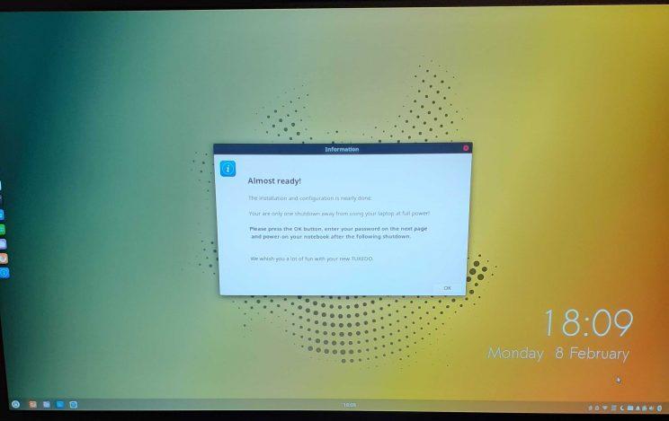

Introduction Thanks to all of our generous donors the Ubuntu Budgie team has purchased a development laptop for me to continue supporting and developing our distro.

Up until now, I have been using my own personal laptop since the first 16.04 budgie-remix days. It was showing its age – needing to be shook hard to wake up, freezing at random times and generally just being a pain to use trying to support over three or four releases at the same time all in virtual machines.

We collectively as a team decided to purchase from a Linux friendly manufacturer; we decided on the Germany based company Tuxedo since their range was very competitive. The order was placed back in November 2020 for a Tuxedo Pulse 15. We knew there would be a delay in its delivery due to the world-wide lack of the Ryzen 7 processor. It didn’t help that Brexit hit a hard-exit that caused chaos at the border and a couple of frustrating weeks waiting to clear customs. More problematic was the massive instant tariffs – so for UK based consumers its now more difficult to justify to buy electronics from anywhere other than the UK ????

Tuxedo arrival Well I must say I am impressed. The laptop was delivered really well packaged – it really did survive weeks on the road. Securely fitted in a customised box within a box. Padded with foam there was no chance of this thing rolling around during transport.

\[caption id="attachment\_2203" align="alignnone" width="744"\] Tux1 \[/caption\]

This was a really light, slim machine, with a cracking matte screen with gorgeous contrasting colours and a keyboard that was really responsive. The keyboard is backlit as well. Very stylish.

Unexpected was the sound – the speaker was mounted underneath the laptop – but works perfectly – great stereo separation and sound was loud but without distortion.

Tuxedo OS The laptop arrived with what is called Tuxedo OS. With trepidation I switched it on knowing from members of our discourse site that this was supposedly based upon Ubuntu Budgie.

\[caption id="attachment\_2204" align="alignnone" width="744"\] Tux2 \[/caption\]

Sure enough I spotted our slideshow – to the background said "Tuxedo" … and the words said Ubuntu Budgie.

Then the first "what the…"

\[caption id="attachment\_2205" align="alignnone" width="744"\] Tux3 \[/caption\]

The Ubuntu purple GDM3 login window – what happened with the nice Slick Greeter? Carrying on a welcome message appeared … not our budgie-welcome screen though.

\[caption id="attachment\_2206" align="alignnone" width="744"\] Tux4 \[/caption\]

Oops with the obvious typo but nice to see and "almost ready" message. The budgie panel has moved from top to bottom – with plank now on the left side of the screen.

Clicking OK presented a "In progress" dialog. No idea what was in progress but it seemed to stay visible for 10 minutes. The panel seem to be frozen and nothing was clickable. Then unexpectedly the laptop powered off without warning. Not a good start.

Booting back up – I noticed the boot speed – from pressing the power button to the login window was 18 seconds. Later I found out that 9 seconds was the EFI splash screen – so 9 seconds from grub to logon window. Nice!

\[caption id="attachment\_2207" align="alignnone" width="744"\] Tux5\[/caption\]

Poking around Tuxedo comes with unexpectedly linux kernel 5.6 – a Tuxedo oem kernel. The rest of the OS is based on Ubuntu 20.04.1 – so not the usual 5.4 kernel. The graphics seemed to be copied from the oibaf unstable PPA – not from the ubuntu repos.

Indeed the repo list was tuxedo all over with other custom tuxedo repos.

\[caption id="attachment\_2208" align="alignnone" width="744"\] Tux6 \[/caption\]

The good… In the system tray was an icon that display a really nice custom Tuxedo Control Center

\[caption id="attachment\_2209" align="alignnone" width="744"\] Tux7 \[/caption\]

Nicely layed out with various sensors & support information. Bravo!

The laptop comes with a massive battery

\[caption id="attachment\_2210" align="alignnone" width="744"\] Tux8\[/caption\]

You can real fun with the "Time to empty" figure when letting the laptop go idle! In reality I’m guessing nine or more hours – more than enough to-do a full day of development.

The bad… Browsing through the menu was lots of non default Ubuntu Budgie apps – snap-store, FreeCiv, KDE Connect, Libreoffice Base, KSysGuard, LinSSID and many others.

Why the number of KDE apps I don’t know – they didn’t really integrate and really felt like bloat.

Brasero disk writer was installed … this machine doesnt come with a DVD drive…

\[caption id="attachment\_2211" align="alignnone" width="744"\] Tux9\[/caption\]

The theme and icons are Tuxedo branded. I’m guessing its some-sort of Arc based GTK theme with a garish highlight colour. Icons are basically Moka based.

The ugly Umm – just why the KDE discover? Just so odd to see

\[caption id="attachment\_2212" align="alignnone" width="744"\] Tux10 \[/caption\]

Lots of software to discover via GNOME Software … and duplicated by snap-store as well!

Conclusions The hardware is perfect. I can only congratulate Tuxedo for producing a really nice machine – powerful, well spec’d at a great price.

Tuxedo OS is a missed opportunity – weird defaults such as a purple GDM3, snap-store plus non integrated KDE based apps with several I’m wondering why they were included. The vendor seems to miss the elegance motif and thrown in a full grab-bag.

Running an update I was hoping the ancient kernel would be at least updated to the supported 5.8 HWE kernel. Unfortunately not.

I would acknowledge I am biased – at the end-of-the-day I didn’t buy this for the operating system – I bought it for the hardware and I warmly recommend it.

Needless to say – after 30 minutes I purged Tuxedo OS and installed both 20.04.2 Ubuntu Budgie & 21.04. Boot speed for 21.04 is 6 seconds from Grub to login window. Both variants of our distro work perfectly demonstrating installing Linux on a friendly Linux vendor based machine really makes sense.

David (project lead)
