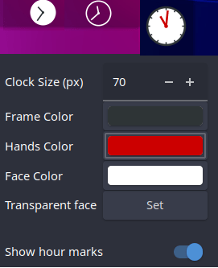
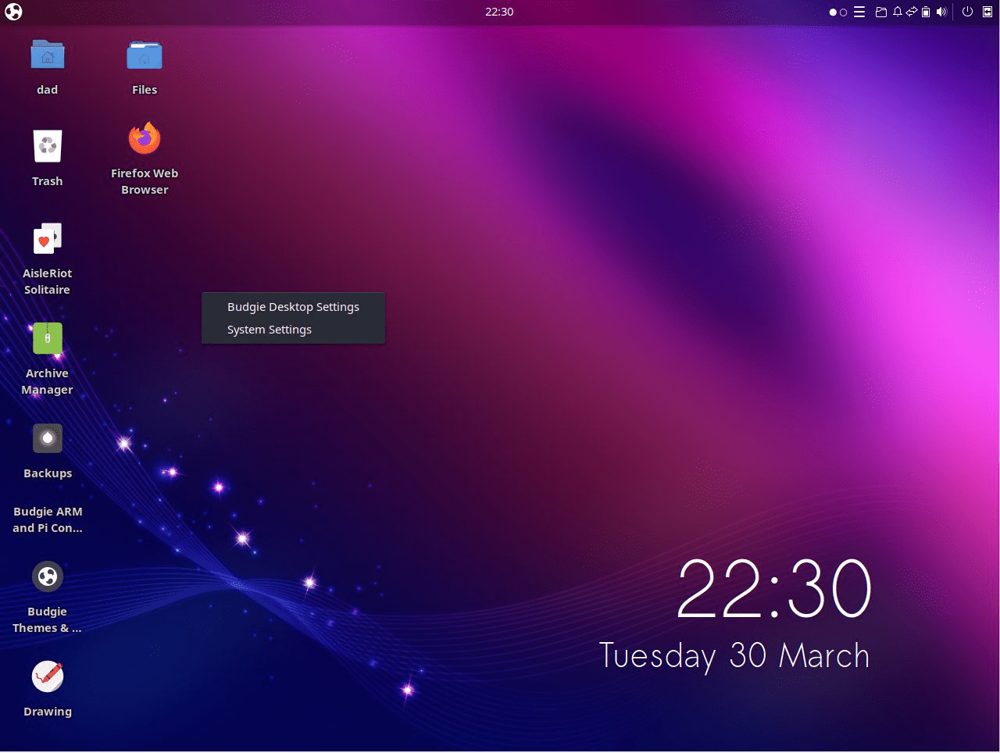

# Ubuntu Budgie v21.04 (Hirsute Hippo) Release: 22nd April, 2021

**This is still in draft - pictures and words to be added and refined. Please check again in the next week or so**

Ubuntu Budgie 21.04 is a normal release that will be supported for 9 months until Jan 2022. Long Term Releases such as 20.04.2 provide assured stability over a longer term (3 yrs) than a standard 9 month release. Critical and stability fixes will be released for all the supported Ubuntu Budgie components; these will be undertaken by ourselves, Canonical and the wider Ubuntu community.

In these release notes the areas covered are:

- New features and enhancements
- Upgrading from 20.04.2/20.10 Ubuntu Budgie
- Known Issues when upgrading
- Where to download Ubuntu Budgie

\[caption id="attachment\_2327" align="alignnone" width="744"\] Desktop 21.04\[/caption\]

## Summary

Ubuntu Budgie is the sum of many hundreds of developers working together. For 21.04 your Ubuntu Budgie team have unfortunately done a bad thing ... we have rocked our largest release ever...

For 21.04 we now have our very first Raspberry Pi 4 image - this is an area lots of members from the UB community have talked about over the years - and its thanks to new team member Sam Lane that we have made this a reality. Do checkout our release notes specifically for the [Raspberry Pi 4](https://ubuntubudgie.org/2021/03/release-notes-ubuntu-budgie-21-04-on-a-raspberry-pi-4/)


Budgie Desktop has now been uplifted to the very latest v10.5.2. We are pleased as a team to have contributed to this release - the results from the whole budgie developer community really shows in 21.04

We now include another Mac like makeover using the fabulous WhiteSur theme and icons through a click of a button. We have also backported this to 20.04 LTS and 21.04.

Also, we also have show-cased two new optional applets from the budgie developer community. Again we have backported these and made available to 20.04 LTS and 21.04.

Our desktop has been refreshed - we now sport a darker theme as a default with a brand new makeup for our Pocillo icons.

Windows Shuffler now includes a key new capability called Layouts. Its now just a click of a button to move/launch/run windows and apps across multiple monitors in whatever desktop layout you want.

Taken together, all the smaller changes plus the larger enhancements shapes our distro to be fully flexible and customisable to your workflow; with sane defaults to provide a first rate experience from the get-go.

## Applets and mini-apps

1. Window Shuffler - Window Rules: Add ability to set the position and size together with the monitor location to open an application on
2. Window Shuffler - Layouts: Add the ability to launch and group together multiple applications

[](http://www.youtube.com/watch?v=SBtvrcf-IfU)

4. Applications Menu:
    
    - Cosmetic - labels on budgie-desktop-settings are left aligned.
    - from upstream Terminal apps are no-longer shown in the menu such as xterm
5. QuickChar installation is now easier on other on Debian based distro's - should not now need to patch your install locations
    
6. A new independent applet called budgie-clipboard-applet is now available - backported to 20.04 and 20.10 - look out for it via Menu - Budgie Extras
    


7. A new independent applet called budgie-analogue-applet ([https://github.com/samlane-ma/budgie-analog-clock](https://github.com/samlane-ma/budgie-analog-clock)) is now available and has been backported to 20.04 and 20.10 as well.



8. Bug fix for the applications menu so that rollover menus settings is remembered on logon.
9. The number of cities that our weather applet can now search has increased from 22.6k to 185k
10. Change to budgie-pixel-saver-applet. It now handles blacklisting of apps to stop it trying to add window decorations where a window didn't have one in the first place. e.g. Firefox, Telegram and Ulauncher. This has been backported to 20.04 & 20.10 as well.

## Budgie Desktop

**v10.5.2 abridged upstream Solus release note summary here**

Budgie 10.5.2 introduces new goodies to make your Budgie experience even better!

Budgie Menu has received various refinements for this release:

- Budgie Menu introduces additional checks for an application's DesktopAppInfo, ensuring that we consistently skip apps and exclude them from calculations when they have Hidden or NoDisplay set, as well as if the NotShowIn contains Budgie.
- Budgie Menu will no longer show empty categories, a common occurrence when installing applications via WINE.
- Budgie Menu will now alphabetically sort category names, which is useful when you have custom user desktop directories for applications. They are no longer forced to be below default system-wide desktop directories such as Internet / Networking, Office, Sound & Video, etc.
- Applications which utilize pkexec in their desktop info will now spawn an asynchronous process, with pkexec being the command and passing the rest of the command line content as arguments.


The Icon Tasklist applet has seen new features and behaviour refinements in Budgie 10.5.2.

- There are now two new options available, disabled by default, to launch a new instance of an application via the respective button for the application: middle click and double click. This expands on our existing option to create a new instance of an application by clicking the + button in the popover of each Icon Button.
- The behavior of the Icon Tasklist has been refined in Budgie 10.5.2. We have consolidated duplicate logic in other less used classes into our dedicated application state tracking class, which is used by the Icon Tasklist and IconPopover to provide a list of running applications, their AppInfo, any group they belong to, and more. This consolidation has meant more consistent “skip pager” checks, as well as more consistent rejection of various types of windows, such as docks, apps with splashscreens and utilities e.g. controls for an emulator.
- Thanks to this more consistent window type rejection, we are able to more closely discern between what is budgie-panel versus what is budgie-desktop-settings, which is part of the panel but is otherwise a NORMAL type application. This enabled us to resolve an issue where the pin and new instance buttons were being unintentionally shown, as well as an issue where you could not close Budgie Desktop Settings via the IconPopover controls (right click popover for each Icon Button in the tasklist).
- After close discussions with members of the community on our forums on the expected behaviour of the Icon Tasklist, time was spent refining the behaviour of Icon Tasklist and individual Icon Buttons to be more consistent. Here are some examples: a. When the “Show All Windows on Click” option is enabled, we will now more consistently show or minimize all windows on click if one of them is currently active. b. If only one instance of an application is open and it is on another workspace (in this case the “Restrict to Workspace” option is not enabled), we switch to that workspace and unminimize the window (since the chances are you probably want to see the application in the first place).
- We are always listening to feedback on how to improve the behaviour of Icon Tasklist while ensuring it remains simple and approachable to use. If you have an idea on how to improve it further, feel free to file an issue on Budgie's issue tracker.


The Sound applet has seen a redesign and now features a dedicated button for mute toggling, as well as leveraging iconography for the System Settings button rather than text.


Dating back to the days of Budgie 7 in 2014, Budgie had been using an na-tray implementation also seen in desktop environments such as Cinnamon for the creation and management of system tray icons. Thanks to the incredible work by Solus contributor Campbell Jones, the System Tray has been completely rewritten from scratch, supporting tray icons leveraging the XEmbed Protocol. This new implementation resolves numerous issues such as:

- Background icons not refreshing, resulting in instances where it may appear that multiple icons are overlapping.
- Tray icons not consistently hiding when a panel hides (during “Intelligent” mode).
- Tray icons blinking when panel transparency is set to “Dynamic”
- Tray icons getting hidden when switching icon themes.

Additionally, a configuration option has been added for the System Tray that enables the setting of spacing between individual icons, making it perfect for those that want both their applets and tray icons to be equidistant!


Budgie Desktop View has been updated to provide a clearer differentiation between removing a Panel and removing an applet from a Panel. A dedicated button for removing a panel has been added below the Panel's applet list, with a description that makes its purpose clearer. This button will not appear when you only have one panel in your Budgie setup. Building on this, we have removed the option to disable the panel removal confirmation dialog. From user reports, the consensus was that this option was too easy to enable, would result in accidental permanent removal of panels more frequently than desired, and lacked a clear user-friendly method to re-enable the prompt.


For those which use Budgie in another language than English, the menu items presented when adding a new Autostart application or command via the Autostart section are now translatable. For any language which has the terms translated, those will be used instead.

Budgie 10.5.2 is the first release of Budgie to feature a new budgie specific desktop icons implementation. Whilst not the default in Ubuntu Budgie, it is available to be installed called budgie-desktop-view.



This budgie specific implementation has been to introduce via a new, separate project that could be iterated on independently from Budgie Desktop itself. This project needed to be rigorously focused and developed with an understanding of the scope and intent of the project, not trying to be a file manager but rather a method of quickly accessing the content and applications you consider most important.

Budgie has always been about striking a balance in customization and that extends to the support we provide downstreams like Ubuntu Budgie as well. That is why we worked hard on introducing a new vendor-oriented mechanism to enable downstreams to choose a desktop icons implementation that fits them and their users best. Alongside our own “native” Budgie Desktop View implementation, we are providing official support in the Budgie Desktop Settings application for the configuration of DesktopFolder and Nemo.

Raven Thanks to Solus contributor Evan Maddock, Budgie 10.5.2 introduces a new option to choose which side of the screen Raven should be. Prior to Budgie 10.5.2, Raven would always appear on the left side when the main panel and trigger were on the left, and appear on the right when the main panel was anywhere else.

Users will be able to choose between this behaviour, called “Automatic”, as well as left and right sides!


Translations Thanks to our incredible community members that have stepped up to translate Budgie, Budgie is now more accessible than ever. Budgie 10.5.2 introduces support for three new languages: Afrikaans, Albanian, and Hindi. Budgie now has 40 languages which have 90% or more coverage and we have seen dedicated translators step up for a wide range of languages, many of which are now completely translated.

We are still working hard to get Budgie translated 100% into many languages. If you are interested in helping translate Budgie into your language, feel free to reach out!

Here are some other aspects of Budgie that received refinements:

- Animation disabling: Background transitions and workspace switching are no longer always enabled but now honor the option to disable animations in Budgie Desktop Settings
- Budgie's Application Switcher a. Typically referred to as the Alt+Tab switcher, this switcher now supports the Ctrl modifier, adding support for more custom keyboard layouts and mappings. b. We now support an option to show all windows from all workspaces in the switcher, enabling you to switch between applications and workspaces simultaneously. c. Budgie Run Dialog can now check keywords, improving search and aligning its behaviour closer to that of Budgie Menu.
- Caffeine Applet: When Caffeine Mode is enabled, the timer will now update the spin button value based on how many minutes are remaining.
    - Forward-specific keyboard layout switching can now be done with Alt+Shift.
    - Transparency is now supported in background images, falling back to the fixed color or gradient behind it.
    - We now provide an option via GSettings to configure the desired screenshot commands, so downstreams can use alternatives to gnome-screenshot.

In addition to all the quality of life improvements and features we have added, Budgie 10.5.2 introduces many bug fixes including for some issues dating back years to the early days of Budgie 10.

- Fix Workspace Applet allowing more than max supported workspace count. We will now return a -1 on our WM AppendNewWorkspace if we are rejecting more additions of workspaces, which informs our WorkspaceApplet to not show the + button (even if set to always show) and reject drag actions onto new workspaces.
- Added missing LEFT and RIGHT panel layouts in the manager, which prevented downstreams and users from using panel.ini files with left or right panels.
- During panel initialization, we will now appropriately set dock-mode if needed, which fixes an issue where the class would only be applied if the dock mode setting actually changed.
- Fix a crash when removing an applet with missing information.
- The Tasklist applet will no longer cause the rest of the panel contents to be thrown into the aether when you have many windows open. You will be able to scroll up / down to get all the windows and we will be working on dedicated buttons in the tasklist applet in Budgie 10.5.3. This resolves two bugs, one from 2014 and another from 2017.
- Regions which do not have any panel widgets / applets will no longer be shown, allowing applets to take up more space and eliminates weird spacing related issues.
- When changing away from dock mode on a panel, we will now correctly remove the dock-mode CSS class.
- Chromium-based browser notifications no longer display with broken icon images. This was due to the fact that these browsers would prefix the icon with file:/// and Chromium-based browsers would not pass the correct path. We will now default to the fallback mail-unread-symbolic icon for these applications.
- Notifications and Notification Groups can no longer be selected, which would result in a visual change with no obvious or easy way to deselect them. There are no functional changes, as there are no actions which make use of the selection of Notifications or Notification Groups.
- Notifications are no longer appended to Notification Groups, resulting in older Notifications being higher in a Notification Group's list than newer ones.
- The Sound widget will no longer allow raising the volume above 100% when the option is off.
- The MPRIS player will correct the album art URLs provided by Spotify, which would otherwise be misreported by Spotify, resulting in images which could not be found.
- Budgie Popovers will now properly handle window scale factors.
- Crash fixes related to the usage of Wnck have been resolved.
- Fix some custom keyboard shortcuts and media keys not correctly applying after boot or reboot.
- Night Light will now appropriately start or end if an application has the fullscreen state amongst its many states, and not just being fullscreen. This is useful if you have an application which is fullscreen and above or below other windows, is sticky (maintains position regardless of workspace), shaded, etc.

For this release, Ubuntu Budgei also has a fix added for non-english keyboard layouts such as Japanese/Chinese/Korean etc. We have added a bug-fix into budgie-desktop so that Ibus suggestions are displayed.

## Themes

1. The Vimix theme make-over in budgie-themes & layouts was broken - this is now fixed and backported to 20.04 & 20.10
2. The latest QogirBudgie theme has been updated from upstream with a whole host of fixes.
3. Pocillo - enhancements to the look and feel: a. sidebar now is shaded - this is now consistent with the dark variant.  
    b. similarly all button controls are now shaded c. Nemo toolbar is also shaded. d. Budgie Desktop Settings has been tweaked to resolve right-truncated controls.  
    e. Shadows has been reduced and f. padding overall has been reduced to give a more compact feeling. g. Thanks to @UltraBurstXD scrollbars have been restyled with a better colour suited to the different pocillo variants. In addition scrollbars default to a thin style which make then more elegant in our opinion.
4. Our Pocillo icon theme now inherits from a combination of Tela-Icons and Qogir Panel/symbolic icons
5. Our default theme is now "Pocillo-dark"
6. Moka and Faba icons have now been dropped from the default install.
7. The Mojave gtk theme has been refreshed upstream and is now in budgie welcome for 20.10 and 21.04 users.
8. The McMojave circle icon theme has been refreshed upstream and is now in budgie welcome for 20.04/20.10 & 21.04 users
9. Now available in v0.14.0 budgie-welcome is the WhiteSur make-over which includes the whitesur gtk theme/whitesur icons and roboto fonts. budgie welcome and this makeover is also available for 20.04 and 20.10


## Budgie Welcome

1. Themes and Layouts now show a tab-look interface - this should aid discovery of layouts since it appears people couldn't instantly visualise that option


2. Budgie Welcome now starts significantly faster on first start
3. Budgie Welcome uses the latest bootstrap v4 which includes faster display and navigation usage
4. Analogue Clock Applet added to Menu - Budgie Extras
5. Latest translations from our [transifex team](https://www.transifex.com/ubuntu-budgie/budgie-welcome)
6. Our Getting Started guide now covers keyboard shortcuts to move windows to other monitors


4. Brave can now be installed from Getting Started - Browser Ballot


5. Browser Ballot is now aware which architecture Welcome is running on - so only browsers applicable to Pi (for example) is displayed
6. Gutenprint is a Recommended application
7. Pocillo makeover defaults to dark-theme for 21.04 to correspond to the new default - the standard theme is used for 20.04 and 20.10

## Additional

1. Often requested, htop has now been added as a default install --> this may be removed again if we can't hide from the menu


2. We have run a poll with the community and the community have clearly spoken: thunderbird is now the default email client. Geary has been dropped from the ISO.
3. The backup tool deja-dup has become a great tool for backups and restores and we are more than happy to include this on our ISO out of the box.


4. Out of the box we now include thousands of printer drivers including support for Epson and Canon printers via printer-driver-gutenprint


5. We now include sane-airscan which supports thousands of modern network scanners (and a few USB based as well). Use simple-scan to connect to your scanner.
6. Budgie Arm & Pi - this tiny app will appear in your menu which ties our Raspberry Pi efforts with the main distro - more information here [https://ubuntubudgie.org/2021/03/release-notes-ubuntu-budgie-21-04-on-a-raspberry-pi-4/](https://ubuntubudgie.org/2021/03/release-notes-ubuntu-budgie-21-04-on-a-raspberry-pi-4/)

## Areas to look out for

1. We now include gnome-remote-desktop instead of vino - Use Settings - Sharing to enable. Lookout for the ability to share Media folders, Remote Login (SSH) as well as Screen-sharing (VNC)
2. Slick Greeter now has the ability to configure the format of the clock - use Login Window to-do this.
3. Whilst Moka icons is no longer part of our defaults, we continue to look after the package on behalf of Debian and Ubuntu. Lots of proposed pull-requests have been included in our soft-fork to continue making Moka a first class icon set for all users.
4. Groovy backports have been copied to hirsute
5. Look out for our 21.04 wallpapers - enjoy!


6. In Settings - there is now a "Power Mode" section. The performance profile will only be available on systems which provide this functionality.


7. Some GNOME "40" applications are now in the repository. If they have been compiled with GTK-4 they will be Adwaita themed. This is to be expected since the vast majority of GTK themes only support GTK-3 and GTK-2 at this point in time. Please let us know which apps are Adwaita themed so we can monitor in future how these apps behave in newer themes made available as part of the 21.10 & 22.04 development cycles.

## KEY FEATURES AVAILABLE TO UB FROM UBUNTU

- Linux kernel v5.11
- GNOME 40 applications
- Latest version of LibreOffice 7.1

What does all that mean - most cutting edge yet stable software that brings great benefits for brand new hardware compatibility - including support for the very latest games.

## UB MAINTAINED PACKAGES

Apart from the above (!) UB maintains many Debian packages. New versions available in 21.04 include:

- Slick Greeter
- Login Window Preferences
- DesktopFolder
- Arc Theme

## KNOWN ISSUES

- If you find that after the upgrade clicking the menu button crashes the panel, then CTRL+ALT+T to open a terminal then run:
    
    ```
    nohup budgie-panel --reset --replace &
    ```
    
- Launching terminal based apps from the menu does not work. Workaround is to fool GLib to assume that a supported terminal (tilix isnt supported) is installed `sudo ln -s /usr/bin/tilix /usr/bin/nxterm`. [](https://bugs.launchpad.net/ubuntu/+source/budgie-desktop/+bug/1873428)[https://bugs.launchpad.net/ubuntu/+source/budgie-desktop/+bug/1873428](https://bugs.launchpad.net/ubuntu/+source/budgie-desktop/+bug/1873428)
    
- Please read the [Ubuntu Release](https://discourse.ubuntu.com/t/groovy-gorilla-release-notes/15533 "Ubuntu") notes which covers issues common to all Ubuntu Flavors.
    

## HOW TO UPGRADE FROM 20.04.2 TO 21.04

Basically you don\\'t. You should upgrade to 20.10 first before then upgrading to 21.04

## HOW TO UPGRADE FROM 20.10 TO 21.04

IMPORTANT: remember to double-check you have the following vital package before you upgrade:

```
sudo apt install ubuntu-budgie-desktop
```

A few days/week or two after the formal release of 21.04 in April you will be automatically offered a graphical prompt to upgrade.

Alternatively, from a command line run:

```
update-manager
```

Some of the packages that were installed as part of the Ubuntu Budgie backports PPA (ppa:ubuntubudgie/backports) will be uninstalled as part of the upgrade. Use budgie-welcome to reinstall anything that is removed.

* * *

Please refer to the community wiki for more help:

[https://help.ubuntu.com/community/Upgrades](https://help.ubuntu.com/community/Upgrades)

Also, Ask Ubuntu has an excellent guide to help you upgrade:

[http://askubuntu.com/questions/110477/how-do-i-upgrade-to-a-newer-version-of-ubuntu](http://askubuntu.com/questions/110477/how-do-i-upgrade-to-a-newer-version-of-ubuntu)

# DOWNLOAD

Final release is available here: [https://ubuntubudgie.org/downloads/](https://ubuntubudgie.org/downloads/)

# GETTING SUPPORT

Thanks to the generosity of discourse.org, our support site is the crucial site for all things Ubuntu Budgie.

One to bookmark [https://discourse.ubuntubudgie.org](https://discourse.ubuntubudgie.org)

More information can be found [here](https://ubuntubudgie.org/2018/03/08/welcome-to-discourse/).

## INFRASTRUCTURE

We just wanted to thank our infrastructure sponsors who help us keep the lights on.

### [DIGITAL OCEAN](https://www.digitalocean.com/)

On a mission to simplify cloud computing so developers and their teams can spend more time building software that changes the world.

### [DISCOURSE](https://www.discourse.org/)

Discourse is the 100% open source discussion platform built for the next decade of the Internet. Use it as a mailing list, discussion forum, long-form chat room, and more!

### [STATUS.IO](https://status.io/)

Status.io was built to help companies enhance transparency and keep their customers in the loop during downtime. The Status.io platform enables organizations to maintain a customized public system status page, external to their infrastructure, that always displays the current health of their app, website or service.

### [SerpAPI](https://serpapi.com/)

SerpAPI allows you to scrape Google and other search engines from their fast, easy, and complete API.

* * *

David (project lead)
