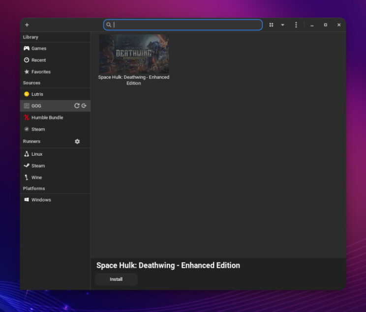
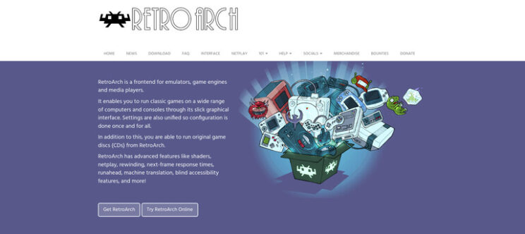
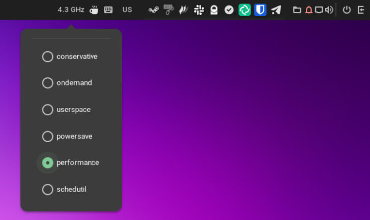
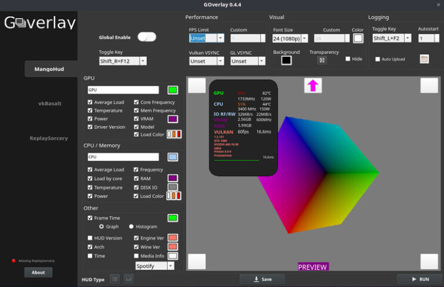
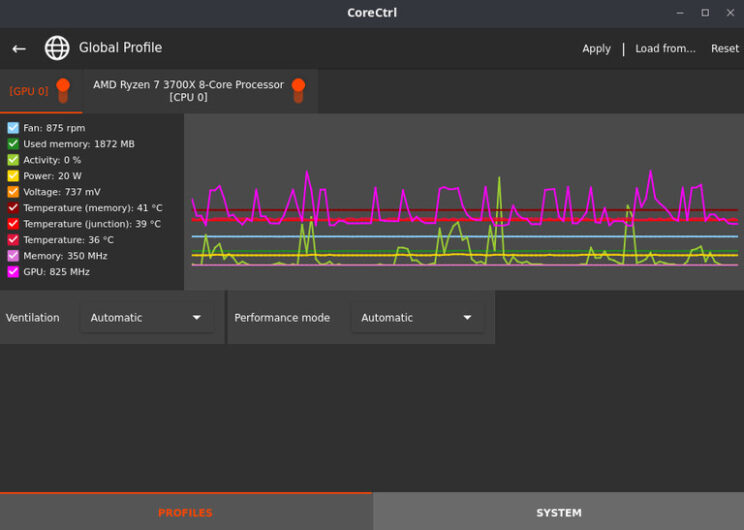
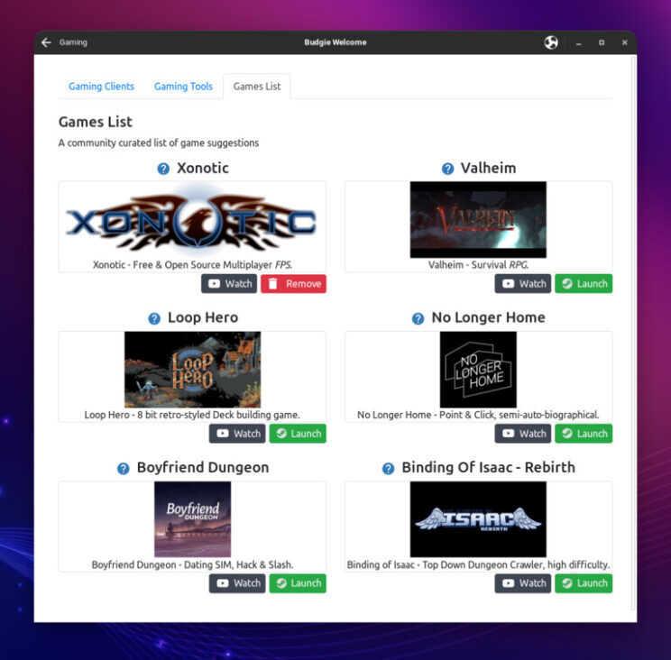

 Budgie Gaming - Gaming Clients

This is a follow up post of our previous article [Quick overview of Budgie Welcome Application](https://ubuntubudgie.org/2022/02/quick-overview-of-budgie-welcome-application/ "Quick overview of Budgie Welcome Application"). As you might know, our team has been working to improve gaming experience. I am here today to take you through our journey.

Soon after I joined the team, mid 2021, I was discussing with David and Nikola about an idea to add gaming recommendations to our Ubuntu Budgie Welcome application. David immediately linked to a page on github where some work was done about the very same idea I had, a few years back. Unfortunately though, the work was not completed back then. However, David and the team showed support for the idea and encouraged me to give it a shot, see what our community thought.

I soon after wrote a [discourse post about this project](https://discourse.ubuntubudgie.org/t/community-project-ubuntu-budgie-gaming/5225 "discourse post about this project"), outlined the scope and asked input and ideas from our community. At the same time I reached out to the person that started the discussion a few years back, Uday Narayan Mukherjee, aka "HellBringer419". I explained that we wanted to resume work on this and since he was the original creator and developer, I asked if he was interested in working with us on the project. Uday graciously agreed to help out and resume his work.

Wow, that was great news. This inspired me to help as much as I could, so I organized my discourse post to be a light version of project management document, while at the same time reaching out to a few enthusiast Linux gamers out there. First one to help, was Matt from Destination Linux Network, AKA Dark1LTG. Later, even Jason Evanghelo from Linux4Everyone got involved.

Others from our community shared some ideas and info, and the project quickly gained momentum. We had quite a list of awesome ideas, software we could not miss to add, and very positive attitude from our friends overall.

We decided to start with a few "Quick Wins", so that we could keep our morale high, and deliver immediate useful tools to our _Budgie Gaming_ application. Also, we outlined longer term goals that would take more effort and testing, and decided to leave those after the release of Ubuntu Budgie 22.04 LTS.

I am very proud to say that it was an absolute pleasure working with our team and our community. Things were going so well, that after a few weeks working with Uday, I saw his positive attitude and FOSS oriented mind at work, and I offered him to join our team. Once again, he agreed and since then, our work has been even faster.

David, our team leader, has been also working behind the scenes to help out with his magic coding skills and advice when we got stuck. David is really the unsung hero of Ubuntu Budgie, we all owe him a great deal.

Fast forward a few months of good work, and we finally managed to have a first polished release with version 0.17.0 of Budgie Welcome. Please note that latest changes are still in Edge Channel of our Budgie Welcome Snap. If you want to give it a try before 22.04 LTS is released, you will have to either swap to edge channel from "Software" GUI Application, or run this command from terminal:

```
snap refresh --edge ubuntu-budgie-welcome
```

Now that we have latest version of Budgie Welcome, let's have a look at what is available.

## Gaming Clients

This section is dedicated to our Linux native gaming clients. There are a few very important applications here for anyone that wants to play on Linux.

### Steam

Steam [https://store.steampowered.com](https://store.steampowered.com) is the gaming platform we all learned to love. Valve, the company behind Steam, has done amazing work for Linux gamers over the years. Together with Codeweavers [https://www.codeweavers.com](https://www.codeweavers.com), they released Proton. Thanks to Proton, we can play so many of our Windows games on Linux.

It is true that not everything works out of the box, but Proton is making great improvements, and with ProtonDB, it is very easy to check what works, what doesn't, and if a particular game needs extra tweaks to run smoothly. [https://www.protondb.com](https://www.protondb.com)

 Steam Store page

### Lutris

Another heavyweight of Linux Gaming, Lutris [https://lutris.net](https://lutris.net) is a great platform for Linux gaming. You can run most games in a variety of different ways via Lutris. On top of that, Lutris also has amazing forums [https://forums.lutris.net](https://forums.lutris.net) and great howtos [https://github.com/lutris/docs/blob/master/InstallingDrivers.md](https://github.com/lutris/docs/blob/master/InstallingDrivers.md) available to help all gamers. Destination Linux also did a great interview with founder of Lutris, Mathieu Comandon [https://destinationlinux.org/episode-255/](https://destinationlinux.org/episode-255/) .

 Lutris

### RetroArch

Some of us like the latest and greatest games. Others prefer to go Retro Gaming. That is what RetroArch is great for. Since it is a bit more involved, I recommend to check their home page for howtos and more information [https://www.retroarch.com](https://www.retroarch.com)

 Retroarch Webpage

### MiniGalaxy

MiniGalaxy is a GOG compatible client for Linux. If you have a lot of GOG games, this client is going to help you a great deal. Make sure to check their website if you need details or help. [https://sharkwouter.github.io/minigalaxy/](https://sharkwouter.github.io/minigalaxy/)

 Minigalaxy

## Gaming Tools

In this section, you will find many tools and applications that will improve your gaming experience, or add some extra, gaming related functionality. CoreCTRL also adds a repository with updated mesa and drivers for Intel and AMD GPUs.

### Piper

Piper is a GTK application that uses libratbag to help you configure gaming mice. A list of supported devices can be found here. [https://github.com/libratbag/libratbag/tree/master/data/devices](https://github.com/libratbag/libratbag/tree/master/data/devices)

 Piper

### CPU Frequency Applet

Ubuntu Budgie has an applet that help you configure CPU governor. This can be very useful for gaming and computer use in general. Once installed, you can add the applet to one of your Budgie panels using "Budgie Desktop Settings", going to "Panels", and adding the applet to one of your panels.

 CPU frequency applet

### OpenRGB

OpenRGB is an open source, cross platform application that helps you manage everything related to RGB. It comes with a nice and powerful GUI, a plugin system, and many nice features. Supported devices list is impressive [https://gitlab.com/CalcProgrammer1/OpenRGB/-/wikis/Supported-Devices](https://gitlab.com/CalcProgrammer1/OpenRGB/-/wikis/Supported-Devices). More details can be found visiting OpenRGB website [https://openrgb.org](https://openrgb.org)

 OpenRGB

### Polychromatic & OpenRazer

Polychromatic and OpenRazer deliver what in my opinion is the best experience for gaming related hardware. Razer hardware compatibility list is extensive and can be found here [https://openrazer.github.io/#devices](https://openrazer.github.io/#devices). Manual installation can be a bit involved, requiring many steps and also manually adding your user to a specific group. For this reason, we decided to put extra effort on this one. I am very happy to announce that all required steps are completely automated, including adding user to "plugdev" group during installation, and removing from the group when software is removed.

Creating customized, game specific lighting effects with Polychromatic is easy and fun. All effects are easy to backup, but I appreciate the fact that there is no cloud, no accounts, no logins needed to use it. If you want to learn more, you can check my OpenRazer and Polychromatic article on Front Page Linux. [https://frontpagelinux.com/tutorials/control-your-razer-devices-on-linux-with-openrazer-polychromatic/](https://frontpagelinux.com/tutorials/control-your-razer-devices-on-linux-with-openrazer-polychromatic/)

 Polychromatic
### Discord

Discord is a very popular communication platform. It is not FOSS but it is what most gamers use. There are some papercuts with Discord Linux app, especially when a new version is detected. Depending on how user installed it, it could be impossible to start it at all, until a new version is released by package maintainers. For this reason, we decided to deploy it via Snap package. Being a Snap, it also ensures higher security and isolation from your operative system.

 Discord Installer

### OBS Studio

OBS studio is a Free and Open Source, multi platform software for video recording and streaming. Over the years, it became a standard application for gamers and streamers. It supports JACK audio, features many plugins, and is very customizable.

 OBS Studio installer

### GOverlay + Mango HUD

MangoHud is a great tool for those that want to monitor CPU, GPU, FPS and more as they play their games. There are many configuration options and I strongly recommend to check out this project on github to learn more [https://github.com/flightlessmango/MangoHud#normal-usage](https://github.com/flightlessmango/MangoHud#normal-usage)

 GOverlay

### CoreCtrl

CoreCtrl allows us to create hardware performance profiles, that can be automatically applied when an application is launched. This even works for Lutris games, Steam games, and yes even Windows games. There is a lot to learn, so I encourage everyone to go and check CoreCtrl gitlab page for more details.

CoreCtrl for Ubuntu is brought to us by Ernst Sjöstrand. He created a PPA that also includes updated, but not bleeding edge versions of Mesa and video drivers for AMD GPUs. I have been using this PPA for months and I really love to have what he calls "Mesa almost stable". [You can check his PPA on Launchpad](https://launchpad.net/~ernstp/+archive/ubuntu/mesarc "You can check his PPA on Launchpad").

 CoreCtrl

## Games List

This is a section dedicated to our community curated list of games. It is very interesting to note that we were also able to manage Steam games from here. Our Gaming app will automatically launch Steam Client for you, and then launch the game if it is on your library. If it is not on your library, Steam Store page for the game will open, so you can check it out and see if you are interested or not. I encourage everyone to give it a try. If Steam Client is not installed, our Gaming application will change behavior and present you with a different choice, to install Steam Client.

For our first release, our team filled the list with some titles we like. As there was a lot of work to do on our first release, together with upcoming 22.04 LTS, we did not have time to dedicate to this.

Once 22.04 LTS is out, we plan to have fun with our community, make some polls, vote for the games we want to be included.

 Budgie Gaming - Games List

## Future Plans

Don't worry, the fun does not stop here. We already have quite a few things planned for future releases. If you want to help out and get involved, you can drop us a message on discourse [https://discourse.ubuntubudgie.org](https://discourse.ubuntubudgie.org), or check our "get involved" [https://discourse.ubuntubudgie.org/c/get-involved/7](https://discourse.ubuntubudgie.org/c/get-involved/7)

## Conclusion

There was quite a lot to go through and I hope you had fun checking what Ubuntu Budgie team is doing for Linux gamers. We certainly had a lot of fun getting this Gaming application up and running.

I also want to take a moment to thank all the developers of the gaming clients and tools we added to our Gaming applications. It is only thanks to their work that we can improve end user experience on Ubuntu Budgie.

Please remember that open source projects are made by passionate people and volunteers, and they most likely need help. And yes, you can help even if you are not a developer. If you are asking yourself how you can help, check a few things that you can do and remember even a little kindness goes a long way:

- Let the project team know how much you love their work.
- Reach out and ask if the project needs any help Spread some love, become and advocate.
- Buy some merchandise, join as patron, or make a donation.
