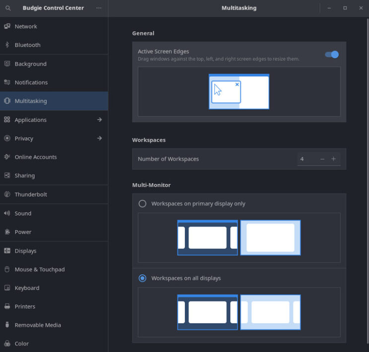

## Introduction and overview

Ubuntu Budgie 22.04 LTS (Jammy Jellyfish) is a Long Term Support release with 3 years of support, from April 2022 to April 2025.

This is the 20.04 upgraders release note. This takes the 20.10/21.04 and 21.10 release notes and highlights the key parts that 20.04 upgraders need to be aware of.

If you are upgrading from 21.10 we have a [release note](https://ubuntubudgie.org/2022/03/ubuntu-budgie-22-04-lts-release-notes/ "release note") more applicable to you!

In these release notes the areas covered are:

- New features and enhancements
- Upgrading from 20.04 Ubuntu Budgie
- Fixed Issues
- Known Issues when upgrading
- Where to download Ubuntu Budgie

## New features and enhancements

 Budgie Control Center

### Translations

- Translations Thanks to our incredible community members that have stepped up to translate Budgie, Budgie is now more accessible than ever. Budgie introduces support for three new languages: Afrikaans, Albanian, and Hindi. Budgie now has 40 languages which have 90% or more coverage and we have seen dedicated translators step up for a wide range of languages, many of which are now completely translated.
- We are still working hard to get Budgie translated 100% into many languages. If you are interested in helping translate Budgie into your language, feel free to reach out! [https://www.transifex.com/ubuntu-budgie/](https://www.transifex.com/ubuntu-budgie/)

### 22.04 Areas to look out for

- Mesa. Late breaking for 22.04 is the inclusion of mesa 22. This is really great news for Gamers – the latest vulkan stuff comes automatically so the latest and greatest games now and in the future have a great base to work from 22.04.
- Catfish is no more. We have now dropped this as part of the default install. There should no longer be a catfish rightclick option in the nemo file-manager. File name search & file content search is available via nemo itself.
- All packages are now arm64 available - see the raspberry Pi section below.
- gedit text edit highlight for current line turned off. Dark themes are broken with gedit and often the text color cannot be read.
- New option "Align to grid" when right click the desktop – this switches on the desktop grid mode. Note there will now be a "Customise" right click menu option available when you choose Align to grid and this can be used to customise the grid including turning off/on the icon auto-arrangement
- We now ship with our own file extension handling list of apps e.g. picture files should open in the viewer gthumb and .deb should open in gnome-software
- We now disable the nemo behaviour where a double-click in an empty area would go up one folder
- We enable default in nemo to allow a slow doubleclick on filename to rename a file
- Nemo – Enforce asking when deleting and moving to trash so that inadvertent deleting files is not possible
- Both nemo-share and nemo-dropbox backport packages have been rebuilt from the upstream v4.6.0 package
- For new accounts/new installs, gnome-software no longer autostarts. This reduces the memory desktop usage by approx 100-150Mb. You’ll see an autostart entry in your autostart list – don't worry, this is just to stop the autostart running for budgie-desktop – but runs correctly for GNOME Shell/Unity desktops.
- Often requested, htop has now been added as a default install –> this may be removed again if we can’t hide from the menu
- We have run a poll with the community and the community have clearly spoken: thunderbird is now the default email client. Geary has been dropped from the ISO.
- The backup tool deja-dup has become a great tool for backups and restores and we are more than happy to include this on our ISO out of the box.
- Out of the box we now include thousands of printer drivers including support for Epson and Canon printers via printer-driver-gutenprint
- We now include sane-airscan which supports thousands of modern network scanners (and a few USB based as well). Use simple-scan to connect to your scanner.
- Budgie Arm & Pi – this tiny app will appear in your menu which ties our Raspberry Pi efforts with the main distro – more information here [https://ubuntubudgie.org/2021/03/release-notes-ubuntu-budgie-21-04-on-a-raspberry-pi-4/](https://ubuntubudgie.org/2021/03/release-notes-ubuntu-budgie-21-04-on-a-raspberry-pi-4/)
- Slick Greeter now has the ability to configure the format of the clock – use Login Window to-do this.
- Whilst Moka icons is no longer part of our defaults, we continue to look after the package on behalf of Debian and Ubuntu. Lots of proposed pull-requests have been included in our soft-fork to continue making Moka a first class icon set for all users.
- Settings (aka GNOME Settings) has now been replaced by Budgie Control Center (BCC)
- In BCC – there is now a "Power Mode" section. The performance profile will only be available on systems which provide this functionality.
- Some GNOME "42" applications are now in the repository. If they have been compiled with GTK-4 they will be Adwaita themed. This is to be expected since the vast majority of GTK themes only support GTK-3 and GTK-2 at this point in time. Please let us know which apps are Adwaita themed so we can monitor in future how these apps behave in newer themes made available as part of the 22.10 development cycle.
- A couple of fixes to budgie-desktop-environment has been made to make budgie more friendly to other desktop environments / remote access that use dash as the default shell.
- Nemo Previews now available as a recommended app in Budgie Welcome to allow you to visualise the content of a highlighted file. Just press Space to toggle the viewer in Nemo. Backported to 20.04 & 20.10 as well.
- IRC links in Budgie Welcome now point to Libera Chat since the Ubuntu family has ended its association with Freenode.
- Right click on a picture via Nemo has a “Set as wallpaper” menu option. This now has a fix to set both the desktop wallpaper and the lock-screen wallpaper at the same time. Previously only the desktop wallpaper was updated.
- From 22.04 Canonical & Mozilla will be enforcing all flavours to swap to using the snap version of Firefox.

### Raspberry PI

 Budgie ARM Tweak Tool

The 22.04 Pi4 image is now available. This includes all the updates from the desktop image described in the release already including the firefox snap and theming changes. For this release the optional VNC option in the Pi app autostarts on boot up. This means the PI image can run headless.

- Added support for the Compute Module 4 board
- Add --force-arm-mode command line option
- Add --force-findpi-mode command line option
- Add --force-model modelname command line option
- Add --model modelname —cpuinfo “CPU String to Match”
- Disable buttons and provide hint on Display tab if pibootctl is not found
- Disable buttons and provide hint on Overclock tab if no ‘/boot/firmware/config.txt’
- Enhanced the various option discoverability by using mouse hover and displaying a hint in a ‘status area’

### Budgie desktop

 Ubuntu Budgie 22.04 Desktop

- Our default layout has changed slightly. The icons in the panel now have additional spacing to ensure we no longer have a cramped look-and-feel. The appindicator applet is now at the beginning of the right ride block of icons. To see this if you are upgrading you will need to reset your panel: nohup budgie-panel --reset --replace &
- RISCV64 support has now been enabled for this up-and-coming architecture [https://discourse.ubuntubudgie.org/t/testing-22-04-are-you-brave-enough/5461/56](https://discourse.ubuntubudgie.org/t/testing-22-04-are-you-brave-enough/5461/56)
- Our plank-preferences menu option no longer appears in GNOME Software – this will ensure users of other desktop don’t accidentally install this together with budgie!
- Budgie Desktop 10.6.1 has been released – [https://github.com/BuddiesOfBudgie/budgie-desktop/releases/tag/v10.6](https://github.com/BuddiesOfBudgie/budgie-desktop/releases/tag/v10.6)
- GNOME Control Center AKA Settings has now been hidden from the menu. New from budgie 10.6 is Budgie Control Center (via the menu) to control all budgie relevant control & device settings.
- You can now choose which screenshot app to be invoked when pressing Print, Ctrl Print, Alt Print – dconf-editor is used to change the app
- Being a good contributor – we have upstream'd to the budgie-desktop project several 20.04 patches we have developed (Wnck crash, gnome-shell/budgie-desktop conflict as well as the ability to define the print button screenshot app)
- Fix created and pull-request made to allow non Latin keyboard layouts from the keyboard applet
- Wallpaper changing now respects the animation flag – so if you turn of animations, changing wallpapers occur instantaneously
- Fix occasional crash when removing applets from a panel
- Upstream has resolved system tray icons breaking on login, resume from suspension
- Upstream: chromium browser based notifications now display their icons
- Upstream has enabled creating new instances of windows via middle click of icon task list applet
- Upstream has completely reworked the system tray. This resolves lots of issues including icons appearing to overlap each other.
- In raven we display week-numbers by default for the calendar
- "Default" theme in budgie-desktop-settings is now hidden
- Budgie Menu introduces additional checks for an application's DesktopAppInfo, ensuring that budgie consistently skip apps and exclude them from calculations when they have Hidden or NoDisplay set, as well as if the NotShowIn contains Budgie.
- Budgie Menu will no longer show empty categories, a common occurrence when installing applications via WINE.
- Budgie Menu will now alphabetically sort category names, which is useful when you have custom user desktop directories for applications. They are no longer forced to be below default system-wide desktop directories such as Internet / Networking, Office, Sound & Video, etc.
- Applications which utilize pkexec in their desktop info will now spawn an asynchronous process, with pkexec being the command and passing the rest of the command line content as arguments.
- The Icon Tasklist applet has seen new features and behaviour refinements
- There are now two new options available, disabled by default, to launch a new instance of an application via the respective button for the application: middle click and double click. This expands on the existing option to create a new instance of an application by clicking the + button in the popover of each Icon Button.
- The behavior of the Icon Tasklist has been refined - more consistent rejection of various types of windows, such as docks, apps with splashscreens and utilities e.g. controls for an emulator.
- Resolved an issue where the pin and new instance buttons were being unintentionally shown, as well as an issue where you could not close Budgie Desktop Settings via the IconPopover controls (right click popover for each Icon Button in the tasklist).
    
    - When the “Show All Windows on Click” option is enabled, budgie will now more consistently show or minimize all windows on click if one of them is currently active.
    - If only one instance of an application is open and it is on another workspace (in this case the “Restrict to Workspace” option is not enabled), budgie switches to that workspace and unminimize the window (since the chances are you probably want to see the application in the first place).
- The Sound applet has seen a redesign and now features a dedicated button for mute toggling, as well as leveraging iconography for the System.
- Dating back to the days of Budgie 7 in 2014, Budgie had been using an na-tray implementation also seen in desktop environments such as Cinnamon for the creation and management of system tray icons. Thanks to the incredible work by Solus contributor Campbell Jones, the System Tray has been completely rewritten from scratch, supporting tray icons leveraging the XEmbed Protocol. This new implementation resolves numerous issues such as:
- Background icons not refreshing, resulting in instances where it may appear that multiple icons are overlapping.
- Tray icons not consistently hiding when a panel hides (during “Intelligent” mode).
- Tray icons blinking when panel transparency is set to “Dynamic”
- Tray icons getting hidden when switching icon themes.
- Additionally, a configuration option has been added for the System Tray that enables the setting of spacing between individual icons, making it perfect for those that want both their applets and tray icons to be equidistant!
- For those which use Budgie in another language than English, the menu items presented when adding a new Autostart application or command via the Autostart section are now translatable. For any language which has the terms translated, those will be used instead.
- Raven introduces a new option to choose which side of the screen Raven should be. Previously Raven would always appear on the left side when the main panel and trigger were on the left, and appear on the right when the main panel was anywhere else.
- Users will be able to choose between this behaviour, called “Automatic”, as well as left and right sides!
- Here are some other aspects of Budgie that received refinements:
- Animation disabling: Background transitions and workspace switching are no longer always enabled but now honor the option to disable animations in Budgie Desktop Settings
- Budgie’s Application Switcher a. Typically referred to as the Alt+Tab switcher, this switcher now supports the Ctrl modifier, adding support for more custom keyboard layouts and mappings. b.support an option to show all windows from all workspaces in the switcher, enabling you to switch between applications and workspaces simultaneously. c. Budgie Run Dialog can now check keywords, improving search and aligning its behaviour closer to that of Budgie Menu.
- Caffeine Applet: When Caffeine Mode is enabled, the timer will now update the spin button value based on how many minutes are remaining.
- Forward-specific keyboard layout switching can now be done with Alt+Shift.
- Transparency is now supported in background images, falling back to the fixed color or gradient behind it.
- The Tasklist applet will no longer cause the rest of the panel contents to be thrown into the aether when you have many windows open. You will be able to scroll up / down to get all the windows. In the future budgie will be working on creating dedicated buttons in the tasklist applet.
- Regions which do not have any panel widgets / applets will no longer be shown, allowing applets to take up more space and eliminates weird spacing related issues.
- Chromium-based browser notifications no longer display with broken icon images. This was due to the fact that these browsers would prefix the icon with file:/// and Chromium-based browsers would not pass the correct path. We will now default to the fallback mail-unread-symbolic icon for these applications.
- Notifications and Notification Groups can no longer be selected, which would result in a visual change with no obvious or easy way to deselect them. There are no functional changes, as there are no actions which make use of the selection of Notifications or Notification Groups.
- Notifications are no longer appended to Notification Groups, resulting in older Notifications being higher in a Notification Group’s list than newer ones.
- The Sound widget will no longer allow raising the volume above 100% when the option is off.
- Budgie Popovers will now properly handle window scale factors.
- Crash fixes related to the usage of Wnck have been resolved.
- Fix some custom keyboard shortcuts and media keys not correctly applying after boot or reboot.
- Night Light will now appropriately start or end if an application has the fullscreen state amongst its many states, and not just beThemes and Layouts now show a tab-look interface – this should aid discovery of layouts since it appears people couldn’t instantly visualise that option
- For this release, Ubuntu Budgie also has a fix added for non-english keyboard layouts such as Japanese/Chinese/Korean etc. We have added a bug-fix into budgie-desktop so that Ibus suggestions are displayed.
- Fix application icons not scaling in Raven’s Notification Group headers.
- Fix issue with VirtualBox icon not being displayed in IconTaskList applet
- Fix regression in Budgie Desktop Settings icon handling.
- MPRIS metadata, playback status, and CanGoPrevious / CanGoNext fetching is now performed immediately rather than being an unnecessary idle operation.
- Notifications now use a high priority timeout.
- Notification iconography now uses a consistent IconSize.DIALOG instead of IconSize.INVALID and only scales if the icon provided is not already the desired height.
- Prevent Budgie Desktop Settings from being pinned via drag-and-drop, fixing an issue where Budgie Desktop Settings was inadvertently pinnable and unable to be unpinned.
- Sound Indicator applet and Raven
- Use standard mute/unmute methods, fixing issues like muting with media keys and then trying to unmute via the applet, which would previously not work.
- System Tray applet
- Fix issue with KeePass causing panel segfaults.
- Various stability improvements, such as more proactive X11 error trapping.
- In GNOME Shell and GNOME Settings Daemon 40, there were changes introduced which impacted Budgie’s ability to use dedicated screensavers, such as gnome-screensaver (which we have been using since 2017). As always, we encourage that Budgie be used with lightdm and an optional greeter such as slick-greeter, as opposed to being installed alongside GDM and GNOME Shell where locking the screen is very hit-and-miss.
- Here are some quality-of-life improvements shipping in Budgie
- Filter out audacious notifications so they do not clutter up Raven.
- Spacing is now configurable in the Status applet.
- The application fullscreen state tracking has been slightly rewritten to use the window XIDs, only call our track window state function on specific flags in the changed or current state, and reducing instances where some unset flags would not result in the application being removed as a fullscreen application.
- There is now an option in Budgie and exposed via Budgie Desktop Settings’ “Windows” section to automatically pause notifications when a window is fullscreen and unpause when there no longer is a fullscreen window. This is useful in reducing distractions when gaming or watching content!
- We will no longer filter device added / removed notifications. This resolves issues where ejection notifications for external media would not get stored in Raven’s Notifications section.
- When xdotool is available on the operating system, the Lock Keys applet can be clicked to toggle CapsLock and NumLock!

## Budgie applets & Budgie mini-apps

 Budgie Extras

- Latest version of budgie-calendar-applet
- Budgie-indicator-applet has now swapped to support ayatana-indicators. This is the new upstream of the original ubuntu indicators.
- ayatana-indicator-applet can be installed – this integrates with Evolution & Thunderbird (with the evolution plugin) to display appointments and calendar events
- ayatana-webmail can be installed – this displays notifications in plank when an email is received.
- budgie-applications-menu-applet: This has the following enhancements from upstream.
    - App context menu available when right click from search results
    - Reads the PrefersNonDefaultGPU setting from .desktop files and uses that to automatically configure default or non-default GPU
    - Adds a new context menu to support choosing the other GPU (integrated if PrefersNonDefaultGPU is set to true, discrete if key not present or its set to false)
    - Categories have been slimmed down – less apps should default to the “Other” category -When searching, Nemo bookmarks are also displayed in the search results
- Shuffler Control animation when switching tabs is now the same as budgie-desktop-settings & the app-menu so that we have a consistent look and feel
- SDXC card and such like now appears in DropBy … so the popup prompt will appear when such a card is inserted in the same way as a USB drive & stick
- Hotcorners now has an option to “delay” the activation of a hotcorner as well as invoking via “pressure” – i.e. how quickly you pushed your cursor into the corner. This will be useful for those touchpads that doesn’t have the sensitivity to allow for the extant pressure option.
- Quicknote pop-up correctly retains its scroll-position so no need to keep scrolling up and down to find text you previously was looking at.
- Fix crash with shuffler when an application window disappears when using invoking shuffler actions.
- Quickchar gets a nice new app icon to view in the menu.
- Applications menu category view now defaults to 6px which gives a less squashed look for most themes – this can be configured via the applet settings.
- Budgie Trash Applet has a number of fixes and enhancements:
    - Support multiple file drag and drop to panel icon.
    - Show trash full icon when there are items in trash.
    - Open trash folder instead of popup when > 100 items.
    - Fix paths with certain characters not restoring correctly.
- Hotcorners: Option added to configure hotcorners via budgie-desktop-settings and therefore hide the icon from the panel
- Dropby: Applet settings now has the ability to display the USB window notification in any corner you define
- Dropby: Animation when copying media so that you now when copying is in progress/finished
- Application Menu: Touch Screen friendly – can now swipe on your touchscreen
- Application Menu: Better keyboard navigation from the search to categories etc.
- Application Menu: Search bar changes position to the bottom when on a bottom panel
- Application Menu: Hide the large number of Settings menu icons shown in the grid view and the System Tools category menu – its more elegant this way – use the search capabilities to find Settings options like bluetooth and sharing etc.
- Application Menu: In a similar fashion the logout/restart/suspend/shutdown icons have now been removed. Search actions are now available for these + the ability to "lock" the screen when searching and "hibernate" if you have enabled hibernation separately
- Application Menu: Mouse rollover capability in the category view is now available via applet settings
- Application Menu: Handling of fractions should be better and more intuitive (e.g. 5.3\*0.5 in the search bar)
- Application Menu – Category view – styled as a sidebar now
- Previews: enable/disabling the capability is now dynamic – there is no need to logout/login
- Previews: now displays a tooltip on mouse hover (configurable) to show the full window name
- Window Shuffler – enable/disabling the capability is now dynamic – there is no need to logout/login
- Window Shuffler Sticky Neighbours – nWindow Shuffler – Window Rules: Add ability to set the position and size together with the monitor location to open an application on
- Window Shuffler – Layouts: Add the ability to launch and group together multiple applications
- Window Shuffler – Window Rules: Add ability to set the position and size together with the monitor location to open an application on
- Window Shuffler – Layouts: Add the ability to launch and group together multiple applications
- Applications Menu:
    - Cosmetic – labels on budgie-desktop-settings are left aligned.
    - from upstream Terminal apps are no-longer shown in the menu such as xterm
    - QuickChar installation is now easier on other on Debian based distro’s – should not now need to patch your install locations
- A new independent applet called budgie-clipboard-applet is now available – -look out for it via Menu – Budgie Extras
- A new independent applet called budgie-analogue-applet ([https://github.com/samlane-ma/budgie-analog-clock](https://github.com/samlane-ma/budgie-analog-clock)) is now available
- Bug fix for the applications menu so that rollover menus settings is remembered on logon.
- The number of cities that our weather applet can now search has increased from 22.6k to 185k
- Change to budgie-pixel-saver-applet. It now handles blacklisting of apps to stop it trying to add window decorations where a window didn’t have one in the first place. e.g. Firefox, Telegram and Ulauncher.
- Fix for spamming the syslog when previews was enabled but end-user was logged into a wayland desktop session
- Fix for WIndow Shuffler layouts executable installation path to work on stateless distros
- Window Shuffler Control has been completely revamped and redesigned
- Shuffler Control
- Window Shuffler now includes an applet to (re-) arrange and automatically move windows, either a single window or a group of windows.
- Shuffler now includes Window Rules – explained here [https://discourse.ubuntubudgie.org/t/testing-21-10-are-you-brave-enough/4897/4?u=fossfreedom](https://discourse.ubuntubudgie.org/t/testing-21-10-are-you-brave-enough/4897/4?u=fossfreedom)
- Shuffler Window rules now allow you to open application windows on specific workspaces
- Applications Menu – Calculator now shows a visual hint how to copy the result to the clipboard. Try it – press Super then enter 2+2
- Applications Menu – transition from Grid to List modes is now a fade rather than a slide animation
- We no longer install the elementary gsettings schema – this ensures we don’t clash with a pantheon install. The elementary schema entry is now found in the budgie applications schema.
- Some themes space the category list oddly. We now have a user configurable override (adjust category spacing) in the applet settings allowing you to control the spacing.
- Fix where after connecting to a VPN spinner cursor was still showing
- Budgie Calendar Applet changes: Handle correctly the display of AM/PM when using custom date formats.
- Budgie Calendar Applet changes: Select the current date when opening the popover.
- Budgie Calendar Applet changes: How & Hide current week option.
- latest of budgie-indicator-applet has been released. This has a fix (hopefully) for any appindicator that used to display big/huge icons
- New applet called CPU Temp that displays the temperature of various sensors.
- Thanks to contributor Akira ([https://github.com/AkiraMiyakoda](https://github.com/AkiraMiyakoda)) budgie-pixel-saver-applet has now received a number of enhancements:
    - Drag – drop to unmaximise
    - Configurable title theming
    - Updates to ensure work with arc-theme
    - Increase configurable title width to 200px
    - Allow right alignment of title
    - revamped theming support for window controls
    - new style class “pixelsaver” to aid theme maintainers
    - These changes are now available in 20.04/21.04 & 21.10
- VisualSpace – we now display a hint when you open the popover – scrolling over the panel icon changes the workspace.
- Brightness Controller has now been reworked to use GNOMEs dbus control … so this should be all distro friendly and will reflect accurately the same Power slider in GNOME Settings.

## Budgie Welcome

 Mg Budgie Welcome 19

Themes and Layouts now show a tab-look interface – this should aid discovery of layouts since it appears people couldn’t instantly visualise that option

- Budgie Welcome now starts significantly faster on first start
- Budgie Welcome uses the latest bootstrap v4 which includes faster display and navigation usage
- Analogue Clock Applet added to Menu – Budgie Extras
- Our Getting Started guide now covers keyboard shortcuts to move windows to other monitors
- Brave and Firefox ESR can now be installed from Getting Started – Browser Ballot
- Browser Ballot is now aware which architecture Welcome is running on – so only browsers applicable to Pi (for example) is displayed
- Gutenprint is a Recommended application
- Pocillo makeover defaults to dark-theme to correspond to the new default.

### Desktop layouts, themes, and wallpapers

 Themes & Layouts

- Latest version of WhiteSur icon theme available in Makeovers
    
- Latest version of WhiteSur GTK theme available in Makeovers
    
- QogirBudgie Gtk Theme has been refreshed from upstream
    
- Pocillo icon theme has been refreshed from upstream tela-icon and qogir icon sources.
    
- Arc-Theme has now been updated – the maintainer has changed to [https://github.com/jnsh/arc-theme](https://github.com/jnsh/arc-theme). The theme now has an additional theme called Arc-Lighter.
    
- QogirTheme – as requested by the community, the highlight focus colour has changed from Ubuntu Orange to Standard Blue.
    
- Moka and Faba icons have now been dropped from the default install.
    
- The Mojave gtk theme has been refreshed upstream
    
- The McMojave circle icon theme has been refreshed upstream
    
- WhiteSur make-over which includes the whitesur gtk theme/whitesur icons and roboto fonts.
    
- Snaps have been produced for QogirBudgie and Pocillo GTK Themes – this means you can now theme snaps that are themable
    
- Welcome snap updated to install 22.04 budgie-extras etc.
    
- Welcome snap includes a snapshot of the community developed gaming page. Please do get involved to shape this Community project: Ubuntu Budgie Gaming [https://discourse.ubuntubudgie.org/t/community-project-ubuntu-budgie-gaming/5225](https://discourse.ubuntubudgie.org/t/community-project-ubuntu-budgie-gaming/5225).
    
- MS Edge web-browser now available to be installed in the browser ballot (Getting Started).
    
- In the Getting Started – ballot browser – the Brave deb repository is an install option alongside the snap install.
    
- For 22.04 there is a new Chrome OS like layout available via budgie welcome.
    
- For 22.04 the deb version of Firefox has been removed since only the snap is now available.
    
- Canonical’s Firefox ESR (extended support release) PPA is now a browser option for all supported released.
    
- Extras – rename "Applets" to Extras to better reflect the types of things that can be installed
    
- Extras – Instructions on how to enable applets after install displayed immediately next to the install button when invoked.
    
- Extras – All window previews to be uninstalled
    
- Add Budgie Lightpad Applet installable for 18.04 and later
    
- Themes – Corrected picture sizing to be identical for all themes
    
- Themes – Allow users of the vimix makeover to install individual parts
    
- Themes – Latest Upstream Paper theme has now removed Paper cursors – so rework to remove this from makeover
    
- Mojave theme/icons and font makeover is now available in budgie-welcome. \* Getting Started – point to the correct YouTube video for Shuffler
    
- Getting Started – Corrected 20.04 keyboard shortcut to launch Shuffler
    
- Getting Started – Added Brave Browser to the browser ballot
    
- Getting Started – fixed bug where translated topics had an apostrophe which caused the topic not to respond to a click to display the topic.
    
- Themes and Layouts now show a tab-look interface – this should aid discovery of layouts since it appears people couldn’t instantly visualise that option
    
- Budgie Welcome now starts significantly faster on first start
    
- Budgie Welcome uses the latest bootstrap v4 which includes faster display and navigation usage
    
- Analogue Clock Applet added to Menu – Budgie Extras
    
- Our Getting Started guide now covers keyboard shortcuts to move windows to other monitors
    
- Brave can now be installed from Getting Started – Browser Ballot
    
- Browser Ballot is now aware which architecture Welcome is running on – so only browsers applicable to Pi (for example) is displayed
    
- Gutenprint is a Recommended application
    
- Pocillo makeover defaults to dark-theme to correspond to the new default
    

## Known issues

- Some app icons remain in the icon-task-list – e.g. steam/discord after opening.
- For more generic issues with Ubuntu 22.04, please check this link: [Ubuntu 22.04 Release Notes](https://discourse.ubuntu.com/t/jammy-jellyfish-release-notes/24668 "Ubuntu 22.04 Release Notes").

## Upgrades

It is important to keep in mind a few useful tips before attempting a release upgrade:

- Backup your data.
- Install all available updates and reboot.
- It is always a good idea to run either a full system snapshot with Timeshift, to a secondary drive, or a full system image using Clonezilla.
- If you have PPAs that come with updated kernel, mesa, GPU drivers, it is better to purge those PPAs and reboot before attempting release upgrade.
- Once release upgrade starts, all your PPAs will be disabled. If you rely on important software from PPAs, it is better to manually check if those are updated for upcoming release of Ubuntu.
- After upgrade is completed, remember to go to software sources, change release name on your PPAs, enable them and refresh package cache

### How to upgrade from 20.04

For those that don’t want to wait, it is possible to trigger manual upgrade by hand. If you are interested, follow the procedure below. If you want to learn more, you can check latest and up to date [22.04 upgrade procedure on Ubuntu Wiki](https://help.ubuntu.com/community/JammyUpgrades " 22.04 upgrade procedure on Ubuntu Wiki").

- Run the update-manager application;
- In Update Manager, click the Settings... button, and enter your password to start the Software Sources application.
- Select the sub menu Updates from the Software Sources application.
- Confirm the "Notify me of a new Ubuntu version:" option is set to "For any new version" if you are using 21.10 or to "For long-term support versions" if you are using 20.04 LTS. If it is not set properly modify it to the appropriate option.
- Close the Software Sources application and return to Update Manager.
- In Update Manager, click the Check button to check for new updates.
- If there are any updates to install, use the Install Updates button to install them, then exit.
- In a terminal run update-manager -c -d.
- A message will appear informing you of the availability of the new release.
- Click Upgrade.
- Follow the on-screen instructions.

## Download

 ubuntubudgie.org

Links to download final releases, as well as installation instructions, are available on our Ubuntu Budgie website: [https://ubuntubudgie.org/downloads/](https://ubuntubudgie.org/downloads/).

## Getting support

Thanks to the generosity of discourse.org, our support site is the crucial site for all things Ubuntu Budgie.

One to bookmark [https://discourse.ubuntubudgie.org](https://discourse.ubuntubudgie.org) More information can be found here.

## Infrastructure sponsors

We just wanted to thank our infrastructure sponsors who help us keep the lights on.

### Digital Ocean

On a mission to simplify cloud computing so developers and their teams can spend more time building software that changes the world.

### Discourse

Discourse is the 100% open source discussion platform built for the next decade of the Internet. Use it as a mailing list, discussion forum, long-form chat room, and more!
